# 开发者指南 :: NVIDIA深度学习TensorRT文档

## [修订历史](#revision-history)


这是《NVIDIA TensorRT 8.5 开发者指南》的修订历史。
## 第三章 更新

| 日期 | 变更摘要 |
| --- | --- |
| 2022年8月25日 | 从 [构建引擎](#build_engine_c "下一步是创建一个构建配置，指定TensorRT应如何优化模型。") 节中添加到新的 _优化构建性能_ 节的链接。|
| 2022年8月26日 | 为C++ API重写了 [执行推理](#perform-inference "引擎保存了优化后的模型，但要执行推理，我们必须管理中间激活状态的其他状态。这是通过使用ExecutionContext接口完成的：")。|

## 第4章 更新

| 日期 | 变更摘要 |
| --- | --- |
| 2022年8月25日 | 从[构建阶段](#importing_trt_python "要创建一个构建器，您必须首先创建一个记录器。Python绑定包括一个简单的记录器实现，它将所有严重性前的消息记录到stdout。")部分添加到新的“优化构建器性能”部分的链接。 |
| 2022年8月26日 | 为Python API重写[执行推理](#perform_inference_python "引擎保存了优化的模型，但要执行推理需要额外的中间激活状态。这是使用IExecutionContext接口完成的:")。 |

## 第5章 更新

| 日期 | 变更摘要 |
| --- | --- |
| 2022年8月25日 | *   解释了如何在[运行时阶段](#memory-runtime-phase "在运行时，TensorRT使用相对较少的主机内存，但可以使用大量的设备内存。")中使用PreviewFeature标志。<br>*   添加了[延迟模块加载](#lazy-module-loading)部分。 |
| 2022年8月30日 | 添加了[L2持久缓存管理](#persistent-cache-management "NVIDIA Ampere及更高架构支持L2缓存持久性，这是一项功能，允许优先保留L2缓存行，当选择要驱逐的行时。TensorRT可以利用此功能在缓存中保留激活，从而减少DRAM流量和功耗。")部分。 |
| 2022年9月19日 | 添加了[IFillLayer确定性](#ifilllayer-determinism "当使用RANDOM_UNIFORM或RANDOM_NORMAL操作将IFillLayer添加到网络时，上述确定性保证将不再有效。在每次调用时，这些操作基于RNG状态生成张量，然后更新RNG状态。此状态存储在每个执行上下文的基础上。")部分。 |

## 第6章 更新

| 日期 | 变更摘要 |
| --- | --- |
| 2022年8月25日 | 更新了C++和Python的[稀疏性](#structured-sparsity)示例代码。 |
| 2022年8月26日 | 重写了[重用输入缓冲区](#reusing-input-buffers "TensorRT允许指定一个CUDA事件，在输入缓冲区可以被重用时发出信号。这允许应用程序立即开始填充下一个推理的输入缓冲区区域，与完成当前推理并行。例如：")。 |
| 2022年8月30日 | 添加了[预览功能](#preview-feature "预览功能API是IBuilderConfig的扩展，允许逐步引入TensorRT的新功能。选择的新功能在此API下公开，允许您选择加入。预览功能在一两个TensorRT发布周期内保持预览状态，然后要么作为主流功能整合，要么被删除。当预览功能完全集成到TensorRT中时，它将不再通过预览API进行控制。")部分。 |

## 第8章 更新内容

| 日期 | 变更摘要 |
| --- | --- |
| 2022年8月25日 | 添加了[命名维度](#named-dimensions "常量和运行时维度都可以被命名。命名维度提供了两个好处：")部分。 |
| 2022年8月26日 | *   添加了一个名为[动态形状输出](#dynamic-shaped-output "如果网络的输出具有动态形状，则可以使用几种策略来分配输出内存。")和[查找多个优化配置文件的绑定索引](#binding-indices-opt-profiles "如果使用enqueueV3而不是已弃用的enqueueV2，则可以跳过此部分，因为基于名称的方法（如IExecutionContext::setTensorAddress）不需要配置文件后缀。")的新部分。<br>*   重写了[执行张量与形状张量](#exe_shape_tensors "TensorRT 8.5在执行张量和形状张量之间基本上消除了区别。但是，如果设计网络或分析性能，了解内部工作原理以及内部同步发生的位置可能会有所帮助。")。 |

## 第12章 更新

| 日期 | 变更摘要 |
| --- | --- |
| 2022年8月25日 | 在 [层支持和限制](#dla-lay-supp-rest "以下列表提供了在DLA上运行时对指定层的支持和限制:") 部分添加了Shuffle层和Equal运算符。 |
| 2022年9月30日 | *   在 [自定义DLA内存池](#customize-dla-mem-pools "您可以使用IBuilderConfig::setMemoryPoolLimit C++ API或IBuilderConfig.set_memory_pool_limit Python API自定义为网络中的每个DLA子网络分配的内存池的大小。有三种类型的DLA内存池（有关详细信息，请参阅MemoryPoolType枚举）:") 部分添加了关于NVIDIA Orin的附加信息。<br>*   在 [确定DLA内存池使用情况](#determine-dla-memory-pool-usage "成功从给定网络编译可加载项后，生成器将报告成功编译为可加载项的子网络候选集的数量，以及这些可加载项每个池使用的总内存量。对于由于内存不足而失败的每个子网络候选项，将发出一条消息以指出哪个内存池不足。在详细日志中，生成器还报告了每个可加载项的内存池要求。") 部分添加了。 |
| 2022年10月5日 | *   添加了 [使用C++构建DLA可加载项](#building-safety-nvmedia-dla-engine) 部分。<br>*   添加了 [使用trtexec生成DLA可加载项](#using-trtexec-gen-dla-load "trtexec工具可以生成DLA可加载项而不是TensorRT引擎。指定--useDLACore和--safe参数将生成器能力设置为EngineCapability::kDLA_STANDALONE。此外，指定--inputIOFormats和--outputIOFormats限制了I/O数据类型和内存布局。通过指定--saveEngine参数，DLA可加载项将保存到文件中。") 部分。 |

## 第13章 更新

| 日期 | 变更摘要 |
| --- | --- |
| 2022年8月25日 | 添加了[优化构建器性能](#opt-builder-perf "对于每个层，TensorRT构建器会对所有可用的策略进行分析，以寻找最快的推理引擎方案。如果模型具有大量层或复杂的拓扑结构，构建器的时间可能会很长。以下部分提供了减少构建器时间的选项。")部分。 |
| 2022年10月20日 | 在[CUDA性能分析工具](#nvprof)部分中添加了如何理解Nsight Systems时间线视图的说明。 |

## 附录更新

| 日期 | 变更摘要 |
| --- | --- |
| 2022年8月25日 | 在[常用命令行标志](#trtexec-flags "本部分列出了常用的trtexec命令行标志。")中添加了\--heuristic标志，用于策略启发。 |
| 2022年9月17日 | 移除了"Layers"章节，并创建了一个新的[_TensorRT运算符参考_](https://docs.nvidia.com/deeplearning/tensorrt/operators/docs/index.html)。 |

## [摘要](#摘要)

本《NVIDIA TensorRT 开发者指南》演示了如何使用 C++ 和 Python API 来实现最常见的深度学习层。它展示了如何使用提供的解析器，采用深度学习框架构建的现有模型来构建 TensorRT 引擎。开发者指南还提供了逐步说明常见用户任务的步骤，例如创建 TensorRT 网络定义、调用 TensorRT 构建器、序列化和反序列化，以及如何使用 C++ 或 Python API 提供数据并执行推理。

有关以前发布的 TensorRT 开发者文档，请参阅[TensorRT 存档](https://docs.nvidia.com/deeplearning/tensorrt/archives/index.html)。

## [1. 介绍](#概述)

NVIDIA® TensorRT™ 是一个能够实现高性能机器学习推理的 SDK。它旨在与 TensorFlow、PyTorch 和 MXNet 等训练框架相辅相成。它专注于在 NVIDIA 硬件上快速高效地运行已经训练好的网络。

请参考 _[NVIDIA TensorRT 安装指南](https://docs.nvidia.com/deeplearning/sdk/tensorrt-install-guide/index.html)_ 了解如何安装 TensorRT 的说明。

[_NVIDIA TensorRT 快速入门指南_](https://docs.nvidia.com/deeplearning/tensorrt/quick-start-guide/index.html) 面向希望尝试 TensorRT SDK 的用户；具体来说，您将学习如何快速构建一个应用程序来在 TensorRT 引擎上运行推理。### [1.1. 本指南的结构](#structure)

第1章提供了有关TensorRT的打包和支持信息，以及它如何适应开发者生态系统。

第2章概述了TensorRT的广泛功能。

第三章和第四章分别介绍了C++和Python的API。

后续章节提供了关于高级功能的更多细节。

附录包含了层参考和常见问题的答案。

### [1.2. 示例](#samples)

[_NVIDIA TensorRT 示例支持指南_](https://docs.nvidia.com/deeplearning/tensorrt/sample-support-guide/index.html)展示了本指南中讨论的许多主题。更多关注嵌入式应用的示例可以在[这里](https://github.com/dusty-nv/jetson-inference)找到。

### [1.3. 互补的GPU功能](#gpu-features)

[多实例GPU](https://docs.nvidia.com/datacenter/tesla/mig-user-guide/index.html)，简称MIG，是NVIDIA Ampere架构或更新架构的NVIDIA GPU的一项功能，它可以将一个单一的GPU划分为多个较小的GPU。这些物理分区提供了具有QoS的专用计算和内存切片，并可以在GPU的一部分上独立执行并行工作负载。对于GPU利用率较低的TensorRT应用程序，MIG可以在对延迟几乎没有影响的情况下提供更高的吞吐量。最佳的划分方案因应用程序而异。

### [1.4. 辅助软件](#comp-software)

[NVIDIA Triton™](https://docs.nvidia.com/deeplearning/triton-inference-server/user-guide/index.html) 推理服务器是一个更高级别的库，可在 CPU 和 GPU 上提供优化的推理。它提供了启动和管理多个模型的功能，并为提供推理的 REST 和 gRPC 端点。

[NVIDIA DALI®](https://docs.nvidia.com/deeplearning/dali/user-guide/docs/#nvidia-dali-documentation) 提供了用于预处理图像、音频和视频数据的高性能原语。TensorRT 推理可以作为 DALI 流水线中的自定义运算符集成。可以在[此处](https://github.com/NVIDIA/DL4AGX)找到将 TensorRT 推理集成为 DALI 一部分的工作示例。

[TensorFlow-TensorRT (TF-TRT)](https://docs.nvidia.com/deeplearning/frameworks/tf-trt-user-guide/index.html) 是将 TensorRT 直接集成到 TensorFlow 中的工具。它选择 TensorFlow 图的子图以由 TensorRT 加速，而将其余部分以 TensorFlow 的本机方式执行。结果仍然是一个可以像往常一样执行的 TensorFlow 图。有关 TF-TRT 示例，请参阅[TensorFlow 中的 TensorRT 示例](https://github.com/tensorflow/tensorrt)。

[Torch-TensorRT (Torch-TRT)](https://developer.nvidia.com/blog/accelerating-inference-up-to-6x-faster-in-pytorch-with-torch-tensorrt/) 是一个将 PyTorch 模块转换为 TensorRT 引擎的 PyTorch-TensorRT 编译器。在内部，PyTorch 模块首先根据所选的中间表示（IR）转换为 TorchScript/FX 模块。编译器选择 PyTorch 图的子图以由 TensorRT 加速，而将其余部分以 Torch 的本机方式执行。结果仍然是一个可以像往常一样执行的 PyTorch 模块。有关示例，请参阅[Torch-TRT 示例](https://github.com/pytorch/TensorRT/tree/master/notebooks)。[TensorFlow-Quantization toolkit](https://github.com/NVIDIA/TensorRT/tree/main/tools/tensorflow-quantization) 提供了在降低精度的情况下训练和部署基于Tensorflow 2的Keras模型的工具。该工具包根据操作符名称、类和模式匹配来量化图中的不同层。然后可以将量化图转换为ONNX格式，再转换为TensorRT引擎。有关示例，请参考[模型库](https://github.com/NVIDIA/TensorRT/tree/main/tools/tensorflow-quantization/examples)。

[PyTorch Quantization Toolkit](https://docs.nvidia.com/deeplearning/tensorrt/pytorch-quantization-toolkit/docs/userguide.html) 提供了在降低精度的情况下训练PyTorch模型的功能，然后可以导出为TensorRT进行优化。

此外，[PyTorch Automatic SParsity (ASP)](https://github.com/NVIDIA/apex/tree/master/apex/contrib/sparsity) 工具提供了用于训练具有结构化稀疏性的模型的功能，然后可以导出并允许TensorRT在NVIDIA Ampere架构的GPU上使用更快的稀疏策略。

TensorRT与NVIDIA的性能分析工具[NVIDIA Nsight™ Systems](https://developer.nvidia.com/nsight-systems)和[NVIDIA® Deep Learning Profiler (DLProf)](https://docs.nvidia.com/deeplearning/frameworks/dlprof-user-guide/)集成。

TensorRT的一部分功能经过认证，可在[NVIDIA DRIVE®](https://developer.nvidia.com/drive)产品中使用。某些API仅标记为适用于NVIDIA DRIVE，并不支持一般用途。

### [1.5. ONNX](#onnx-intro)

TensorRT的主要方式是通过[ONNX](https://onnx.ai/)交换格式从框架中导入训练好的模型。TensorRT附带了一个ONNX解析器库，用于辅助导入模型。在可能的情况下，解析器向后兼容到opset 7；ONNX [Model Opset Version Converter](https://github.com/onnx/onnx/blob/master/docs/VersionConverter.md)可以帮助解决不兼容性问题。

[GitHub版本](https://github.com/onnx/onnx-tensorrt/)可能支持比TensorRT附带版本更高的opset，请参考ONNX-TensorRT [operator support matrix](https://github.com/onnx/onnx-tensorrt/blob/master/docs/operators.md)以获取支持的opset和运算符的最新信息。

有关TensorRT的ONNX运算符支持列表，请点击[此处](https://github.com/onnx/onnx-tensorrt/blob/master/docs/operators.md)。

PyTorch本地支持[ONNX导出](https://pytorch.org/docs/stable/onnx.html)。对于TensorFlow，推荐的方法是使用[tf2onnx](https://github.com/onnx/tensorflow-onnx)。

在将模型导出为ONNX后，一个很好的第一步是使用[Polygraphy](#polygraphy-ovr)运行常量折叠。这通常可以解决ONNX解析器中的TensorRT转换问题，并且通常可以简化工作流程。有关详细信息，请参考[此示例](https://github.com/NVIDIA/TensorRT/tree/main/tools/Polygraphy/examples/cli/surgeon/02_folding_constants)。在某些情况下，可能需要进一步修改ONNX模型，例如，用插件替换子图或者用其他运算重新实现不支持的操作。为了使这个过程更容易，您可以使用[ONNX-GraphSurgeon](https://github.com/NVIDIA/TensorRT/tree/main/tools/onnx-graphsurgeon)。

### [1.6. 代码分析工具](#code-analysis-tools)

有关使用valgrind和clang sanitizer工具与TensorRT的指导，请参阅[故障排除](#troubleshooting "以下部分帮助回答了关于典型用例的最常见问题。")章节。

### [1.7. API 版本控制](#versioning)

TensorRT 版本号（MAJOR.MINOR.PATCH）遵循 [语义化版本控制 2.0.0](https://semver.org/#semantic-versioning-200) 来管理其公共 API 和库 ABI。版本号的变化如下：

1. 当进行不兼容的 API 或 ABI 更改时，MAJOR 版本号会增加
2. 当以向后兼容的方式添加功能时，MINOR 版本号会增加
3. 当进行向后兼容的错误修复时，PATCH 版本号会增加

需要注意的是，语义化版本控制不适用于序列化对象。为了重用计划文件和计时缓存，版本号必须在主要版本、次要版本、修订版本和构建版本上保持一致（但在 _NVIDIA DRIVE OS 6.0_ _Developer Guide_ 中的安全运行时有一些例外情况）。校准缓存通常可以在一个主要版本内重用，但不保证兼容性。

### [1.8. 废弃策略](#deprecation)

废弃用于通知开发人员某些API和工具不再推荐使用。从8.0版本开始，TensorRT采用以下废弃策略：

* 废弃通知在[_TensorRT发布说明_](https://docs.nvidia.com/deeplearning/tensorrt/release-notes/index.html)中进行沟通。
* 使用C++ API时：
    * API函数使用TRT\_DEPRECATED\_API宏进行标记。
    * 枚举类型使用TRT\_DEPRECATED\_ENUM宏进行标记。
    * 其他所有位置使用TRT\_DEPRECATED宏进行标记。
    * 类、函数和对象将有一个声明，说明它们何时被废弃。
* 使用Python API时，如果使用了废弃的方法和类，将在运行时发出废弃警告。
* TensorRT在废弃后提供12个月的迁移期。
* 在迁移期间，API和工具仍然可用。
* 迁移期结束后，API和工具将按照语义版本控制的方式进行删除。

对于在TensorRT 7.x中明确废弃的API和工具，12个月的迁移期从TensorRT 8.0 GA发布日期开始。

### [1.9. 硬件支持寿命](#hw-support-lifetime)

TensorRT 8.5.3 将是最后一个支持 NVIDIA Kepler（SM 3.x）和 NVIDIA Maxwell（SM 5.x）设备的版本。这些设备将不再在 TensorRT 8.6 中受到支持。NVIDIA Pascal（SM 6.x）设备将在 TensorRT 8.6 中被弃用。

### [1.10. 支持](#支持)

有关TensorRT的支持、资源和信息可以在[https://developer.nvidia.com/tensorrt](https://developer.nvidia.com/tensorrt)上找到。这包括博客、示例等内容。

此外，您可以访问NVIDIA DevTalk TensorRT论坛，网址为[https://devtalk.nvidia.com/default/board/304/tensorrt/](https://devtalk.nvidia.com/default/board/304/tensorrt/)，论坛上有关于TensorRT的一切。该论坛提供了寻找答案、建立联系以及参与与客户、开发人员和TensorRT工程师的讨论的可能性。

### [1.11. 报告错误](#bug-reporting)

NVIDIA非常重视各种类型的反馈。如果您遇到任何问题，请按照[报告TensorRT问题](#reporting-issues)部分的说明来报告问题。

## [2. TensorRT的功能](#fit)

本章概述了您可以使用TensorRT做什么。它旨在为所有TensorRT用户提供帮助。
### [2.1. C++和Python API](#api)

TensorRT的API提供了C++和Python的语言绑定，几乎具有相同的功能。Python API可以与Python数据处理工具包和库（如NumPy和SciPy）进行互操作。C++ API可能更高效，并且在一些合规性要求方面可能更好，例如在汽车应用中。

注意：Python API并非适用于所有平台。有关更多信息，请参阅_[NVIDIA TensorRT支持矩阵](https://docs.nvidia.com/deeplearning/sdk/tensorrt-support-matrix/index.html)_。
### [2.2. 编程模型](#prog-model)

TensorRT分为两个阶段。在第一个阶段，通常是离线进行的，您提供TensorRT模型定义，TensorRT会针对目标GPU进行优化。在第二个阶段，您使用优化后的模型来进行推理。
### [2.2.1. 构建阶段](#build-phase)

TensorRT构建阶段的最高级接口是_Builder_（[C++](https://docs.nvidia.com/deeplearning/tensorrt/api/c_api/classnvinfer1_1_1_i_builder.html)，[Python](https://docs.nvidia.com/deeplearning/tensorrt/api/python_api/infer/Core/Builder.html)）。构建器负责优化模型并生成_Engine_。

要构建一个引擎，您必须：

*   创建网络定义。
*   为构建器指定配置。
*   调用构建器来创建引擎。

_NetworkDefinition_接口（[C++](https://docs.nvidia.com/deeplearning/tensorrt/api/c_api/classnvinfer1_1_1_i_network_definition.html)，[Python](https://docs.nvidia.com/deeplearning/tensorrt/api/python_api/infer/Graph/Network.html#inetworkdefinition)）用于定义模型。将模型从框架以ONNX格式导出，并使用TensorRT的ONNX解析器填充网络定义是将模型传输到TensorRT的最常见路径。但是，您也可以使用TensorRT的_Layer_（[C++](https://docs.nvidia.com/deeplearning/tensorrt/api/c_api/classnvinfer1_1_1_i_layer.html)，[Python](https://docs.nvidia.com/deeplearning/tensorrt/api/python_api/infer/Graph/LayerBase.html#ilayer)）和_Tensor_（[C++](https://docs.nvidia.com/deeplearning/tensorrt/api/c_api/classnvinfer1_1_1_i_tensor.html)，[Python](https://docs.nvidia.com/deeplearning/tensorrt/api/python_api/infer/Graph/LayerBase.html#itensor)）接口逐步构建定义。

无论您选择哪种方式，您还必须定义哪些张量是网络的输入和输出。没有标记为输出的张量被视为可以由构建器优化掉的临时值。输入和输出张量必须命名，以便在运行时，TensorRT知道如何将输入和输出缓冲区绑定到模型。
_BuilderConfig_ 接口（[C++](https://docs.nvidia.com/deeplearning/tensorrt/api/c_api/classnvinfer1_1_1_i_builder_config.html)，[Python](https://docs.nvidia.com/deeplearning/tensorrt/api/python_api/infer/Core/BuilderConfig.html)）用于指定 TensorRT 如何优化模型。在可用的配置选项中，您可以控制 TensorRT 减少计算精度的能力，控制内存和运行时执行速度之间的权衡，以及限制 CUDA® 内核的选择。由于构建器可能需要几分钟甚至更长时间来运行，您还可以控制构建器如何搜索内核，并缓存搜索结果以供后续运行使用。

在拥有网络定义和构建器配置之后，您可以调用构建器来创建引擎。构建器会消除无效计算，折叠常量，并重新排序和组合操作，以在 GPU 上更高效地运行。它可以选择减少浮点计算的精度，要么仅使用 16 位浮点数运行它们，要么通过量化浮点值来执行计算，以便可以使用 8 位整数进行计算。它还会使用不同的数据格式计时每个层的多个实现，然后计算一个最佳的调度来执行模型，最小化内核执行和格式转换的综合成本。

构建器以一种称为 _plan_ 的序列化形式创建引擎，该引擎可以立即反序列化，或保存到磁盘以供以后使用。

注意：

*   由 TensorRT 创建的引擎特定于创建它们的 TensorRT 版本和 GPU。
*   TensorRT 的网络定义不会深度复制参数数组（例如卷积的权重）。因此，在构建阶段完成之前，您不能释放这些数组的内存。当使用 ONNX 解析器导入网络时，解析器拥有权重，因此在构建阶段完成之前不能销毁解析器。
*   构建器会计算算法的执行时间以确定最快的算法。与其他GPU任务同时运行构建器可能会干扰计时，导致优化效果不佳。
### [2.2.2. 运行时阶段](#runtime-phase)

TensorRT 执行阶段的最高级接口是 _运行时_ ([C++](https://docs.nvidia.com/deeplearning/tensorrt/api/c_api/classnvinfer1_1_1_i_runtime.html), [Python](https://docs.nvidia.com/deeplearning/tensorrt/api/python_api/infer/Core/Runtime.html))。

在使用运行时时，通常会执行以下步骤：

*   反序列化计划以创建引擎。
*   从引擎创建执行上下文。

然后，重复执行以下步骤：

*   为推理填充输入缓冲区。
*   在执行上下文上调用 enqueueV3() 来运行推理。

_引擎_ 接口 ([C++](https://docs.nvidia.com/deeplearning/tensorrt/api/c_api/classnvinfer1_1_1_i_cuda_engine.html), [Python](https://docs.nvidia.com/deeplearning/tensorrt/api/python_api/infer/Core/Engine.html)) 表示一个优化的模型。您可以查询引擎以获取有关网络的输入和输出张量的信息 - 期望的维度、数据类型、数据格式等等。

从引擎创建的 _执行上下文_ 接口 ([C++](https://docs.nvidia.com/deeplearning/tensorrt/api/c_api/classnvinfer1_1_1_i_execution_context.html), [Python](https://docs.nvidia.com/deeplearning/tensorrt/api/python_api/infer/Core/ExecutionContext.html)) 是调用推理的主要接口。执行上下文包含与特定调用相关联的所有状态 - 因此您可以有多个与单个引擎相关联的上下文，并且可以并行运行它们。

在调用推理时，您必须在适当的位置设置输入和输出缓冲区。根据数据的性质，这可以是在 CPU 或 GPU 内存中。如果根据您的模型不明显，您可以查询引擎以确定在哪个内存空间提供缓冲区。
在设置好缓冲区之后，可以异步地调用推理（enqueueV3）。所需的内核会在一个CUDA流上被排队，并且尽快将控制返回给应用程序。某些网络需要在CPU和GPU之间进行多次控制传输，因此控制可能不会立即返回。要等待异步执行完成，请使用[cudaStreamSynchronize](https://docs.nvidia.com/cuda/cuda-runtime-api/group__CUDART__STREAM.html)在流上进行同步。
### [2.3. 插件](#plugins)

TensorRT具有一个“插件”接口，允许应用程序提供TensorRT本身不支持的操作的实现。通过在TensorRT的PluginRegistry中创建和注册插件，ONNX解析器可以在翻译网络时找到这些插件。

TensorRT附带了一套插件库，并且可以在[这里](https://github.com/NVIDIA/TensorRT/tree/main/plugin)找到其中许多插件的源代码以及一些其他插件。

有关更多详细信息，请参阅[使用自定义层扩展TensorRT](#extending "NVIDIA TensorRT支持许多类型的层，并且其功能不断扩展；然而，有时支持的层不能满足模型的特定需求。在这种情况下，可以通过实现自定义层来扩展TensorRT，通常称为插件。")章节。
### [2.4. 类型和精度](#types-precision)

TensorRT支持使用FP32、FP16、INT8、Bool和INT32数据类型进行计算。

当TensorRT选择CUDA内核来实现网络中的浮点运算时，默认情况下会使用FP32实现。有两种方法可以配置不同精度的级别：

*   在模型级别控制精度，可以使用BuilderFlag选项（[C++](https://docs.nvidia.com/deeplearning/tensorrt/api/c_api/namespacenvinfer1.html#abdc74c40fe7a0c3d05d2caeccfbc29c1)，[Python](https://docs.nvidia.com/deeplearning/tensorrt/api/python_api/infer/Core/BuilderConfig.html#tensorrt.BuilderFlag)）来指示TensorRT在搜索最快实现时可能选择较低精度的实现（因为较低精度通常更快，如果允许的话，它通常会选择较低精度）。
    
    因此，您可以轻松地指示TensorRT在整个模型中使用FP16进行计算。对于输入动态范围约为1的规则化模型，这通常会产生显著的加速，而准确性变化可以忽略不计。
    
*   对于更细粒度的控制，如果网络的一部分对数值敏感或需要较高的动态范围，则可以为该层指定算术精度。

有关更多详细信息，请参阅[减少精度](#reduced-precision)部分。
### [2.5. 量化](#quantization)

TensorRT支持量化浮点数，即将浮点值线性压缩并舍入为8位整数。这显著提高了算术吞吐量，同时减少了存储需求和内存带宽。在量化浮点张量时，TensorRT必须知道其动态范围-即重要表示的值范围-在量化时超出此范围的值将被截断。

动态范围信息可以由构建器计算（称为_校准_），基于代表性输入数据。或者，您可以在框架中执行量化感知训练，并将具有必要动态范围信息的模型导入到TensorRT中。

有关详细信息，请参阅[使用INT8](#working-with-int8)章节。
### [2.6. 张量和数据格式](#data-layout)

在定义网络时，TensorRT假设张量由多维C风格数组表示。每个层对其输入有特定的解释：例如，2D卷积会假设其输入的最后三个维度以CHW格式表示 - 不能使用例如WHC格式的选项。有关每个层如何解释其输入，请参阅[TensorRT运算符参考](https://docs.nvidia.com/deeplearning/tensorrt/operators/docs/index.html)。

请注意，张量的元素数量最多限制为2^31-1个。

在优化网络时，TensorRT在内部执行转换（包括到HWC，以及更复杂的格式），以使用最快的CUDA核心。通常，格式的选择是为了优化性能，应用程序无法控制选择。然而，底层数据格式在I/O边界（网络输入和输出，以及传递数据给插件和从插件传递数据）处是可见的，以允许应用程序最小化不必要的格式转换。

有关更多详细信息，请参阅[I/O格式](#reformat-free-network-tensors "TensorRT使用许多不同的数据格式优化网络。为了允许在TensorRT和客户端应用程序之间高效传递数据，这些底层数据格式在网络I/O边界处是可见的，即对于标记为网络输入或输出的张量以及在传递数据给插件和从插件传递数据时。对于其他张量，TensorRT选择能够实现最快整体执行速度的格式，并可能插入重新格式化以提高性能。")部分。
### [2.7. 动态形状](#dynamic-shapes)

默认情况下，TensorRT根据模型在其定义时的输入形状（批处理大小、图像大小等）进行优化。然而，构建器可以配置为允许在运行时调整输入维度。为了实现这一点，您可以在构建器配置中指定一个或多个优化配置文件（[C++](https://docs.nvidia.com/deeplearning/tensorrt/api/c_api/classnvinfer1_1_1_i_optimization_profile.html)，[Python](https://docs.nvidia.com/deeplearning/tensorrt/api/python_api/infer/Core/OptimizationProfile.html?highlight=optimizationprofile)），其中包含每个输入的最小和最大形状，以及该范围内的优化点。

TensorRT为每个配置文件创建一个优化引擎，选择适用于\[最小值，最大值\]范围内所有形状并且对于优化点最快的CUDA核。然后，您可以在运行时从配置文件中选择。

有关更多详细信息，请参阅[使用动态形状](#work_dynamic_shapes "动态形状是在运行时延迟指定一些或所有张量维度的能力。动态形状可以通过C++和Python接口使用。")章节。
### [2.8. DLA](#dla-ovr)

TensorRT支持NVIDIA的深度学习加速器（DLA），它是许多NVIDIA SoCs上的专用推理处理器，支持TensorRT的部分层次。TensorRT允许您在DLA上执行网络的一部分，其余部分在GPU上执行；对于可以在任一设备上执行的层次，您可以在生成器配置中按层次选择目标设备。

有关更多详细信息，请参阅[与DLA一起使用](#dla_topic)章节。
### [2.9. 更新权重](#updating-weights)

在构建引擎时，您可以指定它以后可能会更新其权重。如果您经常更新模型的权重而不改变结构，例如在强化学习或在保留相同结构的情况下重新训练模型时，这将非常有用。使用 _Refitter_ ([C++](https://docs.nvidia.com/deeplearning/tensorrt/api/c_api/classnvinfer1_1_1_i_refitter.html), [Python](https://docs.nvidia.com/deeplearning/tensorrt/api/python_api/infer/Core/Refitter.html)) 接口执行权重更新。

有关更多详细信息，请参阅[重新安装引擎](#refitting-engine-c "TensorRT可以使用新的权重重新安装引擎，而无需重新构建引擎，但构建时必须指定此选项：") 部分。
### [2.10. trtexec工具](#trtexec-ovr)

在示例目录中包含了一个命令行包装工具，名为trtexec。trtexec是一个无需开发自己的应用程序即可使用TensorRT的工具。trtexec工具有三个主要用途：

*   在随机或用户提供的输入数据上进行网络基准测试。
*   从模型中生成序列化引擎。
*   从构建器生成序列化的计时缓存。

有关详细信息，请参阅[trtexec](#trtexec "在示例目录中包含了一个命令行包装工具，名为trtexec。trtexec是一个无需开发自己的应用程序即可快速利用TensorRT的工具。trtexec工具有三个主要用途：")部分。
### [2.11. Polygraphy](#polygraphy-ovr)

Polygraphy是一个旨在帮助在TensorRT和其他框架中运行和调试深度学习模型的工具包。它包括一个使用此API构建的[Python API](https://github.com/NVIDIA/TensorRT/blob/main/tools/Polygraphy/polygraphy)和[命令行界面（CLI）](https://github.com/NVIDIA/TensorRT/blob/main/tools/Polygraphy/polygraphy/tools)。

使用Polygraphy，您可以：

*   在多个后端（如TensorRT和ONNX-Runtime）之间运行推断并比较结果（例如[API](https://github.com/NVIDIA/TensorRT/blob/main/tools/Polygraphy/examples/api/01_comparing_frameworks)，[CLI](https://github.com/NVIDIA/TensorRT/blob/main/tools/Polygraphy/examples/cli/run/01_comparing_frameworks)）。
*   将模型转换为不同的格式，例如使用训练后量化的TensorRT引擎（例如[API](https://github.com/NVIDIA/TensorRT/blob/main/tools/Polygraphy/examples/api/04_int8_calibration_in_tensorrt)，[CLI](https://github.com/NVIDIA/TensorRT/blob/main/tools/Polygraphy/examples/cli/convert/01_int8_calibration_in_tensorrt)）。
*   查看有关各种类型模型的信息（例如[CLI](https://github.com/NVIDIA/TensorRT/blob/main/tools/Polygraphy/examples/cli/inspect)）。
*   在命令行上修改ONNX模型：
    *   提取子图（例如[CLI](https://github.com/NVIDIA/TensorRT/blob/main/tools/Polygraphy/examples/cli/surgeon/01_isolating_subgraphs)）。
    *   简化和清理（例如[CLI](https://github.com/NVIDIA/TensorRT/blob/main/tools/Polygraphy/examples/cli/surgeon/02_folding_constants)）。
*   隔离TensorRT中的故障策略（例如[CLI](https://github.com/NVIDIA/TensorRT/blob/main/tools/Polygraphy/examples/cli/debug/01_debugging_flaky_trt_tactics)）。

有关更多详细信息，请参阅[Polygraphy存储库](https://github.com/NVIDIA/TensorRT/tree/main/tools/Polygraphy)。


## [3. C++ API](#c_topics)

本章介绍了C++ API的基本用法，假设您从一个ONNX模型开始。 [sampleOnnxMNIST](https://github.com/NVIDIA/TensorRT/tree/main/samples/sampleOnnxMNIST) 更详细地说明了这种用例。

C++ API可以通过头文件NvInfer.h访问，并位于nvinfer1命名空间中。例如，一个简单的应用程序可能会以以下方式开始：

```c++
#include "NvInfer.h"

using namespace nvinfer1;
```

TensorRT C++ API中的接口类以I前缀开头，例如ILogger、IBuilder等。

如果TensorRT在调用CUDA之前不存在CUDA上下文，则在TensorRT首次调用CUDA时会自动创建一个CUDA上下文。通常最好在第一次调用TensorRT之前自己创建和配置CUDA上下文。

为了说明对象的生命周期，本章中的代码不使用智能指针；然而，强烈建议在TensorRT接口中使用智能指针。
### [3.1. 构建阶段](#build-phase-c)

要创建一个构建器，首先必须实例化ILogger接口。以下示例捕获所有警告消息，但忽略信息性消息：

```c++
class Logger : public ILogger           
{
    void log(Severity severity, const char* msg) noexcept override
    {
        // 抑制信息级别的消息
        if (severity <= Severity::kWARNING)
            std::cout << msg << std::endl;
    }
} logger;
```

然后，您可以创建一个构建器的实例：

```c++
IBuilder* builder = createInferBuilder(logger);
```
### [3.1.1. 创建网络定义](#create_network_c)

在创建了构建器之后，优化模型的第一步是创建网络定义：

```c++
uint32_t flag = 1U <<static_cast<uint32_t>
    (NetworkDefinitionCreationFlag::kEXPLICIT_BATCH); 

INetworkDefinition* network = builder->createNetworkV2(flag);
```

为了使用ONNX解析器导入模型，需要使用kEXPLICIT\_BATCH标志。有关更多信息，请参阅[显式批处理与隐式批处理](#explicit-implicit-batch "TensorRT支持两种指定网络的模式：显式批处理和隐式批处理。")部分。
### [3.1.2. 使用 ONNX 解析器导入模型](#import_onnx_c)

现在，网络定义必须从 ONNX 表示中填充。ONNX 解析器 API 在文件 NvOnnxParser.h 中，解析器位于 nvonnxparser C++ 命名空间中。

```c++
#include “NvOnnxParser.h”

using namespace nvonnxparser;
```

您可以创建一个 ONNX 解析器来填充网络，如下所示：

```c++
IParser* parser = createParser(*network, logger);
```

然后，读取模型文件并处理任何错误。

```c++
parser->parseFromFile(modelFile, 
    static_cast<int32_t>(ILogger::Severity::kWARNING));
for (int32_t i = 0; i < parser.getNbErrors(); ++i)
{
std::cout << parser->getError(i)->desc() << std::endl;
}
```

TensorRT 网络定义的一个重要方面是它包含指向模型权重的指针，这些权重通过构建器被复制到优化引擎中。由于网络是使用解析器创建的，解析器拥有权重所占用的内存，因此在构建器运行之后，不应删除解析器对象。
### [3.1.3. 构建引擎](#build_engine_c)

下一步是创建一个构建配置，指定TensorRT如何优化模型。

```c++
IBuilderConfig* config = builder->createBuilderConfig();
```

这个接口有许多属性可以设置，以便控制TensorRT如何优化网络。一个重要的属性是最大工作空间大小。层的实现通常需要一个临时工作空间，而这个参数限制了网络中任何层可以使用的最大大小。如果提供的工作空间不足，TensorRT可能无法为某个层找到实现。默认情况下，工作空间设置为给定设备的总全局内存大小；当需要时，可以进行限制，例如在单个设备上构建多个引擎时。

```c++
config->setMemoryPoolLimit(MemoryPoolType::kWORKSPACE, 1U << 20);
```

配置项指定后，可以构建引擎。

```c++
IHostMemory*  serializedModel = builder->buildSerializedNetwork(*network, *config);
```

由于序列化引擎包含了必要的权重副本、解析器、网络定义、构建配置和构建器，它们不再需要并且可以安全地删除：

```c++
delete parser;
delete network;
delete config;
delete builder;
```

然后可以将引擎保存到磁盘上，并删除序列化引擎的缓冲区。

```c++
delete serializedModel
```

注意：序列化引擎在不同平台或TensorRT版本之间不具备可移植性。引擎是特定于它们构建所在的确切GPU型号的（除了平台和TensorRT版本）。
由于构建引擎是一种离线过程，所以可能需要很长时间。请参考[优化构建性能](#opt-builder-perf "对于每个层，TensorRT构建器会对所有可用策略进行分析，以寻找最快的推理引擎方案。如果模型具有大量层或复杂的拓扑结构，则构建器的时间可能会很长。以下部分提供了减少构建器时间的选项。")部分，了解如何加快构建器运行速度。
### [3.2. 反序列化计划](#perform_inference_c)

假设您之前已经序列化了一个优化模型并且想要进行推理，您必须创建一个 Runtime 接口的实例。与构建器一样，运行时需要一个日志记录器的实例：

```c++
IRuntime* runtime = createInferRuntime(logger);
```

在将模型读入缓冲区之后，您可以对其进行反序列化以获取一个引擎：

```c++
ICudaEngine* engine = 
  runtime->deserializeCudaEngine(modelData, modelSize);
```
### [3.3. 执行推理](#perform-inference)

引擎保存了优化模型，但要执行推理，我们必须为中间激活状态管理额外的状态。这可以通过使用ExecutionContext接口来完成：

```c++
IExecutionContext *context = engine->createExecutionContext();
```

一个引擎可以有多个执行上下文，允许一个权重集用于多个重叠的推理任务。（唯一的例外是在使用动态形状时，每个优化配置文件只能有一个执行上下文。）

要执行推理，您必须传递TensorRT缓冲区作为输入和输出，TensorRT要求您使用setTensorAddress调用来指定缓冲区的名称和地址。您可以使用您为输入和输出张量提供的名称查询引擎，以找到数组中的正确位置：

```c++
context->setTensorAddress(INPUT_NAME, inputBuffer);
context->setTensorAddress(OUTPUT_NAME, outputBuffer);
```

然后，您可以调用TensorRT的enqueueV3方法，使用CUDA流异步开始推理：

```c++
context->enqueueV3(stream);
```

在核函数之前和之后使用cudaMemcpyAsync()来排队数据传输，以将数据从GPU移动到GPU上（如果数据尚未在那里）是常见的做法。

要确定核函数（和可能的cudaMemcpyAsync()）何时完成，可以使用标准的CUDA同步机制，如事件或等待流程。
## [4. Python API](#python_topics)

本章介绍了Python API的基本用法，假设您从一个ONNX模型开始。[onnx\_resnet50.py](https://github.com/NVIDIA/TensorRT/blob/main/samples/python/introductory_parser_samples/onnx_resnet50.py)示例更详细地说明了这种用法。

Python API可以通过tensorrt模块访问：

```python
import tensorrt as trt
```
### [4.1. 构建阶段](#importing_trt_python)

要创建一个构建器，您必须首先创建一个记录器。Python绑定包含一个简单的记录器实现，它将所有严重性前的消息记录到标准输出。

```python
logger = trt.Logger(trt.Logger.WARNING)
```

或者，您可以通过派生自ILogger类来定义自己的记录器实现：

```python
class MyLogger(trt.ILogger):
    def __init__(self):
       trt.ILogger.__init__(self)

    def log(self, severity, msg):
        pass # 在此处编写自定义记录实现

logger = MyLogger()
```

然后，您可以创建一个构建器：

```python
builder = trt.Builder(logger)
```

由于构建引擎被视为离线过程，可能需要很长时间。请参阅[优化构建器性能](#opt-builder-perf "对于每个层，TensorRT构建器会对所有可用的策略进行配置文件化，以寻找最快的推理引擎计划。如果模型具有大量层或复杂的拓扑结构，则构建器时间可能会很长。以下部分提供了减少构建器时间的选项。")部分，了解如何使构建器运行更快。
### [4.1.1. 在Python中创建网络定义](#network_python)

在创建构建器后，优化模型的第一步是创建网络定义：

```python
network = builder.create_network(1 << int(trt.NetworkDefinitionCreationFlag.EXPLICIT_BATCH))
```

为了使用ONNX解析器导入模型，需要使用EXPLICIT_BATCH标志。有关更多信息，请参阅[显式批处理与隐式批处理](#explicit-implicit-batch "TensorRT支持两种指定网络的模式：显式批处理和隐式批处理。")部分。
### [4.1.2. 使用ONNX解析器导入模型](#import_model_python)

现在，网络定义必须从ONNX表示中填充。您可以按照以下方式创建一个ONNX解析器来填充网络：

```python
parser = trt.OnnxParser(network, logger)
```

然后，读取模型文件并处理任何错误：

```python
success = parser.parse_from_file(model_path)
for idx in range(parser.num_errors):
    print(parser.get_error(idx))

if not success:
    pass # 错误处理代码在这里
```
### [4.1.3. 构建引擎](#build_engine_python)

下一步是创建构建配置，指定TensorRT如何优化模型：

```python
config = builder.create_builder_config()
```

这个接口有很多属性，您可以设置这些属性来控制TensorRT如何优化网络。一个重要的属性是最大工作空间大小。层的实现通常需要一个临时工作空间，而这个参数限制了网络中任何层可以使用的最大大小。如果提供的工作空间不足，TensorRT可能无法为某个层找到实现：

```python
config.set_memory_pool_limit(trt.MemoryPoolType.WORKSPACE, 1 << 20) # 1 MiB
```

配置指定后，可以使用以下代码构建并序列化引擎：

```python
serialized_engine = builder.build_serialized_network(network, config)
```

将引擎保存到文件以供将来使用可能会很有用。您可以这样做：

```python
with open(“sample.engine”, “wb”) as f:
    f.write(serialized_engine)
```

注意：序列化的引擎在不同平台或TensorRT版本之间不可移植。引擎是特定于构建它们的确切GPU型号（以及平台和TensorRT版本）的。
### [4.2. 反序列化计划](#deserialize-engine)

要执行推理，使用Runtime接口反序列化引擎。与构建器一样，运行时需要一个日志记录器的实例。

```python
runtime = trt.Runtime(logger)
```

然后，您可以从内存缓冲区反序列化引擎：

```python
engine = runtime.deserialize_cuda_engine(serialized_engine)
```

如果需要，可以先从文件加载引擎：

```python
with open(“sample.engine”, “rb”) as f:
    serialized_engine = f.read()
```
### [4.3. 执行推理](#perform_inference_python)

引擎保存了优化模型，但执行推理需要额外的中间激活状态。这可以通过使用IExecutionContext接口来实现：

```python
context = engine.create_execution_context()
```

一个引擎可以拥有多个执行上下文，允许一个权重集用于多个重叠的推理任务。（使用动态形状时，这个规则有一个例外，每个优化配置文件只能有一个执行上下文。）

为了执行推理，您必须为输入和输出指定缓冲区：

```python
context.set_tensor_address(name, ptr)
```

几个Python包允许您在GPU上分配内存，包括但不限于官方的CUDA Python绑定、PyTorch、cuPy和Numba。

在填充输入缓冲区之后，您可以调用TensorRT的execute_async_v3方法，使用CUDA流异步启动推理。

首先，创建CUDA流。如果您已经有一个CUDA流，可以使用指向现有流的指针。例如，对于PyTorch CUDA流，可以使用cuda_stream属性来访问指针；对于Polygraphy CUDA流，使用ptr属性。

接下来，开始推理：

```python
context.execute_async_v3(buffers, stream_ptr)
```

通常，在内核之前和之后排队异步传输（cudaMemcpyAsync()）是常见的，以便将数据从GPU移动到那里（如果数据尚未在那里）。

要确定推理（和异步传输）何时完成，使用标准的CUDA同步机制，例如事件或等待流。例如，使用Polygraphy：

```python
stream.synchronize()
```


## [5. TensorRT 工作原理](#work)

本章将详细介绍 TensorRT 的工作原理。
### [5.1. 对象生命周期](#对象生命周期)

TensorRT的API是基于类的，其中一些类充当其他类的工厂。对于用户拥有的对象，工厂对象的生命周期必须跨越它创建的对象的生命周期。例如，NetworkDefinition和BuilderConfig类是从builder类创建的，这些类的对象应该在builder工厂对象之前被销毁。

这个规则的一个重要例外是从builder创建一个engine。在创建了一个engine之后，您可以销毁builder、network、parser和build config，并继续使用engine。
### [5.2. 错误处理和日志记录](#error-logging)

在创建TensorRT顶层接口（构建器、运行时或重构器）时，您必须提供_Logger_（[C++](https://docs.nvidia.com/deeplearning/tensorrt/api/c_api/classnvinfer1_1_1_i_logger.html)，[Python](https://docs.nvidia.com/deeplearning/tensorrt/api/python_api/infer/Core/Logger.html)）接口的实现。日志记录器用于诊断和信息消息；其详细程度是可配置的。由于日志记录器可能在TensorRT的整个生命周期中的任何时刻用于传递信息，因此其生命周期必须跨越应用程序中对该接口的任何使用。实现还必须是线程安全的，因为TensorRT可能在内部使用工作线程。

对对象的API调用将使用与相应顶层接口关联的日志记录器。例如，在对ExecutionContext::enqueueV3()的调用中，执行上下文是从引擎创建的，引擎又是从运行时创建的，因此TensorRT将使用与该运行时关联的日志记录器。

错误处理的主要方法是_ErrorRecorder_（[C++](https://docs.nvidia.com/deeplearning/tensorrt/api/c_api/classnvinfer1_1_1_i_error_recorder.html)，[Python](https://docs.nvidia.com/deeplearning/tensorrt/api/python_api/infer/Core/ErrorRecorder.html)）接口。您可以实现此接口，并将其附加到API对象上，以接收与该对象相关的错误。对象的记录器也将传递给它创建的任何其他对象 - 例如，如果您将错误记录器附加到引擎上，并从该引擎创建执行上下文，它将使用相同的记录器。如果然后将新的错误记录器附加到执行上下文上，它将仅接收来自该上下文的错误。如果生成错误但找不到错误记录器，则会通过相关联的日志记录器发出。
请注意，CUDA错误通常是异步的 - 因此，在单个CUDA上下文中异步执行多个推理或其他CUDA工作流时，可能会在不同的执行上下文中观察到异步GPU错误，而不是生成该错误的上下文。
### [5.3. 内存](#memory)

TensorRT使用大量的设备内存，即直接由GPU访问的内存，而不是附加在CPU上的主机内存。由于设备内存通常是一种受限资源，因此了解TensorRT如何使用它非常重要。
### [5.3.1. 构建阶段](#memory-build-phase)

在构建阶段，TensorRT为计时层实现分配设备内存。某些实现可能会消耗大量的临时内存，尤其是对于大张量而言。您可以通过构建器的maxWorkspace属性来控制临时内存的最大使用量。默认情况下，该属性设置为设备全局内存的完整大小，但在必要时可以进行限制。如果构建器发现由于工作空间不足而无法运行适用的内核，它将发出一条日志消息来指示此情况。

即使工作空间相对较小，计时仍需要为输入、输出和权重创建缓冲区。TensorRT对于操作系统（OS）返回内存不足的情况是健壮的。在某些平台上，操作系统可能成功提供内存，然后内存不足杀手进程观察到系统内存不足，并杀死TensorRT。如果发生这种情况，请在重试之前尽可能释放系统内存。

在构建阶段，主机内存中通常会有至少两份权重的副本：原始网络中的权重和作为引擎的一部分而包含的权重。此外，当TensorRT组合权重（例如卷积与批归一化）时，将创建额外的临时权重张量。
### [5.3.2. 运行时阶段](#memory-runtime-phase)

在运行时，TensorRT使用的主机内存相对较少，但可以使用大量的设备内存。

引擎在反序列化时分配设备内存来存储模型权重。由于序列化引擎几乎全部是权重，因此其大小很好地近似了权重所需的设备内存量。

ExecutionContext使用两种类型的设备内存：

* 一些层实现所需的持久内存 - 例如，某些卷积实现使用边缘掩码，而这个状态不能像权重那样在上下文之间共享，因为其大小取决于层输入形状，而层输入形状在上下文之间可能会有所不同。此内存在创建执行上下文时分配，并在其生命周期内持续存在。
* 用于在处理网络时保存中间结果的临时内存。此内存用于保存中间激活张量。它还用于层实现所需的临时存储，其界限由IBuilderConfig::setMaxWorkspaceSize()控制。

您可以选择使用ICudaEngine::createExecutionContextWithoutDeviceMemory()创建一个不带临时内存的执行上下文，并在网络执行期间自行提供该内存。这使您可以在不同时刻共享它，而这些上下文不会同时运行，或者在推理不运行时进行其他用途。所需的临时内存量由ICudaEngine::getDeviceMemorySize()返回。

构建网络时，构建器会在kINFO严重级别下输出有关执行上下文使用的持久内存和临时内存量的信息。通过检查日志，消息看起来类似于以下内容：

```shell
[08/12/2021-17:39:11] [I] [TRT] Total Host Persistent Memory: 106528
[08/12/2021-17:39:11] [I] [TRT] Total Device Persistent Memory: 29785600
[08/12/2021-17:39:11] [I] [TRT] Total Scratch Memory: 9970688
```
默认情况下，TensorRT直接从CUDA分配设备内存。然而，您可以将TensorRT的_IGpuAllocator_（[C++](https://docs.nvidia.com/deeplearning/tensorrt/api/c_api/classnvinfer1_1_1_i_gpu_allocator.html)，[Python](https://docs.nvidia.com/deeplearning/tensorrt/api/python_api/infer/Core/GpuAllocator.html)）接口的实现附加到构建器或运行时，并自行管理设备内存。如果您的应用程序希望控制所有GPU内存并将其子分配给TensorRT，而不是直接从CUDA分配，则这将非常有用。

TensorRT的依赖项（[cuDNN](https://developer.nvidia.com/cudnn)和[cuBLAS](https://developer.nvidia.com/cublas)）可能占用大量设备内存。TensorRT允许您通过使用构建器配置中的TacticSources（[C++](https://docs.nvidia.com/deeplearning/tensorrt/api/c_api/namespacenvinfer1.html#a999ab7be02c9acfec0b2c9cc3673abb4)，[Python](https://docs.nvidia.com/deeplearning/tensorrt/api/python_api/infer/Core/BuilderConfig.html?highlight=tactic_sources#tensorrt.IBuilderConfig.set_tactic_sources)）属性来控制这些库是否用于推理。请注意，某些层实现需要这些库，因此当它们被排除时，网络可能无法成功编译。

此外，PreviewFeature::kDISABLE\_EXTERNAL\_TACTIC\_SOURCES\_FOR\_CORE\_0805用于控制TensorRT核心库中cuDNN、cuBLAS和cuBLASLt的使用。当设置了此标志时，即使IBuilderConfig::setTacticSources()指定了这些策略，TensorRT核心库也不会使用这些策略。如果设置了适当的策略源，则此标志不会影响传递给使用IPluginV2Ext::attachToContext()的插件的cudnnContext和cublasContext句柄。

CUDA基础设施和TensorRT的设备代码也会消耗设备内存。内存的使用量因平台、设备和TensorRT版本而异。您可以使用cudaGetMemInfo来确定正在使用的设备内存的总量。
TensorRT在构建器和运行时的关键操作之前和之后测量内存使用量。这些内存使用统计数据会被打印到TensorRT的信息记录器中。例如：

```shell
[MemUsageChange] Init CUDA: CPU +535, GPU +0, now: CPU 547, GPU 1293 (MiB)
```

它表示CUDA初始化时的内存使用变化。CPU +535，GPU +0是运行CUDA初始化后内存增加的量。now:后面的内容是CUDA初始化后的CPU/GPU内存使用快照。

注意：在多租户情况下，cudaGetMemInfo和TensorRT报告的内存使用存在竞态条件，可能由不同进程或不同线程进行新的分配/释放。由于CUDA无法控制统一内存设备上的内存，cudaGetMemInfo返回的结果在这些平台上可能不准确。
### [5.3.3. 懒加载模块](#lazy-module-loading)

懒加载是一种CUDA功能，可以显著减少TensorRT的GPU内存峰值使用量，对性能影响可忽略不计（<1%）。节省的内存取决于模型和GPU平台。通过设置环境变量CUDA\_MODULE\_LOADING=LAZY来启用。有关更多信息，请参阅[CUDA文档](https://docs.nvidia.com/cuda/cuda-c-programming-guide/index.html#env-vars)。
### [5.3.4. L2持久缓存管理](#persistent-cache-management)

NVIDIA Ampere及更高架构支持L2缓存持久性，这是一项功能，允许在选择驱逐一行时对L2缓存行进行优先级排序。TensorRT可以利用此功能在缓存中保留激活项，从而减少DRAM流量和功耗。

缓存分配是基于执行上下文的，并且可以通过上下文的setPersistentCacheLimit方法进行启用。所有上下文（以及使用此功能的其他组件）的总持久缓存不应超过cudaDeviceProp::persistingL2CacheMaxSize。有关更多信息，请参阅[CUDA最佳实践指南](https://docs.nvidia.com/cuda/cuda-c-best-practices-guide/index.html)。
### [5.4. 多线程](#threading)

一般来说，TensorRT对象不是线程安全的；来自不同线程的对对象的访问必须由客户端进行串行化处理。

预期的运行并发模型是不同的线程将在不同的执行上下文中操作。上下文在执行期间包含网络的状态（激活值等），因此在不同线程中同时使用上下文会导致未定义的行为。

为了支持这个模型，以下操作是线程安全的：

*   对运行时或引擎进行非修改操作。
*   从TensorRT运行时反序列化引擎。
*   从引擎创建执行上下文。
*   注册和注销插件。

在不同线程中使用多个构建器没有线程安全问题；但是，构建器使用计时来确定提供的参数的最快内核，并且使用相同GPU的多个构建器会干扰计时和TensorRT构建最佳引擎的能力。使用多个线程以不同的GPU进行构建不会出现这些问题。
### [5.5. 确定性](#determinism)

TensorRT构建器使用时间来找到实现给定运算符的最快内核。计时内核受到噪音的影响- GPU上运行的其他工作、GPU时钟速度的波动等等。计时噪音意味着在连续运行构建器时，可能不会选择相同的实现。

一般来说，不同的实现会使用不同顺序的浮点运算，导致输出结果的微小差异。这些差异对最终结果的影响通常非常小。然而，当TensorRT配置为通过调整多个精度进行优化时，FP16和FP32内核之间的差异可能更显著，特别是如果网络没有得到很好的正则化或者对数值漂移敏感。

导致不同内核选择的其他配置选项包括不同的输入尺寸（例如，批量大小）或者输入配置文件的不同优化点（请参考[使用动态形状](#work_dynamic_shapes "动态形状是在运行时推迟指定一些或全部张量维度的能力。动态形状可以通过C++和Python接口使用。")部分）。
_AlgorithmSelector_（[C++](https://docs.nvidia.com/deeplearning/tensorrt/api/c_api/classnvinfer1_1_1_i_algorithm_selector.html)，[Python](https://docs.nvidia.com/deeplearning/tensorrt/api/python_api/infer/AlgorithmSelector/pyAlgorithmSelector.html)）接口允许您强制生成器选择给定层的特定实现。您可以使用此功能确保生成器在每次运行时选择相同的内核。有关更多信息，请参阅[算法选择和可再现构建](#algorithm-select "TensorRT优化器的默认行为是选择全局最小化引擎执行时间的算法。它通过计时每个实现来实现此目标，并且当实现的计时相似时，系统噪音可能决定生成器在任何特定运行中选择哪个实现。不同的实现通常会使用不同的浮点值累积顺序，两个实现可能使用不同的算法，甚至以不同的精度运行。因此，生成器的不同调用通常不会产生返回完全相同结果的引擎。")部分。

在构建引擎之后，除了IFillLayer之外，它是确定性的：在相同的运行环境中提供相同的输入将产生相同的输出。
### [5.5.1. IFillLayer确定性](#ifilllayer-determinism)

当使用RANDOM_UNIFORM或RANDOM_NORMAL操作将IFillLayer添加到网络中时，上述确定性保证将不再有效。在每次调用中，这些操作基于RNG状态生成张量，然后更新RNG状态。此状态存储在每个执行上下文的基础上。
## [6.高级主题](#advanced)
### [6.1. 重新安装引擎](#refitting-engine-c)

TensorRT可以在不重新构建的情况下使用新的权重来重新安装引擎，但在构建时必须指定此选项：

```c++
...
config->setFlag(BuilderFlag::kREFIT) 
builder->buildSerializedNetwork(network, config);
```

然后，您可以创建一个Refitter对象：

```c++
ICudaEngine* engine = ...;
IRefitter* refitter = createInferRefitter(*engine,gLogger)
```

然后更新权重。例如，要更新名为“MyLayer”的卷积层的核心权重：

```c++
Weights newWeights = ...;
refitter->setWeights("MyLayer",WeightsRole::kKERNEL,
                    newWeights);
```

新的权重应与用于构建引擎的原始权重数量相同。如果出现问题，例如错误的层名称或角色，或者权重数量的更改，setWeights会返回false。

由于引擎的优化方式，如果更改了某些权重，您可能还需要提供其他一些权重。接口可以告诉您必须提供哪些附加权重。

您可以使用INetworkDefinition::setWeightsName()在构建时为权重命名 - ONNX解析器使用此API将权重与ONNX模型中使用的名称关联起来。然后，稍后可以使用setNamedWeights来更新权重：

```c++
Weights newWeights = ...;
refitter->setNamedWeights("MyWeights", newWeights);
```

setNamedWeights和setWeights可以同时使用，也就是说，您可以使用setNamedWeights使用名称更新权重，并使用setWeights更新那些没有名称的权重。

这通常需要两次调用IRefitter::getMissing，第一次获取必须提供的权重对象数量，第二次获取它们的层和角色。

```c++
const int32_t n = refitter->getMissing(0, nullptr, nullptr);
std::vector<const char*> layerNames(n);
std::vector<WeightsRole> weightsRoles(n);
refitter->getMissing(n, layerNames.data(), 
                        weightsRoles.data());
```

或者，要获取所有缺失权重的名称，请运行：

```c++
const int32_t n = refitter->getMissingWeights(0, nullptr);
std::vector<const char*> weightsNames(n);
refitter->getMissingWeights(n, weightsNames.data());
```

您可以以任何顺序提供缺失的权重：

```c++
for (int32_t i = 0; i < n; ++i)
    refitter->setWeights(layerNames[i], weightsRoles[i],
                         Weights{...});
```

返回的缺失权重集合是完整的，也就是说，仅提供缺失的权重不会生成对更多权重的需求。

一旦提供了所有权重，您可以更新引擎：

```c++
bool success = refitter->refitCudaEngine();
assert(success);
```

如果refit返回false，请检查日志以获取诊断信息，可能是有关仍然缺失的权重的问题。

然后，您可以删除refitter：

```c++
delete refitter;
```

更新后的引擎的行为就好像它是使用新权重更新的网络构建的。

要查看引擎中所有可重新调整的权重，请使用refitter->getAll(...)或refitter->getAllWeights(...)，类似于之前使用getMissing和getMissingWeights的方式。
### [6.2. 算法选择和可复现构建](#algorithm-select)

TensorRT优化器的默认行为是选择全局最小化引擎执行时间的算法。它通过计时每个实现来实现这一点，有时，当实现具有类似的计时时，系统噪声可能决定哪个将在构建器的任何特定运行中被选择。不同的实现通常会使用不同的浮点值累加顺序，而且两个实现可能使用不同的算法甚至以不同的精度运行。因此，构建器的不同调用通常不会产生返回完全相同结果的引擎。

有时候，拥有确定性构建或重新创建先前构建的算法选择是很重要的。通过提供IAlgorithmSelector接口的实现，并将其附加到具有setAlgorithmSelector的构建器配置中，您可以手动指导算法选择。

方法IAlgorithmSelector::selectAlgorithms接收一个包含有关层算法要求的_AlgorithmContext_和满足这些要求的一组_Algorithm_选择。它返回TensorRT应该考虑用于该层的算法集合。

构建器从这些算法中选择一个最小化网络全局运行时间的算法。如果没有返回选择，并且未设置BuilderFlag::kREJECT\_EMPTY\_ALGORITHMS标志，TensorRT将解释为该层可以使用任何算法。要覆盖此行为并在返回空列表时生成错误，请设置BuilderFlag::kREJECT\_EMPTY\_ALGORITHMSS标志。

在TensorRT完成对给定配置的网络优化之后，它会调用reportAlgorithms，该方法可用于记录每个层的最终选择。
要以确定性的方式构建TensorRT引擎，从selectAlgorithms中返回一个选择。要重现之前构建的选择，使用reportAlgorithms来记录该构建中的选择，并在selectAlgorithms中返回它们。

sampleAlgorithmSelector演示了如何使用算法选择器实现构建的确定性和可重现性。

注意：

*   算法选择中的“层”概念与INetworkDefinition中的ILayer不同。前者中的“层”可以等同于由于融合优化而形成的多个网络层的集合。
*   在selectAlgorithms中选择最快的算法可能不会为整个网络提供最佳性能，因为它可能增加重新格式化的开销。
*   如果TensorRT发现某个层是无操作的，则在selectAlgorithms中的IAlgorithm的时间为0。
*   reportAlgorithms不提供提供给selectAlgorithms的IAlgorithm的时间和工作空间信息。
### [6.3. 从头开始创建网络定义](#create-network-def-scratch)

除了使用解析器外，您还可以使用网络定义 API 直接将网络定义给 TensorRT。此方案假设每层的权重已准备好，可以在主机内存中传递给 TensorRT 在网络创建期间使用。

以下示例创建了一个简单的网络，包含输入、卷积、池化、矩阵乘法、洗牌、激活和 SoftMax 层。

有关层的更多信息，请参阅 [_TensorRT 运算符参考_](https://docs.nvidia.com/deeplearning/tensorrt/operators/docs/index.html)。
### [6.3.1. C++](#c-advanced)

此部分对应的代码可以在[sampleMNISTAPI](https://github.com/NVIDIA/TensorRT/tree/main/samples/sampleMNISTAPI)中找到。在这个示例中，权重被加载到一个称为weightMap的数据结构中，该数据结构在以下代码中使用。

首先创建builder和network对象。请注意，在下面的示例中，使用与所有C++示例共同的[logger.cpp](https://github.com/NVIDIA/TensorRT/blob/main/samples/common/logger.cpp)文件初始化了日志记录器。C++示例的辅助类和函数可以在[common.h](https://github.com/NVIDIA/TensorRT/blob/main/samples/common/common.h)头文件中找到。

```c++
    auto builder = SampleUniquePtr<nvinfer1::IBuilder>(nvinfer1::createInferBuilder(sample::gLogger.getTRTLogger()));
    const auto explicitBatchFlag = 1U << static_cast<uint32_t>(nvinfer1::NetworkDefinitionCreationFlag::kEXPLICIT_BATCH);
    auto network = SampleUniquePtr<nvinfer1::INetworkDefinition>(builder->createNetworkV2(explicitBatchFlag));
```

有关kEXPLICIT_BATCH标志的更多信息，请参见[显式与隐式批处理](#explicit-implicit-batch "TensorRT支持两种指定网络的模式：显式批处理和隐式批处理。")部分。

通过指定输入张量的名称、数据类型和完整维度，将输入层添加到网络中。一个网络可以有多个输入，尽管在这个示例中只有一个：

```c++
auto data = network->addInput(INPUT_BLOB_NAME, datatype, Dims4{1, 1, INPUT_H, INPUT_W});
```

使用隐藏层输入节点、步幅和过滤器和偏置的权重，添加卷积层。

```c++
auto conv1 = network->addConvolution(
*data->getOutput(0), 20, DimsHW{5, 5}, weightMap["conv1filter"], weightMap["conv1bias"]);
conv1->setStride(DimsHW{1, 1});
```

注意：传递给TensorRT层的权重在主机内存中。

添加池化层；注意，上一层的输出被作为输入传递。

```c++
auto pool1 = network->addPooling(*conv1->getOutput(0), PoolingType::kMAX, DimsHW{2, 2});
pool1->setStride(DimsHW{2, 2});
```

添加一个Shuffle层以准备进行矩阵乘法的输入重塑：

```c++
int32_t const batch = input->getDimensions().d[0];
int32_t const mmInputs = input.getDimensions().d[1] * input.getDimensions().d[2] * input.getDimensions().d[3];
auto inputReshape = network->addShuffle(*input);
inputReshape->setReshapeDimensions(Dims{2, {batch, mmInputs}});
```

现在，添加一个MatrixMultiply层。在这里，模型导出器提供了转置的权重，因此对它们指定了kTRANSPOSE选项。

```c++
IConstantLayer* filterConst = network->addConstant(Dims{2, {nbOutputs, mmInputs}}, mWeightMap["ip1filter"]);
auto mm = network->addMatrixMultiply(*inputReshape->getOutput(0), MatrixOperation::kNONE, *filterConst->getOutput(0), MatrixOperation::kTRANSPOSE);
```

添加偏置，将在批次维度上进行广播。
```c++
auto biasConst = network->addConstant(Dims{2, {1, nbOutputs}}, mWeightMap["ip1bias"]);
auto biasAdd = network->addElementWise(*mm->getOutput(0), *biasConst->getOutput(0), ElementWiseOperation::kSUM);
```

添加ReLU激活层：

```c++
auto relu1 = network->addActivation(*ip1->getOutput(0), ActivationType::kRELU);
```

添加SoftMax层以计算最终概率：
```c++
auto prob = network->addSoftMax(*relu1->getOutput(0));
```

为SoftMax层的输出添加一个名称，以便在推理时将张量绑定到内存缓冲区：
```c++
prob->getOutput(0)->setName(OUTPUT_BLOB_NAME);
```

将其标记为整个网络的输出：
```c++
network->markOutput(*prob->getOutput(0));
```

MNIST模型的网络已经完全构建完成。请参考[构建引擎](#build_engine_c "下一步是创建一个构建配置，指定TensorRT如何优化模型。")和[反序列化计划](#perform_inference_c "假设您之前已经序列化了一个优化模型并且想要进行推理，您必须创建一个运行时接口的实例。与构建器一样，运行时需要一个日志记录器的实例：")部分，了解如何构建引擎并使用该网络进行推理。

### [6.3.2. Python](#create_network_python)

可以在[network_api_pytorch_mnist](https://github.com/NVIDIA/TensorRT/tree/main/samples/python/network_api_pytorch_mnist)中找到与本节对应的代码。

此示例使用一个辅助类来保存模型的一些元数据：

```python
class ModelData(object):
    INPUT_NAME = "data"
    INPUT_SHAPE = (1, 1, 28, 28)
    OUTPUT_NAME = "prob"
    OUTPUT_SIZE = 10
    DTYPE = trt.float32
```

在此示例中，权重从PyTorch MNIST模型中导入：

```python
weights = mnist_model.get_weights()
```

创建日志记录器、构建器和网络类：

```python
TRT_LOGGER = trt.Logger(trt.Logger.ERROR)
builder = trt.Builder(TRT_LOGGER)
EXPLICIT_BATCH = 1 << (int)(trt.NetworkDefinitionCreationFlag.EXPLICIT_BATCH)
network = builder.create_network(common.EXPLICIT_BATCH)
```

有关kEXPLICIT_BATCH标志的更多信息，请参阅[显式与隐式批处理](#explicit-implicit-batch "TensorRT支持两种指定网络的模式：显式批处理和隐式批处理。")部分。

接下来，为网络创建输入张量，指定张量的名称、数据类型和形状：

```python
input_tensor = network.add_input(name=ModelData.INPUT_NAME, dtype=ModelData.DTYPE, shape=ModelData.INPUT_SHAPE)
```

添加一个卷积层，指定输入、输出特征图数量、卷积核形状、权重、偏置和步长：

```python
conv1_w = weights['conv1.weight'].numpy()
    conv1_b = weights['conv1.bias'].numpy()
    conv1 = network.add_convolution(input=input_tensor, num_output_maps=20, kernel_shape=(5, 5), kernel=conv1_w, bias=conv1_b)
    conv1.stride = (1, 1)
```

添加一个池化层，指定输入（上一卷积层的输出）、池化类型、窗口大小和步长：

```python
pool1 = network.add_pooling(input=conv1.get_output(0), type=trt.PoolingType.MAX, window_size=(2, 2))
    pool1.stride = (2, 2)
```

添加下一对卷积和池化层：

```python
conv2_w = weights['conv2.weight'].numpy()
conv2_b = weights['conv2.bias'].numpy()
conv2 = network.add_convolution(pool1.get_output(0), 50, (5, 5), conv2_w, conv2_b)
conv2.stride = (1, 1)

pool2 = network.add_pooling(conv2.get_output(0), trt.PoolingType.MAX, (2, 2))
pool2.stride = (2, 2)
```

为了准备进行矩阵乘法运算，添加一个Shuffle层来重塑输入:

```python
batch = input.shape[0]
mm_inputs = np.prod(input.shape[1:])
input_reshape = net.add_shuffle(input)
input_reshape.reshape_dims = trt.Dims2(batch, mm_inputs)
```

现在，添加一个MatrixMultiply层。这里，模型导出器提供了转置的权重，因此对这些权重指定了kTRANSPOSE选项。

```python
filter_const = net.add_constant(trt.Dims2(nbOutputs, k), weights["fc1.weight"].numpy())
mm = net.add_matrix_multiply(input_reshape.get_output(0), trt.MatrixOperation.NONE, filter_const.get_output(0), trt.MatrixOperation.TRANSPOSE);
```

添加偏置，将在批次维度上进行广播:

```python
bias_const = net.add_constant(trt.Dims2(1, nbOutputs), weights["fc1.bias"].numpy())
bias_add = net.add_elementwise(mm.get_output(0), bias_const.get_output(0), trt.ElementWiseOperation.SUM)
```

添加ReLU激活层:

```python
relu1 = network.add_activation(input=fc1.get_output(0), type=trt.ActivationType.RELU)
```

添加最后的全连接层，并将该层的输出标记为整个网络的输出:

```python
fc2_w = weights['fc2.weight'].numpy()
fc2_b = weights['fc2.bias'].numpy()
fc2 = network.add_fully_connected(relu1.get_output(0), ModelData.OUTPUT_SIZE, fc2_w, fc2_b)
fc2.get_output(0).name = ModelData.OUTPUT_NAME
network.mark_output(tensor=fc2.get_output(0))
```
MNIST模型的网络已经完全构建好了。请参考[构建引擎](#build_engine_python "下一步是创建一个构建配置，指定TensorRT如何优化模型：")和[执行推理](#perform_inference_python "引擎保存了优化后的模型，但要执行推理需要额外的中间激活状态。这可以通过IExecutionContext接口来实现：")部分，了解如何构建引擎并使用该网络进行推理。
### [6.4. 降低精度](#reduced-precision)
### [6.4.1. 网络层级精度的控制](#network-level-control)

默认情况下，TensorRT使用32位精度，但也可以使用16位浮点数和8位量化浮点数执行操作。使用较低的精度可以减少内存使用并实现更快的计算。

降低精度的支持取决于您的硬件（请参阅_NVIDIA TensorRT支持矩阵_中的[硬件和精度](https://docs.nvidia.com/deeplearning/tensorrt/support-matrix/index.html#hardware-precision-matrix)部分）。您可以查询构建器以检查平台上支持的精度支持：

C++

```c++
if (builder->platformHasFastFp16()) { … };
```

Python

```python
if builder.platform_has_fp16:
```

在构建器配置中设置标志会通知TensorRT可以选择较低精度的实现：

C++

```c++
config->setFlag(BuilderFlag::kFP16);
```

Python

```python
config.set_flag(trt.BuilderFlag.FP16)
```

有三个精度标志：FP16、INT8和TF32，它们可以独立启用。注意，如果更高精度的内核导致总体运行时更低，或者不存在低精度实现，则TensorRT仍会选择更高精度的内核。

当TensorRT为一个层选择精度时，它会自动根据需要转换权重以运行该层。

[sampleGoogleNet](https://github.com/NVIDIA/TensorRT/tree/main/samples/sampleGoogleNet)和[sampleMNIST](https://github.com/NVIDIA/TensorRT/tree/main/samples/sampleMNIST)提供了使用这些标志的示例。

尽管使用FP16和TF32精度相对简单，但在使用INT8时存在额外的复杂性。有关更多详细信息，请参阅[使用INT8](#working-with-int8)章节。
### [6.4.2. 层级精度控制](#layer-level-control)

构建器标志提供了宽松的、粗粒度的控制。然而，有时网络的一部分需要更高的动态范围或对数值精度敏感。您可以对每个层级约束输入和输出类型：

C++

```c++
layer->setPrecision(DataType::kFP16)
```

Python

```python
layer.precision = trt.fp16
```

这为输入和输出提供了一个_首选类型_（在这里是 DataType::kFP16）。

您还可以为层级的输出设置首选类型：

C++

```c++
layer->setOutputType(out_tensor_index, DataType::kFLOAT)
```

Python

```python
layer.set_output_type(out_tensor_index, trt.fp16)
```

计算将使用与输入首选类型相同的浮点类型。大多数 TensorRT 实现对输入和输出具有相同的浮点类型；然而，卷积、反卷积和全连接可以支持量化的 INT8 输入和未量化的 FP16 或 FP32 输出，因为有时从量化的输入中获得更高精度的输出以保持准确性是必要的。

将精度约束提示设置为 TensorRT 应选择一个输入和输出与首选类型匹配的层级实现，如果前一层的输出和下一层的输入不匹配请求的类型，则插入重新格式化操作。请注意，只有在构建器配置中使用标志启用了这些类型，TensorRT 才能选择具有这些类型的实现。

默认情况下，TensorRT 仅在结果是更高性能的网络时选择这样的实现。如果有另一个实现更快，TensorRT 将使用它并发出警告。您可以通过在构建器配置中优先考虑类型约束来覆盖此行为。

C++

```c++
config->setFlag(BuilderFlag::kPREFER_PRECISION_CONSTRAINTS)
```

Python

```python
config.set_flag(trt.BuilderFlag.PREFER_PRECISION_CONSTRAINTS)
```
如果首选约束，则TensorRT将遵守它们，除非没有符合首选精度约束的实现，此时它会发出警告并使用最快的可用实现。

要将警告更改为错误，请在C++中使用OBEY而不是PREFER：

C++

```c++
config->setFlag(BuilderFlag::kOBEY_PRECISION_CONSTRAINTS);
```

Python

```python
config.set_flag(trt.BuilderFlag.OBEY_PRECISION_CONSTRAINTS);
```

[sampleINT8API](https://github.com/NVIDIA/TensorRT/tree/main/samples/sampleINT8API)演示了使用这些API的降低精度的用法。

精度约束是可选的 - 您可以使用layer->precisionIsSet()在C++中或layer.precision\_is\_set在Python中查询是否已设置约束。如果未设置精度约束，则从layer->getPrecision()在C++中返回的结果或在Python中读取的精度属性不具有意义。输出类型约束也是可选的。

如果没有使用ILayer::setPrecision或ILayer::setOutputType API设置约束，则BuilderFlag::kPREFER\_PRECISION\_CONSTRAINTS或BuilderFlag::kOBEY\_PRECISION\_CONSTRAINTS将被忽略。一个层可以根据允许的构建器精度从任何精度或输出类型中选择。

请注意，layer->getOutput(i)->setType()和layer->setOutputType()之间存在区别-前者是对TensorRT将为层选择的实现进行约束的可选类型。后者是强制性的（默认为FP32），并指定网络输出的类型。如果它们不同，TensorRT将插入一个转换以确保两个规范都得到遵守。因此，如果您为生成网络输出的层调用setOutputType()，通常还应配置相应的网络输出具有相同的类型。
### [6.4.3. TF32](#tf32-inference-c)

TensorRT默认情况下允许使用TF32 Tensor Cores。在计算内积时，例如卷积或矩阵乘法，TF32执行以下操作：

*   将FP32乘数舍入为FP16精度，但保留FP32的动态范围。
*   计算舍入乘数的精确乘积。
*   将乘积累加到FP32总和中。

TF32 Tensor Cores可以加速使用FP32的网络，通常不会丢失精度。对于需要权重或激活的HDR（高动态范围）的模型，它比FP16更可靠。

不能保证实际使用TF32 Tensor Cores，并且无法强制实现使用它们- TensorRT可以随时回退到FP32，并且如果平台不支持TF32，则始终回退。但是，您可以通过清除TF32构建器标志来禁用它们的使用。

C++

```c++
config->clearFlag(BuilderFlag::kTF32);
```

Python

```python
config.clear_flag(trt.BuilderFlag.TF32)
```

在构建引擎时设置环境变量NVIDIA\_TF32\_OVERRIDE=0将禁用TF32的使用，尽管设置了BuilderFlag::kTF32。当将此环境变量设置为0时，它会覆盖NVIDIA库的任何默认值或编程配置，因此它们永远不会使用TF32 Tensor Cores加速FP32计算。这仅用作调试工具，任何在NVIDIA库之外的代码都不应根据此环境变量更改行为。除0之外的任何其他设置都保留供将来使用。

警告：在运行引擎时，将环境变量NVIDIA\_TF32\_OVERRIDE设置为不同的值可能会导致不可预测的精度/性能影响。最好在运行引擎时将其保持未设置状态。

注意：除非您的应用程序需要TF32提供的更高动态范围，否则FP16将是更好的解决方案，因为它几乎总是提供更快的性能。
### [6.5. I/O 格式](#reformat-free-network-tensors)

TensorRT 使用多种不同的数据格式来优化网络。为了在 TensorRT 和客户端应用程序之间高效传递数据，这些底层数据格式在网络输入或输出以及插件数据传递时被暴露出来。对于其他张量，TensorRT 会选择能够实现最快速执行的格式，并可能插入重新格式化来提高性能。

通过分析可用的 I/O 格式和在 TensorRT 之前和之后最高效的操作格式的组合，可以组装一个最优的数据流水线。

要指定 I/O 格式，您需要以位掩码的形式指定一个或多个格式。

下面的示例将输入张量格式设置为 TensorFormat::kHWC8。请注意，此格式仅适用于 DataType::kHALF，因此必须相应地设置数据类型。

C++

```c++
auto formats = 1U << TensorFormat::kHWC8;
network->getInput(0)->setAllowedFormats(formats);
network->getInput(0)->setType(DataType::kHALF);
```

Python

```python
formats = 1 << int(tensorrt.TensorFormat.HWC8)
network.get_input(0).allowed_formats = formats
network.get_input(0).dtype = tensorrt.DataType.HALF
```

可以通过设置构建器配置标志 DIRECT_IO 来使 TensorRT 避免在网络边界插入重新格式化。这个标志通常是逆向的，原因如下：

*   生成的引擎可能比允许 TensorRT 插入重新格式化时更慢。重新格式化可能听起来像是浪费的工作，但它可以允许最高效的内核之间的耦合。
*   如果 TensorRT 无法在不引入这种重新格式化的情况下构建引擎，则构建将失败。这种失败可能仅发生在某些目标平台上，因为这些平台的内核支持哪些格式的原因。
标志位存在是为了让用户完全控制是否在I/O边界处进行重新格式化，例如构建仅在DLA上运行而不回退到GPU进行重新格式化的引擎。

[sampleIOFormats](https://github.com/NVIDIA/TensorRT/tree/main/samples/sampleIOFormats)演示了如何使用C++指定I/O格式。

以下表格显示了支持的格式。

表1. 支持的I/O格式

| 格式 | kINT32 | kFLOAT | kHALF | kINT8 |
| --- | --- | --- | --- | --- |
| kLINEAR | 仅适用于GPU | 支持 | 支持 | 支持 |
| kCHW2 | 不适用 | 不适用 | 仅适用于GPU | 不适用 |
| kCHW4 | 不适用 | 不适用 | 支持 | 支持 |
| kHWC8 | 不适用 | 不适用 | 仅适用于GPU | 不适用 |
| kCHW16 | 不适用 | 不适用 | 支持 | 不适用 |
| kCHW32 | 不适用 | 仅适用于GPU | 仅适用于GPU | 支持 |
| kDHWC8 | 不适用 | 不适用 | 仅适用于GPU | 不适用 |
| kCDHW32 | 不适用 | 不适用 | 仅适用于GPU | 仅适用于GPU |
| kHWC | 不适用 | 仅适用于GPU | 不适用 | 不适用 |
| kDLA\_LINEAR | 不适用 | 不适用 | 仅适用于DLA | 仅适用于DLA |
| kDLA\_HWC4 | 不适用 | 不适用 | 仅适用于DLA | 仅适用于DLA |
| kHWC16 | 不适用 | 不适用 | 仅适用于NVIDIA Ampere架构的GPU及更高版本 | 不适用 |

请注意，对于矢量化格式，通道维度必须填充为向量大小的倍数。例如，如果一个输入绑定的维度为\[16,3,224,224\]，数据类型为kHALF，格式为kHWC8，则绑定缓冲区的实际所需大小将是16\***8**\*224\*224\*sizeof(half)字节，即使engine->getBindingDimension() API将返回张量维度为\[16,3,224,224\]。填充部分（即在此示例中C=3,4,…,7的位置）的值必须填充为零。
请参考[数据格式描述](#data-format-desc "TensorRT支持不同的数据格式。需要考虑两个方面：数据类型和布局。")，了解这些格式在内存中的实际布局方式。
### [6.6. 序列化引擎的兼容性](#compatibility-serialized-engines)

只有在使用序列化引擎的操作系统、CPU架构、GPU型号和TensorRT版本与序列化引擎时相同的情况下，才能保证序列化引擎的正确运行。

TensorRT会检查引擎的以下属性，并在与引擎序列化环境不匹配时无法反序列化：

*   TensorRT的主要、次要、修订和构建版本
*   计算能力（主要和次要版本）

这样可以确保在构建阶段选择的内核存在并可以运行。此外，TensorRT用于从cuDNN和cuBLAS选择和配置内核的API不支持跨设备兼容性，因此在生成器配置中禁用使用这些策略源。

在某些情况下，安全运行时可以反序列化在TensorRT的主要、次要、修订和构建版本不完全匹配的环境中生成的引擎。有关更多信息，请参阅 _NVIDIA DRIVE OS 6.0_ _开发者指南_。

TensorRT还会检查以下属性，并在不匹配时发出警告：

*   全局内存总线宽度
*   L2缓存大小
*   每个块和每个多处理器的最大共享内存
*   纹理对齐要求
*   多处理器数量
*   GPU设备是否集成或离散

如果引擎序列化和运行时系统之间的GPU时钟速度不同，序列化系统选择的策略可能对运行时系统不是最优的，并可能导致一些性能下降。

如果在反序列化过程中可用的设备内存小于序列化过程中的内存量，则由于内存分配失败，反序列化可能会失败。
当在较大的设备上构建小型模型时，TensorRT可能会选择效率较低但在可用资源上更好扩展的内核。因此，如果要优化单个TensorRT引擎以在相同架构的多个设备上使用，则最好的方法是在最小的设备上运行构建器。或者，您可以在具有有限计算资源的较大设备上构建引擎（参见[限制计算资源](#limit-compute-resources "在引擎创建期间限制TensorRT可用的计算资源数量对于更好地表示运行时的预期条件是有益的。例如，当预计GPU将并行执行与TensorRT引擎相关的其他工作，或者当预计引擎将在具有较少资源的不同GPU上运行时（请注意，推荐的方法是在用于推理的GPU上构建引擎，但这并不总是可行的）。")部分）。
### [6.7. 显式批处理与隐式批处理](#explicit-implicit-batch)

TensorRT支持两种网络指定模式：显式批处理和隐式批处理。

在_隐式批处理_模式下，每个张量都有一个隐式的批处理维度，而其他维度必须具有固定的长度。这个模式在TensorRT的早期版本中被使用过，现在已经被废弃，但为了向后兼容性仍然被支持。

在_显式批处理_模式下，所有维度都是显式的，可以是动态的，也就是说它们的长度可以在执行时改变。许多新功能，如动态形状和循环，只在这种模式下可用。ONNX解析器也要求使用这种模式。

例如，考虑一个以NCHW格式处理大小为HxW、具有3个通道的N个图像的网络。在运行时，输入张量的维度为\[N,3,H,W\]。这两种模式在INetworkDefinition中指定张量的维度上有所不同：

*   在显式批处理模式中，网络指定为\[N,3,H,W\]。
*   在隐式批处理模式中，网络只指定为\[3,H,W\]。批处理维度N是隐式的。

在隐式批处理模式下，无法表达"跨批处理"的操作，因为无法在网络中指定批处理维度。隐式批处理模式下无法表达的操作示例包括：

*   沿批处理维度进行减少
*   重新塑造批处理维度
*   将批处理维度与其他维度进行转置

例外情况是，一个张量可以通过ITensor::setBroadcastAcrossBatch方法在整个批处理中进行_广播_，而其他张量则通过隐式广播进行。
显式批处理模式消除了限制-批处理轴是轴0。显式批处理的更准确的术语应该是“批处理无视”，因为在这种模式下，TensorRT对于前导轴不附加任何特殊的语义含义，除非特定操作需要。事实上，在显式批处理模式下，可能甚至没有批处理维度（例如仅处理单个图像的网络），或者可能存在多个无关长度的批处理维度（例如从两个批次中绘制的所有可能对的比较）。

在创建INetworkDefinition时，必须指定显式与隐式批处理的选择，使用一个标志。以下是显式批处理模式的C++代码：

```c++
IBuilder* builder = ...;
INetworkDefinition* network = builder->createNetworkV2(1U << static_cast<uint32_t>(NetworkDefinitionCreationFlag::kEXPLICIT_BATCH)))
```

对于隐式批处理，请使用createNetwork或将0传递给createNetworkV2。

以下是显式批处理模式的Python代码：

```python
builder = trt.Builder(...)
builder.create_network(1 << int(trt.NetworkDefinitionCreationFlag.EXPLICIT_BATCH))
```

对于隐式批处理，请省略参数或传递0。
### [6.8. 稀疏性](#structured-sparsity)

NVIDIA Ampere 架构的 GPU 支持[结构化稀疏性](https://blogs.nvidia.com/blog/2020/05/14/sparsity-ai-inference/)。为了利用这个特性来实现更高的推理性能，卷积核权重和全连接权重必须满足以下要求：

对于每个输出通道和卷积核权重中的每个空间像素，每四个输入通道必须至少有两个零。换句话说，假设卷积核权重的形状为 \[K, C, R, S\]，且 C % 4 == 0，则可以使用以下算法验证要求：

```c++
hasSparseWeights = True
for k in range(0, K):
    for r in range(0, R):
        for s in range(0, S):
            for c_packed in range(0, C // 4):
                if numpy.count_nonzero(weights[k, c_packed*4:(c_packed+1)*4, r, s]) > 2 :
                    hasSparseWeights = False
```

要启用稀疏性特性，请在构建器配置中设置 kSPARSE\_WEIGHTS 标志，并确保启用了 kFP16 或 kINT8 模式。例如：

C++

```c++
config->setFlag(BuilderFlag::kSPARSE_WEIGHTS);
config->setFlag(BuilderFlag::kFP16);
config->setFlag(BuilderFlag::kINT8);
```

Python

```python
config.set_flag(trt.BuilderFlag.SPARSE_WEIGHTS)
config.set_flag(trt.BuilderFlag.FP16)
config.set_flag(trt.BuilderFlag.INT8)
```

在构建 TensorRT 引擎时，当 TensorRT 日志结束时，TensorRT 会报告哪些层包含满足结构化稀疏性要求的权重，并且在哪些层中，TensorRT 选择利用结构化稀疏性的策略。在某些情况下，结构化稀疏性的策略可能比普通策略慢，TensorRT 在这些情况下会选择普通策略。以下输出显示了 TensorRT 日志的示例，显示有关稀疏性的信息：

```shell
[03/23/2021-00:14:05] [I] [TRT] (Sparsity) Layers eligible for sparse math: conv1, conv2, conv3
```
【03/23/2021-00:14:05】【我】【TRT】（稀疏性）TRT推理计划选择了卷积层的稀疏实现：conv2，conv3

强制卷积核权重具有结构化稀疏模式可能导致准确性损失。要通过进一步的微调恢复丢失的准确性，请参考[PyTorch中的自动稀疏工具](https://github.com/NVIDIA/apex/tree/master/apex/contrib/sparsity)。

要使用trtexec测量使用结构化稀疏的推理性能，请参考[trtexec](#trtexec "在示例目录中包含一个命令行包装工具，称为trtexec。trtexec是一个快速利用TensorRT的工具，无需开发自己的应用程序。trtexec工具有三个主要用途：")部分。
### [6.9. 空张量](#empty-tensors)

TensorRT支持空张量。如果一个张量的一个或多个维度的长度为零，则它是一个空张量。长度为零的维度通常不会得到特殊处理。如果一个规则对于长度为L的维度在任意正值L上都适用，那么它通常也适用于L=0。

例如，当沿着最后一个轴连接两个维度为\[x,y,z\]和\[x,y,w\]的张量时，结果的维度为\[x,y,z+w\]，无论x、y、z还是w是否为零。

隐式广播规则保持不变，因为只有长度为1的维度对于广播是特殊的。例如，给定两个维度为\[1,y,z\]和\[x,1,z\]的张量，它们通过IElementWiseLayer计算的和的维度为\[x,y,z\]，无论x、y还是z是否为零。

如果一个引擎绑定是一个空张量，它仍然需要一个非空的内存地址，并且不同的张量应该有不同的地址。这与C++的规则一致，即每个对象都有一个唯一的地址，例如，new float\[0\]返回一个非空指针。如果使用一个可能为零字节返回空指针的内存分配器，那么请至少要求一个字节。

有关空张量的每层特殊处理，请参阅[TensorRT运算符参考](https://docs.nvidia.com/deeplearning/tensorrt/operators/docs/index.html)。
### [6.10. 重用输入缓冲区](#reusing-input-buffers)

TensorRT允许指定一个CUDA事件，一旦输入缓冲区可以被重用，就会发出信号。这使得应用程序可以立即开始填充下一个推理的输入缓冲区，同时完成当前推理的过程。例如：

C++

```c++
context->setInputConsumedEvent(&inputReady);
```

Python

```python
context.set_input_consumed_event(inputReady)
```
### [6.11. 引擎检查器](#engine-inspector)

TensorRT提供了IEngineInspector API来检查TensorRT引擎内部的信息。从反序列化的引擎中调用createEngineInspector()创建一个引擎检查器，然后调用getLayerInformation()或getEngineInformation()检查器API来分别获取引擎中特定层的信息或整个引擎的信息。您可以按照以下方式打印给定引擎的第一层的信息，以及整个引擎的总体信息：

C++

```c++
auto inspector = std::unique_ptr<IEngineInspector>(engine->createEngineInspector());
inspector->setExecutionContext(context); // 可选
std::cout << inspector->getLayerInformation(0, LayerInformationFormat::kJSON); // 打印引擎中第一层的信息。
std::cout << inspector->getEngineInformation(LayerInformationFormat::kJSON); // 打印整个引擎的信息。
```

Python

```python
inspector = engine.create_engine_inspector();
inspector.execution_context = context; # 可选
print(inspector.get_layer_information(0, LayerInformationFormat.JSON); # 打印引擎中第一层的信息。
print(inspector.get_engine_information(LayerInformationFormat.JSON); # 打印整个引擎的信息。
```

请注意，引擎/层信息的详细程度取决于构建引擎时的ProfilingVerbosity构建器配置设置。默认情况下，ProfilingVerbosity设置为kLAYER\_NAMES\_ONLY，因此只会打印层名称。如果ProfilingVerbosity设置为kNONE，则不会打印任何信息；如果设置为kDETAILED，则会打印详细信息。

以下是根据ProfilingVerbosity设置使用getLayerInformation() API打印的一些层信息示例：

kLAYER\_NAMES\_ONLY

```shell
"node_of_gpu_0/res4_0_branch2a_1 + node_of_gpu_0/res4_0_branch2a_bn_1 + node_of_gpu_0/res4_0_branch2a_bn_2"
```

kDETAILED

```shell
{
"name": "node_of_gpu_0/res4_0_branch2a_1 + node_of_gpu_0/res4_0_branch2a_bn_1 + node_of_gpu_0/res4_0_branch2a_bn_2",
  "layerType": "CaskConvolution",
  "inputs": [
  {
    "name": "gpu_0/res3_3_branch2c_bn_3",
    "dimensions": [16,512,28,28],
    "format/datatype": "Thirty-two wide channel vectorized row major Int8 format."
  }],
  "outputs": [
  {
    "name": "gpu_0/res4_0_branch2a_bn_2",
    "dimensions": [16,256,28,28],
    "format/datatype": "Thirty-two wide channel vectorized row major Int8 format."
  }],
  "parameterType": "Convolution",
  "kernel": [1,1],
  "paddingMode": "kEXPLICIT_ROUND_DOWN",
  "prePadding": [0,0],
  "postPadding": [0,0],
  "stride": [1,1],
  "dilation": [1,1],
  "outMaps": 256,
  "groups": 1,
  "weights": {"type": "Int8", "count": 131072},
  "bias": {"type": "Float", "count": 256},
  "allowSparse": 0,
  "activation": "RELU",
  "hasBias": 1,
  "hasReLU": 1,
  "tacticName": "sm80_xmma_fprop_implicit_gemm_interleaved_i8i8_i8i32_f32_nchw_vect_c_32kcrs_vect_c_32_nchw_vect_c_32_tilesize256x128x64_stage4_warpsize4x2x1_g1_tensor16x8x32_simple_t1r1s1_epifadd",
  "tacticValue": "0x11bde0e1d9f2f35d"
}
```

此外，当引擎使用动态形状构建时，引擎信息中的动态维度将显示为-1，并且张量格式信息将不会显示，因为这些字段取决于推理阶段的实际形状。要获取特定推理形状的引擎信息，创建一个IExecutionContext，将所有输入维度设置为所需的形状，然后调用inspector->setExecutionContext(context)。设置上下文后，检查器将打印上下文中设置的特定形状的引擎信息。
trtexec工具提供了\--profilingVerbosity、\--dumpLayerInfo和\--exportLayerInfo标志，可用于获取给定引擎的引擎信息。有关详细信息，请参阅[trtexec](#trtexec "在示例目录中包含一个命令行包装工具，称为trtexec。trtexec是一个工具，可以快速利用TensorRT而无需开发自己的应用程序。trtexec工具有三个主要目的：")部分。

目前，引擎信息中仅包括绑定信息和层信息，包括中间张量的维度、精度、格式、策略索引、层类型和层参数。在未来的TensorRT版本中，可能会向输出JSON对象的新键中添加更多信息。关于检查器输出中的键和字段的更多规范也将提供。

此外，一些子图由下一代图优化器处理，该优化器尚未与引擎检查器集成。因此，当前不显示这些层内的层信息。这将在未来的TensorRT版本中得到改进。
### [6.12. 预览功能](#preview-feature)

预览功能API是IBuilderConfig的扩展，允许逐步引入新功能到TensorRT中。选定的新功能在此API下公开，允许您选择加入。预览功能在一个或两个TensorRT发布周期内保持预览状态，然后要么作为主流功能整合，要么被取消。当一个预览功能完全整合到TensorRT中时，它将不能再通过预览API进行控制。

预览功能使用32位的PreviewFeature枚举进行定义。功能标识符是功能名称和TensorRT版本的连接。

```shell
<FEATURE_NAME>_XXYY
```

其中XX和YY分别是TensorRT发布的TensorRT主版本和次版本，它们使用两位数字表示，并在需要时进行前导零填充。

如果一个预览功能在一个TensorRT版本与另一个版本之间的语义发生变化，那么旧的预览功能将被弃用，修订后的功能将被分配一个新的枚举值和名称。

根据[弃用政策](#deprecation)，弃用的预览功能将被标记。

有关C++ API的更多信息，请参阅nvinfer1::PreviewFeature、IBuilderConfig::setPreviewFeature和IBuilderConfig::getPreviewFeature。

Python API具有类似的语义，使用PreviewFeature枚举和set\_preview\_feature、get\_preview\_feature函数。

## [7. 使用 INT8](#working-with-int8)
### 7.1. 量化简介

TensorRT支持使用8位整数表示量化的浮点数值。量化方案是_对称均匀_量化——量化值以有符号INT8表示，从量化到非量化值的转换仅是一个乘法。在相反的方向上，量化使用倒数的比例尺，然后进行四舍五入和夹紧。

量化方案包括激活量化和权重量化。

激活量化的方案取决于选择的校准算法来找到最佳平衡舍入误差和精度误差的比例尺$s_{undefined}$。TensorRT支持的不同校准方案可以在[使用校准进行后训练量化](https://docs.nvidia.com/deeplearning/tensorrt/archives/tensorrt-853/developer-guide/topics/enable_int8_c.html)中找到。

权重量化的方案如下：$s\text{ } = \text{ }\frac{\max \left(abs\left(x_{\min }\right),abs\left(x_{\max }\right)\right)}{127}$，其中$x_{\min }$和$x_{\max }$是权重张量的浮点最小值和最大值。

给定比例尺$s_{undefined}$，我们可以表示量化/反量化操作如下：$x_{q}\text{ } = \text{ }quantize\left(x,\text{ }s\right):\text{ } = \text{ }roundWithTiesToEven\left(clip\left(\frac{x}{s},\text{ } - \text{ }128,\text{ }127\right)\right)$，其中：

*   $x_{q}$是范围在\[-128,127\]的量化值。
*   $x_{undefined}$是激活的浮点值。
*   $roundWithTiesToEven_{undefined}$的描述在[这里](https://en.wikipedia.org/wiki/Rounding#Round_half_to_even)。

$x\text{ } = \text{ }dequantize\left(x_{q},\text{ }s\right)\text{ } = \text{ }x_{q}\text{ }*\text{ }s$
对于DLA，量化方案更新为使用不同的舍入模式：$x_{q}\text{ } = \text{ }quantize\left(x,\text{ }s\right)\text{ } = \text{ }roundWithTiesAwayFromZero\left(clip\left(\frac{x}{s},\text{ } - \text{ }128,\text{ }127\right)\right)$其中$roundWithTiesAwayFromZero_{undefined}$的描述可以在[这里](https://en.wikipedia.org/wiki/Rounding#Round_half_away_from_zero)找到。

要启用任何量化操作的使用，必须在生成器配置中设置INT8标志。
### [7.1.1. 量化工作流程](#quantization-workflows)

创建量化网络有两种工作流程：

_训练后量化_（PTQ）在网络训练完成后推导出比例因子。TensorRT 提供了 PTQ 的工作流程，称为_校准_，它在网络在代表性输入数据上执行时测量每个激活张量中的激活分布，然后使用该分布估计张量的比例值。

_量化感知训练_（QAT）在训练过程中计算比例因子。这允许训练过程补偿量化和去量化操作的影响。

TensorRT 的[量化工具包](https://github.com/NVIDIA/TensorRT/tree/main/tools/pytorch-quantization)是一个 PyTorch 库，可帮助生成可以由 TensorRT 优化的 QAT 模型。您还可以使用该工具包的 PTQ 配方在 PyTorch 中执行 PTQ 并导出到 ONNX。
### [7.1.2. 显式与隐式量化](#explicit-implicit-quantization)

量化网络可以用两种方式表示：

在 _隐式量化_ 网络中，每个量化张量都有一个关联的比例尺。在读写张量时，比例尺被用来隐式地量化和反量化值。

在处理隐式量化网络时，TensorRT在应用图优化时将模型视为浮点模型，并使用INT8来优化层的执行时间。如果某个层在INT8上运行更快，则在INT8上执行。否则，使用FP32或FP16。在此模式下，TensorRT仅优化性能，对于INT8的使用几乎无法控制 - 即使在API级别显式设置了层的精度，TensorRT可能会在图优化期间将该层与另一个层融合，并丢失必须在INT8上执行的信息。TensorRT的PTQ功能生成了一个隐式量化网络。

在 _显式量化_ 网络中，用于在量化和非量化值之间进行转换的缩放操作由图中的IQuantizeLayer ([C++](https://docs.nvidia.com/deeplearning/sdk/tensorrt-api/c_api/classnvinfer1_1_1_i_quantize_layer.html), [Python)](https://docs.nvidia.com/deeplearning/sdk/tensorrt-api/python_api/infer/Graph/Layers.html#iquantizelayer) 和 IDequantizeLayer ([C++](https://docs.nvidia.com/deeplearning/sdk/tensorrt-api/c_api/classnvinfer1_1_1_i_dequantize_layer.html), [Python](https://docs.nvidia.com/deeplearning/sdk/tensorrt-api/python_api/infer/Graph/Layers.html#idequantizelayer)) 节点显式表示 - 这些节点将在此后称为Q/DQ节点。与隐式量化相比，显式形式明确指定了转换为和从INT8执行的位置，并且优化器仅执行由模型语义所决定的精度转换，即使：
*   添加额外的转换可以增加层的精度（例如，选择FP16内核实现而不是INT8内核实现）
*   添加额外的转换可以使引擎执行更快（例如，选择INT8内核实现来执行指定为浮点精度的层，或者反之亦然）

ONNX使用显式量化表示-当PyTorch或TensorFlow中的模型导出为ONNX时，框架图中的每个伪量化操作都会导出为Q后跟DQ。由于TensorRT保留了这些层的语义，您可以期望任务的准确性非常接近框架中的准确性。虽然优化会保留量化和去量化的位置，但可能会改变模型中浮点运算的顺序，因此结果不会完全相同。

请注意，与TensorRT的PTQ相比，在框架中执行QAT或PTQ，然后导出到ONNX将导致一个明确量化的模型。

表2. 隐式量化与显式量化

|     | 隐式量化 | 显式量化 |
| --- | --- | --- |
| 用户对精度的控制 | 控制较少：INT8在加速性能的所有内核中使用。 | 对量化/去量化边界有完全控制。 |
| 优化准则 | 优化性能。 | 在保持算术精度（准确性）的同时优化性能。 |
| API | *   模型+尺度（动态范围API）<br>*   模型+校准数据 | 带有Q/DQ层的模型。 |
| 量化尺度 | 权重：<br><br>*   由TensorRT设置（内部）<br>*   范围[-127，127]<br><br>激活：<br><br>*   由校准设置或用户指定<br>*   范围[-128，127] | 权重和激活：<br><br>*   使用Q/DQ ONNX运算符指定<br>*   范围[-128，127] |

有关量化的更多背景信息，请参阅《整数量化用于深度学习推理：原理和实证评估》论文。
### [7.1.3. 每张量和每通道量化](#quantize-scale-values)

有两种常见的量化粒度：

*   _每张量量化_**：**使用单个比例值（标量）来缩放整个张量。
*   _每通道量化_**：**在给定的轴上广播比例张量 - 对于卷积神经网络，通常是通道轴。

使用显式量化，权重可以使用每张量量化或使用每通道量化进行量化。在任一情况下，比例精度为FP32。激活只能使用每张量量化进行量化。

在使用每通道量化时，量化的轴必须是输出通道轴。例如，当使用KCRS表示2D卷积的权重时，K是输出通道轴，权重量化可以描述为：

```c++
对于K中的每个k：
    对于C中的每个c：
        对于R中的每个r：
            对于S中的每个s：
                output[k,c,r,s] := clamp(round(input[k,c,r,s] / scale[k]))
```

比例是一个系数向量，必须与量化轴具有相同的大小。量化比例必须由所有正浮点系数组成。舍入方法是[四舍五入到最近的偶数](https://en.wikipedia.org/wiki/Rounding#Round_half_to_even)，并且夹紧范围为[-128, 127]。

反量化的操作类似，只是定义了逐点操作：

```c++
output[k,c,r,s] := input[k,c,r,s] * scale[k]
```

TensorRT仅支持激活张量的每张量量化，但支持卷积、反卷积、全连接层和矩阵乘法的每通道权重量化，其中第二个输入是常量，并且两个输入矩阵都是2D。
### [7.2. 设置动态范围](#set-dynamic-range)

TensorRT提供了直接设置动态范围（量化张量必须表示的范围）的API，以支持在TensorRT之外计算这些值的隐式量化。

该API允许使用最小值和最大值来设置张量的动态范围。由于TensorRT目前仅支持对称范围，因此使用max(abs(min\_float), abs(max\_float))来计算比例。请注意，当abs(min\_float) != abs(max\_float)时，TensorRT使用比配置的更大的动态范围，这可能会增加舍入误差。

动态范围在将在INT8中执行的操作的所有浮点输入和输出中都是必需的。

您可以按以下方式设置张量的动态范围：

C++

```c++
tensor->setDynamicRange(min_float, max_float);
```

Python

```python
tensor.dynamic_range = (min_float, max_float)
```

[sampleINT8API](https://github.com/NVIDIA/TensorRT/tree/main/samples/sampleINT8API)演示了在C++中使用这些API的用法。
### [7.3. 使用校准进行后训练量化](#enable_int8_c)

在后训练量化中，TensorRT为网络中的每个张量计算一个比例值。这个过程称为"校准"，需要您提供代表性的输入数据，TensorRT在这些数据上运行网络以收集每个激活张量的统计信息。

所需的输入数据量取决于应用程序，但实验证明，对于校准ImageNet分类网络，大约需要500张图像。

根据激活张量的统计信息，确定最佳比例值不是一门确切的科学，它需要平衡量化表示中的两种错误源："离散化错误"（随着每个量化值表示的范围变大而增加）和"截断错误"（将值截断到可表示范围的限制）。因此，TensorRT提供了多种不同的校准器，以不同的方式计算比例。旧的校准器还对GPU执行层融合，以优化掉不需要的张量，然后进行校准。但在使用DLA时，这可能会有问题，因为融合模式可能不同，可以使用kCALIBRATE\_BEFORE\_FUSION量化标志来覆盖。
批量大小的校准也会影响IInt8EntropyCalibrator2和IInt8EntropyCalibrator的截断误差。例如，使用多个小批次的校准数据进行校准可能会导致直方图分辨率降低和尺度值较差。对于每个校准步骤，TensorRT会更新每个激活张量的直方图分布。如果遇到激活张量中的值大于当前直方图最大值的情况，直方图范围会增加一个二的幂次以容纳新的最大值。这种方法在直方图重新分配发生在最后的校准步骤时效果良好，结果是最终的直方图中有一半的箱子为空。这样的直方图可能会产生较差的校准尺度。这也使得校准对于校准批次的顺序敏感，即不同顺序的校准批次可能会在不同的位置增加直方图大小，从而产生稍微不同的校准尺度。为了避免这个问题，尽量使用尽可能大的单个批次进行校准，并确保校准批次具有良好的随机性和相似的分布。

IInt8EntropyCalibrator2

熵校准选择张量的尺度因子以优化量化张量的信息论内容，并通常抑制分布中的异常值。这是当前和推荐的熵校准器，并且在DLA中是必需的。默认情况下，在层融合之前进行校准。校准批量大小可能会影响最终结果。对于基于CNN的网络，建议使用此方法。

IInt8MinMaxCalibrator

此校准器使用激活分布的整个范围来确定尺度因子。它似乎对于NLP任务效果更好。默认情况下，在层融合之前进行校准。这对于像NVIDIA BERT（[Google官方实现的优化版本](https://github.com/google-research/bert)）这样的网络是推荐的。

IInt8EntropyCalibrator
这是原始的熵校准器。使用起来比LegacyCalibrator更简单，并且通常产生更好的结果。校准批处理大小可能会影响最终结果。默认情况下，校准在层融合之后进行。

IInt8LegacyCalibrator

此校准器与TensorRT 2.0 EA兼容。如果其他校准器产生不理想的结果，可以使用此校准器，并需要用户参数化。默认情况下，校准在层融合之后进行。您可以自定义此校准器以实现百分位最大值，例如，观察到99.99%的百分位最大值对于NVIDIA BERT和NeMo ASR模型QuartzNet具有最佳准确性。

构建INT8引擎时，构建器执行以下步骤：

1. 构建一个32位引擎，运行它在校准集上，并记录每个张量的激活值分布的直方图。
2. 从直方图中构建校准表，为每个张量提供一个缩放值。
3. 从校准表和网络定义构建INT8引擎。

校准可能会很慢，因此可以缓存并重复使用第2步（校准表）的输出。当在给定平台上多次构建相同网络时，这是非常有用的，并且所有校准器都支持此功能。

在运行校准之前，TensorRT会查询校准器实现，以查看是否可以访问缓存的表。如果可以，它将直接进行第3步。缓存的数据以指针和长度的形式传递。可以在[此处](https://github.com/NVIDIA/TensorRT/tree/main/samples/sampleINT8#calibration-file)找到示例校准表。
校准缓存数据在图层融合之前进行校准时可在不同设备间进行传输。具体来说，当使用IInt8EntropyCalibrator2或IInt8MinMaxCalibrator校准器进行校准，或设置QuantizationFlag::kCALIBRATE_BEFORE_FUSION时，校准缓存是可传输的。这可以简化工作流程，例如在具有离散GPU的计算机上构建校准表，然后在嵌入式平台上重复使用。融合在平台或设备间不能保证相同，因此在图层融合后进行校准可能不会得到可传输的校准缓存。通常情况下，校准缓存在TensorRT版本间是不可传输的。

除了量化激活之外，TensorRT还必须量化权重。它使用对称量化，并使用权重张量中找到的最大绝对值计算量化比例。对于卷积、反卷积和全连接权重，比例是按通道计算的。

注意：当构建器配置为使用INT8 I/O时，TensorRT仍然希望校准数据为FP32格式。您可以通过将INT8 I/O校准数据转换为FP32精度来创建FP32校准数据。还要确保FP32转换的校准数据在范围[-128.0F, 127.0F]内，以便可以将其转换为INT8数据而不会有任何精度损失。

INT8校准可以与动态范围API一起使用。手动设置动态范围会覆盖从INT8校准生成的动态范围。

注意：校准是确定性的 - 也就是说，如果您在同一设备上以相同顺序提供相同输入进行校准，生成的比例将在不同运行间是相同的。当使用相同设备、相同批量大小和相同校准输入时，校准缓存中的数据在生成时将是位相同的。但是，当使用不同设备、不同批量大小或不同校准输入时，校准缓存中的确切数据不能保证位相同。
### [7.3.1. 使用C++进行INT8校准](#optimizing_int8_c)

为了向TensorRT提供校准数据，需要实现IInt8Calibrator接口。

构建器按照以下方式调用校准器：

*   首先，查询接口以获取批大小，并调用getBatchSize()来确定期望的输入批次的大小。
*   然后，它会重复调用getBatch()来获取输入的批次。批次的大小必须完全符合getBatchSize()的批大小。当没有更多的批次时，getBatch()必须返回false。

在实现了校准器之后，可以配置构建器来使用它：

```c++
config->setInt8Calibrator(calibrator.get());
```

为了缓存校准表，需要实现writeCalibrationCache()和readCalibrationCache()方法。

有关配置INT8校准器对象的更多信息，请参见[sampleINT8](https://github.com/NVIDIA/TensorRT/tree/main/samples/sampleINT8)。
### [7.3.2. 使用 Python 进行校准](#optimizing_int8_python)

以下步骤说明了如何使用 Python API 创建一个 INT8 校准器对象。

1. 导入 TensorRT：

    ```python
    import tensorrt as trt
    ```

2. 类似于测试/验证数据集，使用一组输入文件作为校准数据集。确保校准文件能够代表整体推理数据文件。为了让 TensorRT 使用校准文件，您必须创建一个 batchstream 对象。batchstream 对象用于配置校准器。

    ```python
    NUM_IMAGES_PER_BATCH = 5
    batchstream = ImageBatchStream(NUM_IMAGES_PER_BATCH, calibration_files)
    ```

3. 使用输入节点名称和 batchstream 创建一个 Int8_calibrator 对象：

    ```python
    Int8_calibrator = EntropyCalibrator(["input_node_name"], batchstream)
    ```

4. 设置 INT8 模式和 INT8 校准器：

    ```python
    config.set_flag(trt.BuilderFlag.INT8)
    config.int8_calibrator = Int8_calibrator
    ```
### [7.3.3. 量化噪声降低](#quant-noise-reduction)

对于隐式量化的网络，TensorRT尝试通过强制一些靠近网络输出的层在FP32中运行来减少量化噪声，即使有INT8实现可用。

该启发式方法试图通过多个量化值的求和来确保INT8量化被平滑处理。被视为“平滑层”的层包括卷积、反卷积、全连接层或矩阵乘法，在达到网络输出之前。例如，如果一个网络由一系列（卷积+激活+混洗）子图组成，并且网络输出的类型为FP32，则最后一个卷积将输出FP32精度，即使允许使用INT8且速度更快。

以下情况不适用该启发式方法：

*   网络输出的类型为INT8。
*   从最后一个平滑层到输出路径上的操作（包括）被ILayer::setOutputType或ILayer::setPrecision限制为输出INT8。
*   没有到输出的平滑层，或者该路径中有一个中间的插件层。
*   网络使用显式量化。
### [7.4. 显式量化](#使用QAT网络)

当TensorRT检测到网络中存在Q/DQ层时，它将使用显式精度处理逻辑构建引擎。

必须使用INT8精度构建器标志来构建Q/DQ网络：

```c++
config->setFlag(BuilderFlag::kINT8);
```

在显式量化中，网络的表示从INT8到其他类型的转换是显式的，因此不能将INT8用作类型约束。
### [7.4.1. 量化权重](#qat-weights)

使用FP32数据类型必须指定Q/DQ模型的权重。TensorRT使用在权重上操作的IQuantizeLayer的比例对权重进行量化。量化后的权重存储在Engine文件中。预量化权重也可以使用，但必须使用FP32数据类型指定。Q节点的比例必须设置为1.0F，但DQ节点必须是实际比例值。
### [7.4.2. ONNX支持](#qat-models-work)

当使用PyTorch或TensorFlow进行量化感知训练(QAT)训练的模型导出为ONNX格式时，框架图中的每个伪量化操作都会导出为一对[QuantizeLinear](https://github.com/onnx/onnx/blob/master/docs/Operators.md#QuantizeLinear)和[DequantizeLinear](https://github.com/onnx/onnx/blob/master/docs/Operators.md#dequantizelinear) ONNX运算符。

当TensorRT导入ONNX模型时，ONNX QuantizeLinear运算符会被导入为IQuantizeLayer实例，而ONNX DequantizeLinear运算符会被导入为IDequantizeLayer实例。ONNX在opset 10中引入了对QuantizeLinear/DequantizeLinear的支持，并在opset 13中添加了quantization-axis属性（用于通道量化）。PyTorch 1.8引入了使用opset 13将PyTorch模型导出为ONNX的支持。

警告：ONNX GEMM运算符是一个可以进行通道量化的示例。PyTorch的torch.nn.Linear层会被导出为具有(K, C)权重布局且启用了transB GEMM属性的ONNX GEMM运算符（这会在执行GEMM运算之前对权重进行转置）。另一方面，TensorFlow在ONNX导出之前会预先转置权重（C, K）：

*   PyTorch: $y\text{ }=\text{ }xW^{T}$
*   TensorFlow: $y\text{ }=\text{ }xW$

因此，TensorRT会对PyTorch的权重进行转置。在转置之前，TensorRT会对权重进行量化，因此来自从PyTorch导出的ONNX QAT模型的GEMM层在进行通道量化时使用维度0（轴K = 0）；而来自TensorFlow的模型使用维度1（轴K = 1）。

TensorRT不支持使用INT8张量或量化运算符的预量化ONNX模型。具体来说，如果TensorRT在导入ONNX模型时遇到以下不支持的ONNX量化运算符，将会生成导入错误：
*   [QLinearConv](https://github.com/onnx/onnx/blob/master/docs/Operators.md#QLinearConv)/[QLinearMatmul](https://github.com/onnx/onnx/blob/master/docs/Operators.md#QLinearMatMul)
*   [ConvInteger](https://github.com/onnx/onnx/blob/master/docs/Operators.md#ConvInteger)/[MatmulInteger](https://github.com/onnx/onnx/blob/master/docs/Operators.md#MatMulInteger)

您是一位专业的翻译人员。将其翻译为简体中文，不要修改任何现有的Markdown命令：*   [QLinearConv](https://github.com/onnx/onnx/blob/master/docs/Operators.md#QLinearConv)/[QLinearMatmul](https://github.com/onnx/onnx/blob/master/docs/Operators.md#QLinearMatMul)
*   [ConvInteger](https://github.com/onnx/onnx/blob/master/docs/Operators.md#ConvInteger)/[MatmulInteger](https://github.com/onnx/onnx/blob/master/docs/Operators.md#MatMulInteger)
### [7.4.3. TensorRT Q/DQ网络处理](#tensorrt-process-qdq)

当TensorRT优化一个Q/DQ模式的网络时，优化过程仅限于不改变网络算术正确性的优化。由于浮点运算的顺序可能会产生不同的结果（例如，将$a\text{ }*\text{ }s\text{ }\text{+}\text{ }b\text{ }*\text{ }s$重写为$\left(a\text{ }+\text{ }b\right)\text{ }*\text{ }s$是一种有效的优化），因此很少能达到位级精度。允许这些差异对于后端优化是基本的，这也适用于将具有Q/DQ层的图转换为使用INT8计算的图。

Q/DQ层控制网络的计算和数据精度。一个IQuantizeLayer实例通过量化将FP32张量转换为INT8张量，而一个IDequantizeLayer实例通过去量化将INT8张量转换为FP32张量。TensorRT期望在可量化层的每个输入上有一个Q/DQ层对。可量化层是可以通过与IQuantizeLayer和IDequantizeLayer实例融合而转换为量化层的深度学习层。当TensorRT执行这些融合时，它将可量化层替换为实际上使用INT8数据和INT8计算操作运行的量化层。

在本章中使用的图表中，绿色表示INT8精度，蓝色表示浮点精度。箭头表示网络激活张量，方块表示网络层。

图1. 一个可量化的AveragePool层（蓝色）与一个DQ层和一个Q层融合。这三个层都被一个量化的AveragePool层（绿色）替代。

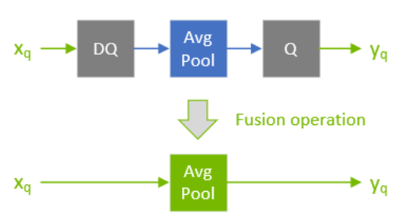
在网络优化过程中，TensorRT通过Q/DQ传播来移动Q/DQ层。传播的目标是最大化可以以低精度处理的图的比例。因此，TensorRT向后传播Q节点（以便尽早进行量化）和向前传播DQ节点（以便尽可能晚地进行去量化）。Q层可以与与量化可交换的层交换位置，而DQ层可以与与去量化可交换的层交换位置。

如果层$Op$与量化可交换，则$Q\text{ }\left(Op\text{ }\left(x\right)\text{ }\right)\text{ }==Op\text{ }\left(Q\text{ }\left(x\right)\text{ }\right)$。

类似地，如果层$Op$与去量化可交换，则$Op\text{ }\left(DQ\text{ }\left(x\right)\text{ }\right)\text{ }==DQ\text{ }\left(Op\text{ }\left(x\right)\text{ }\right)$。

下图说明了DQ正向传播和Q反向传播。这些是模型的合法重写，因为最大池化具有INT8的实现，并且最大池化与DQ和Q可交换。

图2. 描述DQ正向传播和Q反向传播的示意图。  

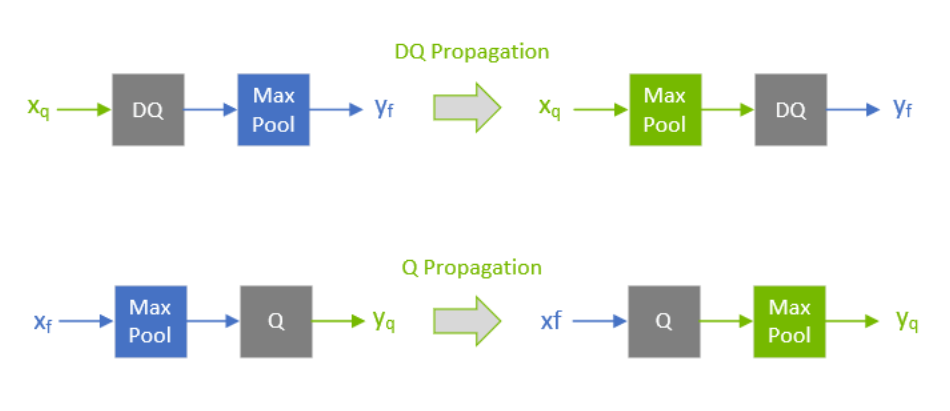

注意：

为了理解最大池化的可交换性，让我们看一下应用于任意输入的最大池化操作的输出。最大池化应用于输入系数的组，并输出具有最大值的系数。对于由系数组成的第i组：$\left\{x_{0\text{ }}.\text{ }.\text{ }x_{m}\right\}$ ：  

$output_{i}\text{ }:=\text{ }\max \left(\left\{x_{0},\text{ }x_{1},\text{ }...\text{ }x_{m}\right\}\right)\text{ } = \text{ }\max \left(\left\{\max \left(\left\{\max \left(\left\{x_{0},\text{ }x_{1}\right\}\right),\text{ }x_{2}\right\},\text{ }...\text{ }x_{m}\right.\right\}\right)$
因此，只需要查看两个任意系数而不会损失一般性（WLOG）：

对于量化函数 $Q(a, scale, x_{\max }, x_{\min }) : = truncate(round(a/ scale), x_{\max }, x_{\min })$，其中 $scale > 0$，注意（不提供证明，并使用简化符号）：

$Q(x_{j}, scale) \geq Q(x_{k}, scale) \text{ 对于 } x_{j} \geq x_{k}$

因此：

$\max \left(\{Q(x_{j}, scale), Q(x_{k}, scale)\}\right) = Q(x_{j}, scale) \text{ 对于 } x_{j} \geq x_{k}$

然而，根据定义：

$Q(\max \{x_{j}, x_{k}\}, scale) = Q(x_{j}, scale) \text{ 对于 } x_{j} \geq x_{k}$

函数 $\max $ 与量化函数交换，最大池化也是如此。

同样地，对于反量化，函数 $DQ(a, scale) := a * scale$，其中 $scale > 0$，我们可以证明：

$\max \{DQ(x_{j}, scale), DQ(x_{k}, scale)\} = DQ(x_{j}, scale) = DQ(\max \{x_{j}, x_{k}\}, scale) \text{ 对于 } x_{j} \geq x_{k}$
有一个区别是可量化层和可交换层的处理方式不同。这两种类型的层都可以使用INT8进行计算，但是可量化层还可以与DQ输入层和一个Q输出层进行融合。例如，一个平均池化层（可量化）既不与Q融合，也不与DQ融合，因此它使用Q/DQ融合进行量化，如第一个图所示。这与最大池化（可交换）的量化方式相反。
### [7.4.4. Q/DQ层放置建议](#qdq-placement-recs)

Q/DQ层在网络中的放置会影响性能和准确性。过度量化可能会导致模型准确性下降，因为量化引入了误差。但是，量化也可以减少延迟。以下是在网络中放置Q/DQ层的一些建议。

**量化所有加权操作的输入**（卷积、转置卷积和GEMM）。对权重和激活进行量化可以减少带宽要求，并且还可以使用INT8计算加速受带宽限制和计算限制的层。

SM 7.5及之前的设备可能没有所有层的INT8实现。在这种情况下，在构建引擎时会遇到找不到任何实现错误。要解决此问题，请删除量化失败层的Q/DQ节点。

图3. TensorRT融合卷积层的两个示例。左侧只量化输入。右侧同时量化输入和输出。

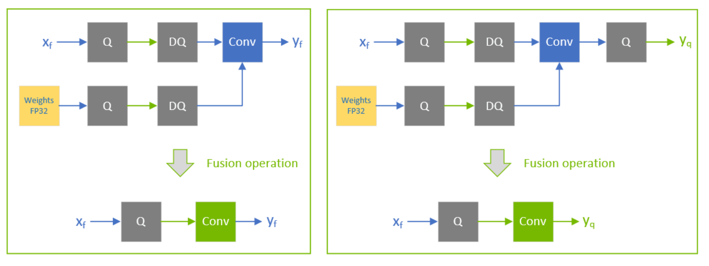

**默认情况下，不要量化加权操作的输出**。有时候保留高精度的反量化输出是有用的。例如，如果线性操作后面跟随一个需要更高精度输入才能产生可接受准确性的激活函数（如下图中的SiLU）。

图4. 线性操作后跟随激活函数的示例。

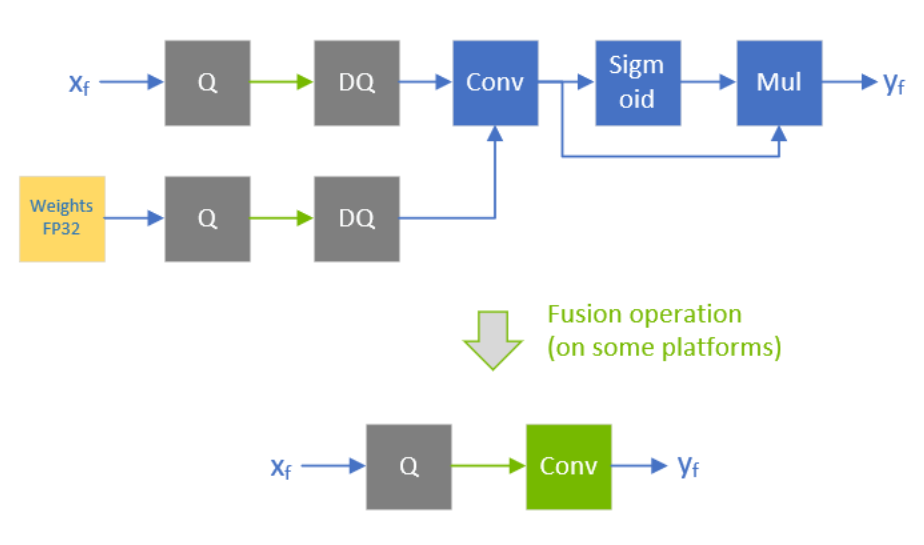

**不要在训练框架中模拟批量归一化和ReLU融合**，因为TensorRT优化保证保留这些操作的算术语义。
图5. 在保持与预融合网络中定义的相同的执行顺序的同时，批量归一化与卷积和ReLU融合在一起。在训练网络中不需要模拟BN折叠。

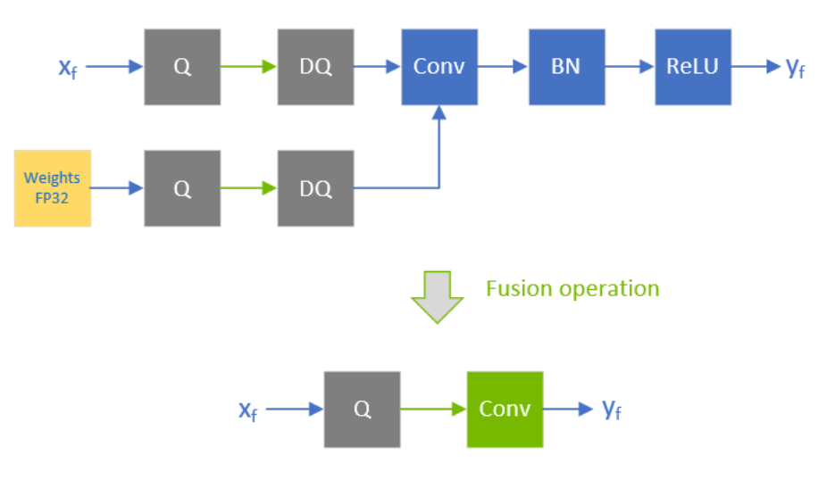

TensorRT可以在加权层后面融合逐元素加法，这对于具有跳跃连接（如ResNet和EfficientNet）的模型非常有用。融合的输出的精度取决于逐元素加法层的第一个输入的精度。

例如，在下图中，xf1的精度是浮点型，因此融合卷积的输出被限制为浮点型，而尾随的Q层无法与卷积融合。

图6. xf1的精度是浮点型，因此融合卷积的输出被限制为浮点型，而尾随的Q层无法与卷积融合。

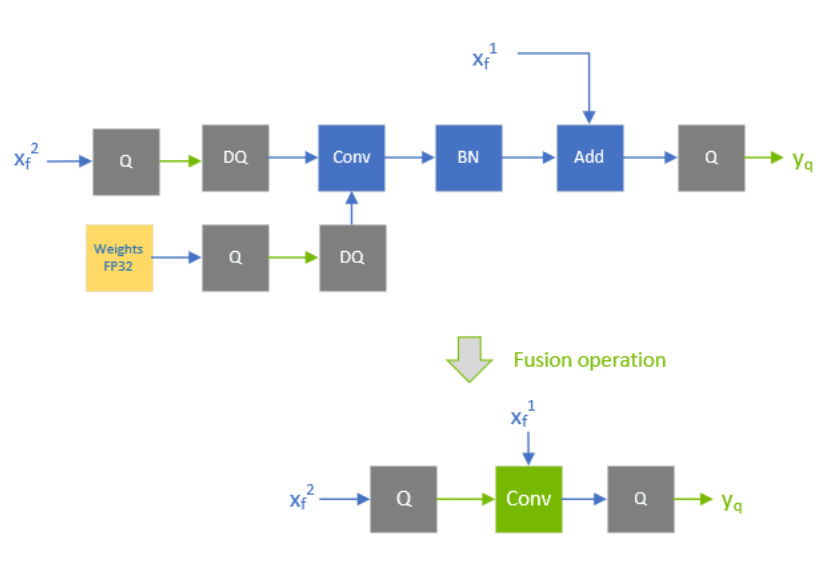

相反，当xf1量化为INT8时，如下图所示，融合卷积的输出也是INT8，而尾随的Q层与卷积融合。

图7. 当xf1量化为INT8时，融合卷积的输出也是INT8，而尾随的Q层与卷积融合。

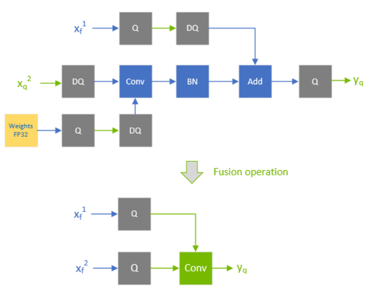
为了提高性能，**尝试对与Q/DQ不对易的层进行量化处理**。目前，具有INT8输入的非加权层也需要INT8输出，因此需要对输入和输出进行量化处理。

图8. 量化可量化操作的示例。逐元素相加与输入DQ和输出Q融合。

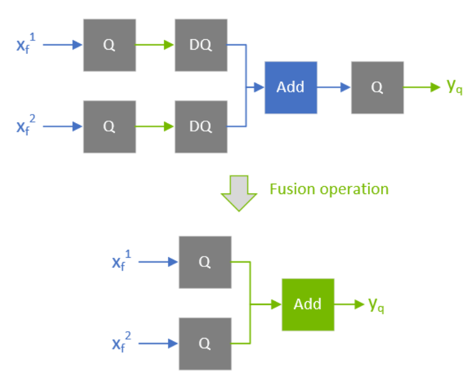

如果TensorRT无法将操作与周围的Q/DQ层融合，性能可能会下降，因此在添加Q/DQ节点时要保守，并考虑准确性和TensorRT性能。

下图是额外的Q/DQ操作可能导致的次优融合示例（突出显示的浅绿色背景矩形）。将下图与[图7](#qdq-placement-recs__xxx)进行对比，后者显示了更高性能的配置。卷积与逐元素相加分别融合，因为它们每个都被Q/DQ对包围。逐元素相加的融合显示在[图8](#qdq-placement-recs__yyy)中。

图9. 次优量化融合示例：对比A中的次优融合和B中的最优融合。额外的一对Q/DQ操作（用发光绿色边框突出显示）导致卷积与逐元素相加分离。

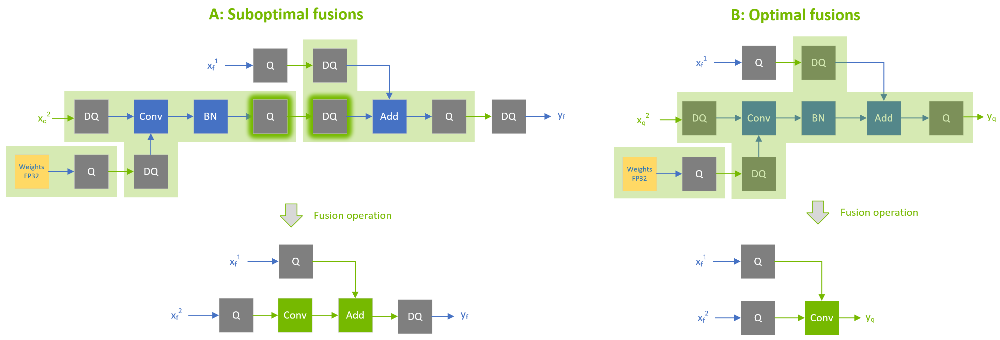

**对激活使用逐张量量化；对权重使用逐通道量化**。经验证明，这种配置在量化准确性方面效果最好。
您可以通过启用FP16进一步优化引擎延迟。TensorRT在可能的情况下尝试使用FP16而不是FP32（目前并不支持所有层类型）。
### [7.4.5. Q/DQ 限制](#qdq-limitations)

TensorRT 执行的一些 Q/DQ 图重写优化会比较两个或多个 Q/DQ 层之间的量化比例值，并且只有在比较的量化比例值相等时才执行图重写。当可重新拟合的 TensorRT 引擎被重新拟合时，Q/DQ 节点的比例可以被分配新的值。在 Q/DQ 引擎的重新拟合操作中，TensorRT 检查参与比例相关优化的 Q/DQ 层是否被分配了破坏重写优化的新值，如果是，则抛出异常。

图 10. _一个示例，显示了 Q1 和 Q2 的比例被比较是否相等，如果相等，则允许向后传播。如果引擎被重新拟合为 Q1 和 Q2 的新值，使得 Q1 != Q2，则会中止重新拟合过程。_


### [7.4.6. 使用 TensorFlow 进行 QAT 网络](#qat-tf)

我们提供了一个开源的 [TensorFlow-Quantization 工具包](https://github.com/NVIDIA/TensorRT/tree/main/tools/tensorflow-quantization)，可以按照 NVIDIA 的 QAT 配方在 TensorFlow 2 Keras 模型中执行 QAT。这将在 NVIDIA GPU 和硬件加速器上实现最佳的模型加速。更多详细信息可以在[_TensorFlow-Quantization 工具包用户指南_](https://docs.nvidia.com/deeplearning/tensorrt/tensorflow-quantization-toolkit/docs/index.html)中找到。

TensorFlow 1 不支持通道精度量化（PCQ）。建议对权重使用 PCQ 以保持模型的准确性。
### [7.4.7. 使用 PyTorch 进行 QAT 网络](#qat-pytorch)

PyTorch 1.8.0 及以后的版本支持 ONNX 的 [QuantizeLinear](https://github.com/onnx/onnx/blob/master/docs/Operators.md#QuantizeLinear)/[DequantizeLinear](https://github.com/onnx/onnx/blob/master/docs/Operators.md#dequantizelinear) 支持通道尺度。您可以使用 [pytorch-quantization](https://github.com/NVIDIA/TensorRT/tree/main/tools/pytorch-quantization) 进行 INT8 校准，运行量化感知微调，生成 ONNX 模型，最后使用 TensorRT 在该 ONNX 模型上运行推理。更多详细信息请参阅 _[PyTorch-Quantization Toolkit 用户指南](https://docs.nvidia.com/deeplearning/tensorrt/pytorch-quantization-toolkit/docs/index.html)_。
### [7.5. INT8 舍入模式](#int8-rounding-modes)

| 后端 | 计算内核量化（FP32 到 INT8） | 权重量化（FP32 到 INT8） |     |
| --- | --- | --- | --- |
| 量化网络（QAT） | 动态范围 API / 校准 |
| --- | --- | --- | --- |
| GPU | 最接近偶数的舍入模式 | 最接近偶数的舍入模式 | 最接近正无穷大的舍入模式 |
| DLA | 最接近零的舍入模式 | 不适用 | 最接近零的舍入模式 |

## [8. 使用动态形状](#work_dynamic_shapes)

_动态形状_是在运行时推迟指定一些或所有张量维度的能力。动态形状可以通过C++和Python接口使用。

以下各节提供了更详细的信息；然而，下面是构建具有动态形状的引擎的步骤概述：

1. 网络定义不能有隐式批处理维度。
    
    C++
    
    通过调用以下方法创建INetworkDefinition：
    
    ```c++
    IBuilder::createNetworkV2(1U <<
            static_cast<int>(NetworkDefinitionCreationFlag::kEXPLICIT_BATCH))
    ```
    
    Python
    
    通过调用以下方法创建tensorrt.INetworkDefinition：
    
    ```python
    create_network(1 <<
            int(tensorrt.NetworkDefinitionCreationFlag.EXPLICIT_BATCH))
    ```
    
    这些调用请求网络没有隐式批处理维度。
2. 使用\-1作为维度的占位符来指定输入张量的每个运行时维度。
3. 在构建时为具有运行时维度的输入指定一个或多个_优化配置文件_，该配置文件指定输入维度的允许范围以及自动调优器将进行优化的维度。有关更多信息，请参阅[优化配置文件](#opt_profiles "优化配置文件描述每个网络输入的维度范围以及自动调优器将用于优化的维度。使用运行时维度时，您必须在构建时创建至少一个优化配置文件。两个配置文件可以指定不相交或重叠的范围。").
4. 要使用引擎：
    1. 从引擎创建执行上下文，与没有动态形状时相同。
    2. 指定步骤3中涵盖输入维度的优化配置文件之一。
    3. 指定执行上下文的输入维度。设置输入维度后，您可以获取TensorRT根据给定的输入维度计算的输出维度。
    4. 排队工作。
要更改运行时维度，请重复步骤4b和4c，直到输入维度发生变化为止。

当启用预览功能（PreviewFeature::kFASTER_DYNAMIC_SHAPES_0805）时，对于动态形状网络，它可以潜在地实现以下效果：

*   减少引擎构建时间，
*   减少运行时间，
*   减少设备内存使用和引擎大小。

最有可能从启用kFASTER_DYNAMIC_SHAPES_0805中受益的模型是基于Transformer的模型和包含动态控制流的模型。
### [8.1. 指定运行时维度](#runtime_dimensions)

在构建网络时，使用\-1来表示输入张量的运行时维度。例如，要创建一个名为foo的3D输入张量，其中最后两个维度在运行时指定，而第一个维度在构建时固定，可以执行以下操作。

C++

```c++
networkDefinition.addInput("foo", DataType::kFLOAT, Dims3(3, -1, -1))
```

Python

```python
network_definition.add_input("foo", trt.float32, (3, -1, -1))
```

在运行时，在选择优化配置文件后，必须设置输入维度（请参阅[优化配置文件](#opt_profiles "优化配置文件描述每个网络输入的维度范围以及自动调谐器用于优化的维度。使用运行时维度时，必须在构建时创建至少一个优化配置文件。两个配置文件可以指定不相交或重叠的范围。")）。假设输入foo的绑定索引为0，并且输入维度为[3,150,250]。在为上一个示例设置优化配置文件后，您将调用：

C++

```c++
context.setBindingDimensions(0, Dims3(3, 150, 250))
```

Python

```python
context.set_binding_shape(0, (3, 150, 250))
```

在运行时，询问引擎的绑定维度将返回用于构建网络的相同维度，这意味着每个运行时维度都会得到一个\-1。例如：

C++

engine.getBindingDimensions(0) 返回具有维度{3, -1, -1}的Dims。

Python

engine.get\_binding\_shape(0) 返回(3, -1, -1)。

要获取实际的维度，即特定于每个执行上下文的维度，请查询执行上下文：

C++

context.getBindingDimensions(0) 返回具有维度{3, 150, 250}的Dims。

Python

context.get\_binding\_shape(0) 返回(3, 150, 250)。
注意：setBindingDimensions的返回值仅表示输入与为该输入设置的优化配置文件一致。在指定了所有输入绑定维度之后，您可以通过查询网络的输出绑定维度来检查整个网络是否与动态输入形状一致。

```c++
nvinfer1::Dims out_dim = context->getBindingDimensions(out_index);

if (out_dim.nbDims == -1) {
gLogError << "无效的网络输出，这可能是由于输入形状不一致引起的。" << std::endl;
// 中止推理
}
```
### [8.2. 命名维度](#named-dimensions)

常量和运行时维度都可以被命名。命名维度有两个好处：

*   对于运行时维度，错误消息使用维度的名称。例如，如果一个输入张量 foo 的维度是 [n,10,m]，那么得到一个关于 m 的错误消息比得到一个关于 (#2 (SHAPE foo)) 的错误消息更有帮助。
*   具有相同名称的维度被隐式视为相等，这有助于优化器生成更高效的引擎，并在运行时诊断不匹配的维度。例如，如果两个输入具有维度 [n,10,m] 和 [n,13]，优化器知道前导维度始终相等，并且在意外使用具有不匹配 n 值的引擎时将报告错误。

只要在运行时它们始终相等，您可以为常量和运行时维度使用相同的名称。

以下语法示例将张量的第三个维度命名为 m。

C++

```c++
tensor.setDimensionName(2, "m")
```

Python

```python
tensor.set_dimension_name(2, "m")
```

有相应的方法来获取维度的名称：

C++

```c++
tensor.getDimensionName(2) 返回张量的第三个维度的名称，如果没有名称则返回 nullptr。
```

Python

```python
tensor.get_dimension_name(2) 返回张量的第三个维度的名称，如果没有名称则返回 None。
```
### [8.3. 优化配置文件](#opt_profiles)

_优化配置文件_描述了每个网络输入的维度范围以及自动调谐器用于优化的维度。当使用运行时维度时，您必须在构建时创建至少一个优化配置文件。两个配置文件可以指定不相交或重叠的范围。

例如，一个配置文件可能指定最小尺寸为[3,100,200]，最大尺寸为[3,200,300]，优化维度为[3,150,250]，而另一个配置文件可能指定最小、最大和优化维度为[3,200,100]、[3,300,400]和[3,250,250]。

要创建一个优化配置文件，首先构建一个IOptimizationProfile。然后设置最小、优化和最大维度，并将其添加到网络配置中。优化配置文件定义的形状必须为网络定义有效的输入形状。以下是对于前面提到的第一个配置文件的调用，针对名为foo的输入：

C++

```c++
IOptimizationProfile* profile = builder.createOptimizationProfile();
profile->setDimensions("foo", OptProfileSelector::kMIN, Dims3(3,100,200);
profile->setDimensions("foo", OptProfileSelector::kOPT, Dims3(3,150,250);
profile->setDimensions("foo", OptProfileSelector::kMAX, Dims3(3,200,300);

config->addOptimizationProfile(profile)
```

Python

```python
profile = builder.create_optimization_profile();
profile.set_shape("foo", (3, 100, 200), (3, 150, 250), (3, 200, 300)) 
config.add_optimization_profile(profile)
```

在运行时，必须在设置输入维度之前设置优化配置文件。配置文件按照它们被添加的顺序编号，从0开始。请注意，每个执行上下文必须使用单独的优化配置文件。

要选择示例中的第一个优化配置文件，使用：

C++

调用 context.setOptimizationProfileAsync(0, stream)

其中stream是用于此上下文中后续的enqueue()、enqueueV2()或enqueueV3()调用的CUDA流。

Python
set context.set_optimization_profile_async(0, stream)

如果关联的CUDA引擎具有动态输入，则必须至少设置一次优化配置文件，该配置文件索引不能被其他未销毁的执行上下文使用。对于为引擎创建的第一个执行上下文，隐式选择配置文件0。

可以调用setOptimizationProfileAsync()函数切换配置文件。在当前上下文中，必须在任何enqueue()、enqueueV2()或enqueueV3()操作完成后调用它。当多个执行上下文同时运行时，允许切换到以前被其他具有不同动态输入维度的执行上下文释放的配置文件。

setOptimizationProfileAsync()函数替代了现在已弃用的API setOptimizationProfile()。使用setOptimizationProfile()在优化配置文件之间切换可能会导致在后续的enqueue()或enqueueV2()操作中进行GPU内存复制操作。为了避免在enqueue期间进行这些调用，应改用setOptimizationProfileAsync() API。
### [8.4. 动态形状的输出](#dynamic-shaped-output)

如果网络的输出具有动态形状，则可以使用几种策略来分配输出内存。

如果输出的维度可以从输入的维度计算得出，请使用IExecutionContext::getTensorShape()来获取输出的维度，在提供输入张量的维度和[形状张量 I/O (高级)](#shape_tensor_io "有时需要将形状张量用作网络的输入/输出张量。例如，考虑一个仅由IShuffleLayer组成的网络。TensorRT可以推断出第二个输入是一个形状张量。ITensor::isShapeTensor对其返回true。因为它是一个输入形状张量，TensorRT对其有两个要求："). 使用IExecutionContext::inferShapes()方法检查是否忘记提供必要的信息。

否则，如果不知道输出的维度是否可以提前计算或者调用enqueueV3，将一个IOutputAllocator与输出相关联。具体而言：

1. 从IOutputAllocator派生自己的分配器类。
2. 重写reallocateOutput和notifyShape方法。当TensorRT需要分配输出内存时，调用第一个方法；当TensorRT知道输出维度时，调用第二个方法。例如，INonZeroLayer的输出内存在层运行之前就已经分配好了。

这是一个示例派生类：

```c++
class MyOutputAllocator : nvinfer1::IOutputAllocator
{
public:
    void* reallocateOutput(
        char const* tensorName, void* currentMemory, 
        uint64_t size, uint64_t alignment) override
    {
        // 分配输出内存。根据具体策略进行分配，并在以后使用时记住。
        outputPtr = ... 根据具体策略进行分配...
       return outputPtr;
    }

    void notifyShape(char const* tensorName, Dims const& dims)
    {
        // 记住输出的维度以备后用。
        outputDims = dims;
    }

    // 输出的维度
    Dims outputDims{};
```
您好，我是一名专业的翻译员。请将其翻译为简体中文，不要修改任何现有的Markdown命令：

```cpp
// 如果无法分配内存，则为nullptr
void* outputPtr{nullptr};
};
```

以下是如何使用的示例：

```c++
std::unordered_map<std::string, MyOutputAllocator> allocatorMap;

for (const char* name : names of outputs)
{
    Dims extent = context->getTensorShape(name);
    void* ptr;
    if (engine->getTensorLocation(name) == TensorLocation::kDEVICE)
    {
        if (extent.d contains a -1)
        {
            auto allocator = std::make_unique<MyOutputAllocator>();
            context->setOutputAllocator(name, allocator.get());
            allocatorMap.emplace(name, std::move(allocator));
        }
        else
        {
            ptr = allocate device memory per extent and format
                   }
    }
    else
    {
        ptr = allocate cpu memory per extent and format
    }
    context->setTensorAddress(name, ptr);
}
```

可以使用多种策略来实现reallocateOutput：

*   推迟分配，直到知道大小。不要调用IExecution::setTensorAddress，或者将其用nullptr调用张量地址。
*   预先分配足够的内存，根据IExecutionTensor::getMaxOutputSize报告的上限。这样可以确保引擎不会因为缺乏足够的输出内存而失败，但上限可能太高而无用。
*   基于经验预先分配足够的内存，使用IExecution::setTensorAddress告诉TensorRT。如果张量不适合，则使reallocateOutput返回nullptr，这将导致引擎正常失败。
*   像C语言一样预先分配内存，但是如果有适配问题，则使reallocateOutput返回指向更大缓冲区的指针。根据需要增加输出缓冲区。
*   像A一样推迟分配，直到知道大小。然后，在后续调用中尝试回收该分配，直到请求更大的缓冲区，然后像D一样增加它。

以下是实现E的示例派生类：

```c++
class FancyOutputAllocator : nvinfer1::IOutputAllocator
{
public:

    void reallocateOutput(
        char const* tensorName, void* currentMemory,
        uint64_t size, uint64_t alignment) override
    {
        if (size > outputSize)
        {
            // 需要重新分配
            cudaFree(outputPtr);
            outputPtr = nullptr;
            outputSize = 0;
            if (cudaMalloc(&outputPtr, size) == cudaSuccess)
            {
                outputSize = size;
            }
        }
        // 如果cudaMalloc失败，outputPtr=nullptr，引擎将优雅地失败。
        return outputPtr;
    }

    void notifyShape(char const* tensorName, Dims const& dims)
    {
        // 记住输出张量的维度以供以后使用。
        outputDims = dims;
    }

    // 保存输出张量的维度
    Dims outputDims{};

    // 如果内存无法分配，则为nullptr
    void* outputPtr{nullptr};

    // 指向输出分配的大小
    uint64_t outputSize{0};

    ~FancyOutputAllocator() override
    {
        cudaFree(outputPtr);
    }
};
```

### [8.4.1. 查找多个优化配置文件的绑定索引](#binding-indices-opt-profiles)

如果使用enqueueV3而不是已弃用的enqueueV2，可以跳过此部分，因为基于名称的方法（如IExecutionContext::setTensorAddress）不需要配置文件后缀。

在由多个优化配置文件构建的引擎中，每个配置文件都有单独的绑定索引。对于第_K_个配置文件的输入/输出张量，它们的名称会在后面附加[profile _K_]，其中_K_以十进制形式表示。例如，如果INetworkDefinition的名称为“foo”，并且bindingIndex引用了具有索引3的优化配置文件中的张量，则engine.getBindingName(bindingIndex)会返回“foo [profile 3]”。

同样，如果使用ICudaEngine::getBindingIndex(name)来获取第_K_个配置文件（_K>0_）中的索引，需要在INetworkDefinition中使用的名称后面附加“[profile _K_]”。例如，如果在INetworkDefinition中张量的名称为“foo”，则engine.getBindingIndex(“foo [profile 3]“)会返回优化配置文件3中张量“foo”的绑定索引。

对于_K=0_，始终省略后缀。
### [8.4.2. 多个优化配置的绑定](#opt_profiles_bindings)

考虑一个具有四个输入和一个输出的网络，IBuilderConfig中有三个优化配置。引擎有15个绑定，每个优化配置有五个绑定，概念上组织成一个表格：

图11. 优化配置表格  
  


  
  

每一行都是一个优化配置。表格中的数字表示绑定索引。第一个优化配置的绑定索引是0到4，第二个是5到9，第三个是10到14。

接口中有一个“自动修正”功能，用于处理绑定属于第一个优化配置，但指定了其他优化配置的情况。在这种情况下，TensorRT会发出警告，然后从相同列中选择正确的绑定索引。

为了向后半兼容，接口中还有一个“自动修正”功能，用于处理绑定属于第一个优化配置，但指定了其他优化配置的情况。在这种情况下，TensorRT会发出警告，然后从相同列中选择正确的绑定索引。
### [8.5. 动态形状的层扩展](#layer_ex)

一些层具有可选输入，允许指定动态形状信息，并且有一个新的层IShapeLayer用于在运行时访问张量的形状。此外，一些层允许计算新的形状。下一节将详细介绍语义细节和限制。以下是与动态形状结合使用时可能有用的摘要。

IShapeLayer输出一个包含输入张量的维度的一维张量。例如，如果输入张量的维度为[2,3,5,7]，则输出张量是一个包含{2,3,5,7}的四个元素的一维张量。如果输入张量是一个标量，它的维度为[]，输出张量是一个包含{}的零元素一维张量。

IResizeLayer接受一个可选的第二个输入，其中包含输出的所需维度。

IShuffleLayer接受一个可选的第二个输入，其中包含在应用第二次转置之前的重塑维度。例如，以下网络将张量Y重塑为与X具有相同维度的形状：

C++

```c++
    auto* reshape = networkDefinition.addShuffle(Y);
    reshape.setInput(1, networkDefintion.addShape(X)->getOutput(0));
```

Python

```python
    reshape = network_definition.add_shuffle(y)
    reshape.set_input(1, network_definition.add_shape(X).get_output(0))
```

ISliceLayer接受可选的第二、第三和第四个输入，其中包含起始位置、大小和步长。

```c++
IConcatenationLayer、IElementWiseLayer、IGatherLayer、IIdentityLayer和IReduceLayer
```

可以用于对形状进行计算并创建新的形状张量。
### [8.6. 动态形状的限制](#rest_dynamic_shapes)

以下是由于层的权重具有固定大小而产生的层限制：

*   IConvolutionLayer 和 IDeconvolutionLayer 要求通道维度是一个构建时常量。
*   IFullyConnectedLayer 要求最后三个维度是构建时常量。
*   Int8 要求通道维度是一个构建时常量。
*   接受额外形状输入的层（IResizeLayer、IShuffleLayer、ISliceLayer）要求额外形状输入与最小和最大优化配置文件的维度以及运行时数据输入的维度兼容；否则，可能会导致构建时或运行时错误。

必须是构建时常量的值在 API 级别上不必是常量。TensorRT 的形状分析器通过对进行形状计算的层进行逐元素常量传播来实现。只需常量传播发现一个值是构建时常量即可。

有关层的更多信息，请参阅[TensorRT 运算符参考](https://docs.nvidia.com/deeplearning/tensorrt/operators/docs/index.html)。
### [8.7. 执行张量与形状张量](#exe_shape_tensors)

TensorRT 8.5 在很大程度上消除了执行张量和形状张量之间的区别。然而，如果设计网络或分析性能，了解内部和内部同步发生的位置可能会有所帮助。

使用动态形状的引擎采用了乒乓执行策略。

1. 在 CPU 上计算张量的形状，直到达到需要 GPU 结果的形状。
2. 将任务流传输到 GPU，直到没有任务或达到未知形状。如果是后者，则进行同步并返回到步骤 1。

_执行张量_ 是传统的 TensorRT 张量。_形状张量_ 是与形状计算相关的张量。它必须具有 Int32、Float 或 Bool 类型，其形状必须在构建时可确定，并且其元素数量不能超过 64 个。有关形状张量在网络 I/O 边界处的附加限制，请参阅[形状张量 I/O (高级)](#shape_tensor_io "有时需要将形状张量用作网络 I/O 张量。例如，考虑一个仅由 IShuffleLayer 组成的网络。TensorRT 推断第二个输入是一个形状张量。ITensor::isShapeTensor 返回 true。因为它是一个输入形状张量，TensorRT 对其有两个要求:")。例如，有一个 IShapeLayer，其输出是包含输入张量维度的一维张量。输出是一个形状张量。IShuffleLayer 接受一个可选的第二个输入，用于指定重塑的维度。第二个输入必须是一个形状张量。

一些层对它们处理的张量类型是“多态”的。例如，IElementWiseLayer 可以对两个 INT32 执行张量求和，也可以对两个 INT32 形状张量求和。张量的类型取决于它的最终用途。如果求和用于重塑另一个张量，则它是一个“形状张量”。
当TensorRT需要一个形状张量，但张量被分类为执行张量时，运行时必须将张量从GPU复制到CPU，这会产生同步开销。
### [8.7.1. 形式推理规则](#形式推理规则)

TensorRT用于对张量进行分类的形式推理规则基于类型推理代数。设E表示执行张量，S表示形状张量。

IActivationLayer的签名为：

```c++
IActivationLayer: E → E
```

因为它以执行张量作为输入和执行张量作为输出。IElementWiseLayer在这方面是多态的，具有两个签名：

```c++
IElementWiseLayer: S × S → S, E × E → E
```

为了简洁起见，让我们采用约定，_t_表示一个变量，表示任一类张量，签名中的所有_t_都指的是同一类张量。那么，前面两个签名可以写成一个多态签名：

```c++
IElementWiseLayer: t × t → t
```

两输入的IShuffleLayer的第二个输入是一个形状张量，并且相对于第一个输入是多态的：

```c++
IShuffleLayer (两个输入): t × S → t
```

IConstantLayer没有输入，但可以生成任一种类的张量，因此其签名为：

```c++
IConstantLayer: → t
```

IShapeLayer的签名允许所有四种可能的组合E→E、E→S、S→E和S→S，因此可以用两个独立变量来表示：

```c++
IShapeLayer: t1 → t2
```

以下是完整的规则集，也是用于操作形状张量的层的参考：

```c++
IAssertionLayer: S → 
IConcatenationLayer: t × t × ...→ t
IIfConditionalInputLayer: t → t
IIfConditionalOutputLayer: t → t
IConstantLayer: → t
IActivationLayer: t → t
IElementWiseLayer: t × t → t
IFillLayer: S → t
IFillLayer: S × E × E → E 
IGatherLayer: t × t → t
IIdentityLayer: t → t
IReduceLayer: t → t
IResizeLayer (一个输入): E → E
IResizeLayer (两个输入): E × S → E
ISelectLayer: t × t × t → t
IShapeLayer: t1 → t2
IShuffleLayer (一个输入): t → t
IShuffleLayer (两个输入): t × S → t
ISliceLayer (一个输入): t → t
ISliceLayer (两个输入): t × S → t
ISliceLayer (三个输入): t × S × S → t

ISliceLayer（四个输入）：t × S × S × S → t
IUnaryLayer：t → t
所有其他层：E × ... → E × ...
```

由于一个输出可以是多个后续层的输入，推断的“类型”并不是互斥的。例如，IConstantLayer的输出可以作为一个需要执行张量的使用和一个需要形状张量的使用的输入。IConstantLayer的输出被分类为两者，并且可以在两阶段执行的第一阶段和第二阶段中使用。

形状张量的大小在构建时必须已知，这限制了ISliceLayer用于操作形状张量的方式。具体而言，如果第三个参数（指定结果的大小）不是构建时常数，则结果张量的长度在构建时是未知的，从而打破了形状张量具有常数形状的限制。切片仍然可以工作，但会在运行时产生同步开销，因为张量被视为需要被复制回CPU进行进一步形状计算的执行张量。

任何张量的秩必须在构建时已知。例如，如果ISliceLayer的输出是一个未知长度的1D张量，用作IShuffleLayer的重塑维度，那么重塑的输出在构建时将具有未知的秩，因此不允许这样的组合。

可以使用ITensor::isShapeTensor()方法检查TensorRT的推断，该方法对于形状张量返回true，并使用ITensor::isExecutionTensor()方法对于执行张量返回true。在调用这些方法之前，先构建整个网络，因为它们的答案可能会根据张量的使用情况而改变。
您是一名专业的翻译员。将其翻译为简体中文，不要修改任何现有的Markdown命令：例如，如果一个部分构建的网络将两个张量_T1_和_T2_相加得到张量_T3_，并且目前都不需要作为形状张量，那么isShapeTensor()对于这三个张量都返回false。如果将IShuffleLayer的第二个输入设置为_T3_，那么这三个张量都将变成形状张量，因为IShuffleLayer要求它的第二个可选输入是一个形状张量，如果IElementWiseLayer的输出是一个形状张量，那么它的输入也是形状张量。
### [8.8. 形状张量的输入输出（高级）](#shape_tensor_io)

有时候需要将形状张量用作网络的输入输出张量。例如，考虑一个只包含 IShuffleLayer 的网络。TensorRT 推断第二个输入是一个形状张量。ITensor::isShapeTensor 返回 true。因为它是一个输入形状张量，TensorRT 对其有两个要求：

*   在构建时：形状张量的优化配置 _values_。
*   在运行时：形状张量的 _values_。

输入形状张量的形状在构建时总是已知的。需要描述的是其值，因为它们可以用于指定执行张量的维度。

优化配置的值可以使用 IOptimizationProfile::setShapeValues 来设置。类似于执行张量的运行时维度需要提供 min、max 和优化维度，形状张量在构建时需要提供 min、max 和优化值。

相应的运行时方法是 IExecutionContext::setTensorAddress，它告诉 TensorRT 在哪里查找形状张量的值。

由于“执行张量”与“形状张量”的推断是基于最终的使用情况的，TensorRT 无法推断网络的输出是否是一个形状张量。您必须使用 INetworkDefinition::markOutputForShapes 方法告诉它。

除了允许您输出形状信息以进行调试，这个特性还可以用于组合引擎。例如，考虑构建三个引擎，分别用于子网络 A、B、C，其中从 A 到 B 或从 B 到 C 的连接可能涉及一个形状张量。以相反的顺序构建网络：C、B 和 A。在构建网络 C 后，您可以使用 ITensor::isShapeTensor 来确定输入是否为形状张量，并使用 INetworkDefinition::markOutputForShapes 来标记网络 B 中相应的输出张量。然后检查 B 的哪些输入是形状张量，并标记网络 A 中相应的输出张量。
您是一名专业的翻译员。将其翻译成简体中文，不要修改任何现有的Markdown命令：网络边界处的形状张量必须具有Int32类型。它们不能具有Float或Bool类型。对于Bool类型，可以使用Int32类型的I/O张量，并使用零和一进行转换，然后使用IIdentityLayer进行Bool类型的转换。

在运行时，可以通过ICudaEngine::isShapeInferenceIO()方法确定张量是否为I/O形状张量。
### [8.9. INT8动态形状校准](#int8-calib-dynamic-shapes)

要对具有动态形状的网络进行INT8校准，必须设置一个校准优化配置文件。校准是使用配置文件的kOPT值进行的。校准输入数据的大小必须与此配置文件匹配。

要创建一个校准优化配置文件，首先以与一般优化配置文件相同的方式构建一个IOptimizationProfile。然后将该配置文件设置为配置中的配置：

C++

```c++
config->setCalibrationProfile(profile)
```

Python

```python
config.set_calibration_profile(profile)
```

校准配置文件必须有效或为nullptr。kMIN和kMAX值将被kOPT覆盖。要检查当前的校准配置文件，请使用IBuilderConfig::getCalibrationProfile。

此方法返回指向当前校准配置文件的指针，如果校准配置文件未设置，则返回nullptr。当对具有动态形状的网络进行校准时，getBatchSize()校准方法必须返回1。

注意：如果未设置校准优化配置文件，则将使用第一个网络优化配置文件作为校准优化配置文件。


## [9. 扩展TensorRT与自定义层](#extending)

NVIDIA TensorRT支持许多类型的层，并且其功能不断扩展；然而，有时候支持的层不能满足模型的特定需求。在这种情况下，可以通过实现自定义层来扩展TensorRT，通常称为插件。

TensorRT包含可以加载到应用程序中的插件。有关开源插件的列表，请参阅[GitHub：TensorRT插件](https://github.com/NVIDIA/TensorRT/tree/main/plugin#tensorrt-plugins)。

要在应用程序中使用TensorRT插件，必须加载libnvinfer\_plugin.so（在Windows上为nvinfer\_plugin.dll）库，并通过在应用程序代码中调用initLibNvInferPlugins来注册所有插件。有关这些插件的更多信息，请参阅[NvInferPlugin.h](https://docs.nvidia.com/deeplearning/sdk/tensorrt-api/c_api/_nv_infer_plugin_8h.html)文件。

如果这些插件不能满足您的需求，您可以编写并添加自己的插件。
### [9.1. 使用C++ API添加自定义层](#add_custom_layer)

您可以通过从TensorRT的插件基类派生出一个自定义层来实现。

从插件基类中派生您的插件类。它们在支持不同类型/格式的I/O或具有动态形状的网络方面具有不同的表达能力。下表总结了基类，按从最不具表达能力到最具表达能力的顺序排列。

注意：如果插件用于通用用途，请提供FP32实现，以便允许它与任何网络正确运行。

表3. 基类，按从最不具表达能力到最具表达能力的顺序排列
|     | 引入TensorRT版本？ | 混合I/O格式/类型 | 动态形状？ | 支持隐式/显式批处理模式？ |
| --- | --- | --- | --- | --- |
| [IPluginV2Ext](https://docs.nvidia.com/deeplearning/sdk/tensorrt-api/c_api/classnvinfer1_1_1_i_plugin_v2_ext.html) | 5.1 | 有限 | 否 | 隐式和显式批处理模式 |
| [IPluginV2IOExt](https://docs.nvidia.com/deeplearning/sdk/tensorrt-api/c_api/classnvinfer1_1_1_i_plugin_v2_i_o_ext.html) | 6.0.1 | 通用 | 否 | 隐式和显式批处理模式 |
| [IPluginV2DynamicExt](https://docs.nvidia.com/deeplearning/sdk/tensorrt-api/c_api/classnvinfer1_1_1_i_plugin_v2_dynamic_ext.html) | 6.0.1 | 通用 | 是 | 仅显式批处理模式 |

为了在网络中使用插件，您必须先在TensorRT的PluginRegistry（[C++](https://docs.nvidia.com/deeplearning/tensorrt/api/c_api/classnvinfer1_1_1_i_plugin_registry.html)，[Python](https://docs.nvidia.com/deeplearning/tensorrt/api/python_api/infer/Plugin/IPluginRegistry.html)）中注册它。与直接注册插件不同，您需要注册一个派生自PluginCreator的插件工厂类的实例。插件创建者类还提供有关插件的其他信息：名称、版本和插件字段参数。

有两种方法可以将插件注册到注册表中：

*   TensorRT提供了一个宏REGISTER_TENSORRT_PLUGIN，用于静态注册插件创建者到注册表中。请注意，REGISTER_TENSORRT_PLUGIN总是将创建者注册到默认命名空间（“”）下。
*   动态注册插件，类似于initLibNvInferPlugins，通过创建自己的入口点并在插件注册表上调用registerCreator来进行注册。这种方法优于静态注册，因为它可以提供更低的内存占用，并允许插件在唯一的命名空间下注册。这样可以确保在不同的插件库之间的构建期间不会发生名称冲突。

调用IPluginCreator::createPlugin()会返回一个类型为IPluginV2的插件对象。您可以使用[addPluginV2()](https://docs.nvidia.com/deeplearning/sdk/tensorrt-api/c_api/classnvinfer1_1_1_i_network_definition.html#a0c6e2a0b4e1c8a4df1722a24cc7c0473)将插件添加到TensorRT网络中，该函数会创建一个具有给定插件的网络层。

例如，您可以按如下方式向网络中添加一个插件层：

```c++
// 在注册表中查找插件
auto creator = getPluginRegistry()->getPluginCreator(pluginName, pluginVersion);

const PluginFieldCollection* pluginFC = creator->getFieldNames();
// 为插件层填充字段参数
// PluginFieldCollection *pluginData = parseAndFillFields(pluginFC, layerFields);
// 使用layerName和插件元数据创建插件对象
IPluginV2 *pluginObj = creator->createPlugin(layerName, pluginData);
// 将插件添加到TensorRT网络中
auto layer = network.addPluginV2(&inputs[0], int(inputs.size()), pluginObj);
...（构建网络的其余部分并序列化引擎）
// 销毁插件对象
pluginObj->destroy()
...（释放已分配的pluginData）
```

注意：前面描述的createPlugin方法在堆上创建一个新的插件对象，并返回一个指向它的指针。确保像前面展示的那样销毁pluginObj，以避免内存泄漏。

在序列化期间，TensorRT引擎在内部存储了所有IPluginV2类型插件的插件类型、插件版本和命名空间（如果存在）。在反序列化期间，TensorRT从插件注册表中查找插件创建者，并调用IPluginCreator::deserializePlugin()。当引擎被删除时，通过调用IPluginV2::destroy()方法，引擎销毁了在构建引擎期间创建的插件对象的克隆。您有责任确保在将插件添加到网络后，释放您创建的插件对象。

注意：

- 不要序列化所有插件参数：只需序列化运行时插件正确运行所需的参数。构建时参数可以省略。
- 在序列化和反序列化期间以相同的顺序序列化和反序列化插件参数。在反序列化期间，验证插件参数是初始化为默认值还是反序列化值。未初始化的参数会导致未定义行为。
### [9.1.1. 示例: 使用C++添加具有动态形状支持的自定义层](#example3_add_custlay_dynamic)

要支持动态形状，您的插件必须派生自IPluginV2DynamicExt。

BarPlugin是一个具有两个输入和两个输出的插件，其中：

*   第一个输出是第二个输入的副本。
*   第二个输出是两个输入的连接，沿第一个维度，所有类型/格式必须相同且为线性格式。

BarPlugin必须如下派生：

```c++
class BarPlugin : public IPluginV2DynamicExt
{
	...覆盖从IPluginV2DynamicExt继承的虚拟方法。
};
```

受动态形状影响的四个方法是：

*   getOutputDimensions
*   supportsFormatCombination
*   configurePlugin
*   enqueue

getOutputDimensions的覆盖以符号表达式的形式返回输出维度，以输入维度为基础构建表达式，使用传递给getOutputDimensions的IExprBuilder。在示例中，对于情况1，不需要构建新的表达式，因为第二个输出的维度与第一个输入的维度相同。

```c++
DimsExprs BarPlugin::getOutputDimensions(int outputIndex, 
    const DimsExprs* inputs, int nbInputs, 
    IExprBuilder& exprBuilder)
{
    switch (outputIndex)
    {
    case 0: 
    {
        // 输出的第一个维度是输入第一个维度的总和。
        DimsExprs output(inputs[0]);
        output.d[0] = 
            exprBuilder.operation(DimensionOperation::kSUM, 
                inputs[0].d[0], inputs[1].d[0]);
	   return output;
    }
    case 1:
        return inputs[0];
    default:
         throw std::invalid_argument(“invalid output”);
}
```
supportsFormatCombination的重写必须指示是否允许格式组合。该接口将输入/输出统一索引为“连接”，从第一个输入开始为0，然后按顺序处理其余的输入，然后对输出进行编号。在示例中，输入是连接0和1，输出是连接2和3。

TensorRT使用supportsFormatCombination来询问给定的格式/类型组合是否适用于连接，给定较低索引连接的格式/类型。因此，重写可以假定较低索引的连接已经经过审查，并关注索引为pos的连接。

```c++
bool BarPlugin::supportsFormatCombination(int pos, const PluginTensorDesc* inOut, int nbInputs, int nbOutputs) override
{
    assert(0 <= pos && pos < 4);
    const auto* in = inOut;
    const auto* out = inOut + nbInputs;
    switch (pos)
    {
    case 0: return in[0].format == TensorFormat::kLINEAR;
    case 1: return in[1].type == in[0].type &&
                   in[1].format == TensorFormat::kLINEAR;
    case 2: return out[0].type == in[0].type &&
                   out[0].format == TensorFormat::kLINEAR;
    case 3: return out[1].type == in[0].type &&
                   out[1].format == TensorFormat::kLINEAR;
    }
    throw std::invalid_argument(“invalid connection number”);
}
```

这里的局部变量in和out允许按输入或输出编号而不是连接编号来检查inOut。

重要提示：重写检查索引小于pos的连接的格式/类型，但绝不能检查索引大于pos的连接的格式/类型。示例使用case 3来检查连接3与连接0的情况，而不使用case 0来检查连接0与连接3的情况。

TensorRT使用configurePlugin在运行时设置插件。此插件不需要configurePlugin执行任何操作，因此它是一个空操作：

```c++
void BarPlugin::configurePlugin(
    const DynamicPluginTensorDesc* in, int nbInputs, 
```
const DynamicPluginTensorDesc* out, int nbOutputs) override
{
}
如果插件需要知道可能遇到的最小或最大维度，可以检查DynamicPluginTensorDesc::min或DynamicPluginTensorDesc::max字段，以获取任何输入或输出的信息。格式和构建时的维度信息可以在DynamicPluginTensorDesc::desc中找到。任何运行时维度都显示为-1。实际维度由BarPlugin::enqueue提供。

最后，重写BarPlugin::enqueue必须完成工作。由于形状是动态的，enqueue接收到一个PluginTensorDesc，描述每个输入和输出的实际维度、类型和格式。
### [9.1.2. 示例：使用C++添加支持INT8 I/O的自定义层](#example4_add_custlay_int8)

PoolPlugin是一个插件，用于演示如何扩展自定义池化层的INT8 I/O。推导如下：

```c++
class PoolPlugin : public IPluginV2IOExt
{
    ...重写继承自IPluginV2IOExt的虚方法。
};
```

大多数纯虚方法对于插件是通用的。对INT8 I/O产生影响的主要方法有：

*   supportsFormatCombination
*   configurePlugin
*   enqueue

supportsFormatCombination的重写必须指示允许的INT8 I/O组合。此接口的使用与[示例：使用C++添加支持动态形状的自定义层](#example3_add_custlay_dynamic "要支持动态形状，您的插件必须派生自IPluginV2DynamicExt。")类似。在本示例中，支持的I/O张量格式为带有FP32、FP16或INT8数据类型的线性CHW，但I/O张量必须具有相同的数据类型。

```c++
bool PoolPlugin::supportsFormatCombination(int pos, const PluginTensorDesc* inOut, int nbInputs, int nbOutputs) const override
{
    assert(nbInputs == 1 && nbOutputs == 1 && pos < nbInputs + nbOutputs);
    bool condition = inOut[pos].format == TensorFormat::kLINEAR;
    condition &= ((inOut[pos].type == DataType::kFLOAT) ||
                  (inOut[pos].type == DataType::kHALF) ||
                  (inOut[pos].type == DataType::kINT8));
    condition &= inOut[pos].type == inOut[0].type;
    return condition;
}
```

重要提示：

*   如果在具有INT8 I/O插件的网络中必须使用INT8校准，则插件必须支持FP32 I/O，因为TensorRT使用FP32来校准图形。
*   如果不支持FP32 I/O变体或不使用INT8校准，则必须显式设置所有所需的INT8 I/O张量缩放。
*   校准无法确定插件内部张量的动态范围。操作量化数据的插件必须为内部张量计算自己的动态范围。
TensorRT通过调用configurePlugin方法来通过PluginTensorDesc将信息传递给插件，这些信息存储为成员变量，并进行序列化和反序列化。

```c++
void PoolPlugin::configurePlugin(const PluginTensorDesc* in, int nbInput, const PluginTensorDesc* out, int nbOutput)
{
    ...
    mPoolingParams.mC = mInputDims.d[0];
    mPoolingParams.mH = mInputDims.d[1];
    mPoolingParams.mW = mInputDims.d[2];
    mPoolingParams.mP = mOutputDims.d[1];
    mPoolingParams.mQ = mOutputDims.d[2];
    mInHostScale = in[0].scale >= 0.0F ? in[0].scale : -1.0F;
    mOutHostScale = out[0].scale >= 0.0F ? out[0].scale : -1.0F;
}
```

其中，INT8输入/输出的比例可以从PluginTensorDesc::scale获取。

最后，重写的UffPoolPluginV2::enqueue方法需要完成工作。它包括一系列核心算法，通过使用实际的批大小、输入、输出、cuDNN流和配置的信息，在运行时执行自定义层。

```c++
int PoolPlugin::enqueue(int batchSize, const void* const* inputs, void** outputs, void* workspace, cudaStream_t stream)
{
    ...
    CHECK(cudnnPoolingForward(mCudnn, mPoolingDesc, &kONE, mSrcDescriptor, input, &kZERO, mDstDescriptor, output));
    ...
    return 0;
}
```
### [9.2. 使用 Python API 添加自定义层](#add_custom_layer_python)

尽管 C++ API 是实现自定义层的首选语言，因为可以访问 CUDA 和 cuDNN 等库，但您也可以在 Python 应用程序中使用自定义层。

您可以使用 C++ API 创建自定义层，在 Python 中使用 pybind11 打包该层，然后将插件加载到 Python 应用程序中。有关更多信息，请参阅[在 Python 中创建网络定义](#network_python "在创建了构建器之后，优化模型的第一步是创建网络定义。")。

相同的自定义层实现可以用于 C++ 和 Python。
### [9.2.1. 示例：使用Python向TensorRT网络添加自定义层](#example1_add_custom_layer_python)

可以使用插件节点在Python中向任何TensorRT网络中添加自定义层。

Python API提供了一个名为[add\_plugin\_v2](https://docs.nvidia.com/deeplearning/sdk/tensorrt-api/python_api/infer/Graph/Network.html#tensorrt.INetworkDefinition.add_plugin_v2)的函数，可以向网络中添加插件节点。以下示例说明了这一点。它创建了一个简单的TensorRT网络，并通过查找TensorRT插件注册表来添加了一个泄漏ReLU插件节点。

```python
import tensorrt as trt
import numpy as np

TRT_LOGGER = trt.Logger()

trt.init_libnvinfer_plugins(TRT_LOGGER, '')
PLUGIN_CREATORS = trt.get_plugin_registry().plugin_creator_list

def get_trt_plugin(plugin_name):
        plugin = None
        for plugin_creator in PLUGIN_CREATORS:
            if plugin_creator.name == plugin_name:
                lrelu_slope_field = trt.PluginField("neg_slope", np.array([0.1], dtype=np.float32), trt.PluginFieldType.FLOAT32)
                field_collection = trt.PluginFieldCollection([lrelu_slope_field])
                plugin = plugin_creator.create_plugin(name=plugin_name, field_collection=field_collection)
        return plugin

def main():
    builder = trt.Builder(TRT_LOGGER) 
    network = builder.create_network()
    config = builder.create_builder_config()
    config.max_workspace_size = 2**20
    input_layer = network.add_input(name="input_layer", dtype=trt.float32, shape=(1, 1))
    lrelu = network.add_plugin_v2(inputs=[input_layer], plugin=get_trt_plugin("LReLU_TRT"))
    lrelu.get_output(0).name = "outputs"
    network.mark_output(lrelu.get_output(0))
```

### [9.3. 使用自定义层在解析器中导入模型](#using_custom_layer)

ONNX 解析器会自动尝试将无法识别的节点作为插件导入。如果在插件注册表中找到与节点相同的 op\_type 的插件，解析器将将节点的属性作为插件字段参数转发给插件创建者，以便创建插件。默认情况下，解析器使用“1”作为插件版本，使用“”作为插件命名空间。可以通过在相应的 ONNX 节点中设置 plugin\_version 和 plugin\_namespace 字符串属性来覆盖此行为。

在某些情况下，您可能希望在将 ONNX 图导入到 TensorRT 之前修改它。例如，用插件节点替换一组操作。为了实现这一目标，您可以使用 [ONNX GraphSurgeon 工具](https://github.com/NVIDIA/TensorRT/tree/main/tools/onnx-graphsurgeon)。有关如何使用 ONNX-GraphSurgeon 替换子图的详细信息，请参考 [此示例](https://github.com/NVIDIA/TensorRT/tree/main/tools/onnx-graphsurgeon/examples/08_replacing_a_subgraph)。

更多示例，请参考 [onnx\_packnet](https://github.com/NVIDIA/TensorRT/tree/main/samples/python/onnx_packnet) 示例。
### [9.4. 插件 API 描述](#plugin-api-desc)

所有新的插件都应该从 IPluginCreator 和 [使用 C++ API 添加自定义层](#add_custom_layer "您可以通过从 TensorRT 的插件基类之一派生来实现自定义层。") 中描述的插件基类之一派生。此外，新的插件还应该调用 REGISTER\_TENSORRT\_PLUGIN(...) 宏来将插件注册到 TensorRT 插件注册表中，或者创建一个等效于 initLibNvInferPlugins() 的初始化函数。
### [9.4.1. 将插件从TensorRT 6.x或7.x迁移到TensorRT 8.x.x](#migrating-plugins-6x-7x-to-8x)

为了向后兼容TensorRT 5.1和6.0.x，仍然支持IPluginV2和IPluginV2Ext。然而，新的插件应该针对IPluginV2DynamicExt或IPluginV2IOExt接口，并且应该重构旧插件以使用这些接口。

IPluginV2DynamicExt中的新功能如下：

```c++
virtual DimsExprs getOutputDimensions(int outputIndex, const DimsExprs* inputs, int nbInputs, IExprBuilder& exprBuilder) = 0;

virtual bool supportsFormatCombination(int pos, const PluginTensorDesc* inOut, int nbInputs, int nbOutputs) = 0;

virtual void configurePlugin(const DynamicPluginTensorDesc* in, int nbInputs, const DynamicPluginTensorDesc* out, int nbOutputs) = 0;

virtual size_t getWorkspaceSize(const PluginTensorDesc* inputs, int nbInputs, const PluginTensorDesc* outputs, int nbOutputs) const = 0;

virtual int enqueue(const PluginTensorDesc* inputDesc, const PluginTensorDesc* outputDesc, const void* const* inputs, void* const* outputs, void* workspace, cudaStream_t stream) = 0;
```

IPluginV2IOExt中的新功能如下：

```c++
virtual void configurePlugin(const PluginTensorDesc* in, int nbInput, const PluginTensorDesc* out, int nbOutput) = 0;

virtual bool supportsFormatCombination(int pos, const PluginTensorDesc* inOut, int nbInputs, int nbOutputs) const = 0;
```

迁移到IPluginV2DynamicExt或IPluginV2IOExt的指南：

*   getOutputDimensions实现给定输入的输出张量维度的表达式。
*   supportsFormatCombination检查插件是否支持指定I/O的格式和数据类型。
*   configurePlugin模拟IPluginV2Ext中等效configurePlugin的行为，但接受张量描述符。
*   getWorkspaceSize和enqueue模拟IPluginV2Ext中等效API的行为，但接受张量描述符。
请参考[IPluginV2 API描述](#ipluginv2 "以下部分描述了IPluginV2类的功能。为了将插件层连接到相邻层并设置输入和输出数据结构，构建器通过调用以下插件方法来检查输出的数量和维度。")以获取有关API的更多详细信息。
### [9.4.2. IPluginV2 API 描述](#ipluginv2)

以下部分描述了 IPluginV2 类的功能。为了将插件层连接到相邻层并设置输入和输出数据结构，构建器通过调用以下插件方法来检查输出的数量和维度。

getNbOutputs

用于指定输出张量的数量。

getOutputDimensions

根据输入维度指定输出的维度。

supportsFormat

用于检查插件是否支持给定的数据格式。

getOutputDataType

用于获取给定索引处输出的数据类型。返回的数据类型必须具有插件支持的格式。

插件层可以支持以下数据格式：

*   LINEAR 单精度 (FP32)、半精度 (FP16)、整数 (INT8) 和整数 (INT32) 张量
*   CHW32 单精度 (FP32) 和整数 (INT8) 张量
*   CHW2、HWC8、HWC16 和 DHWC8 半精度 (FP16) 张量
*   CHW4 半精度 (FP16) 和整数 (INT8) 张量

这些格式由 PluginFormatType 计数。

插件如果不在原地计算所有数据，并且除了输入和输出张量之外需要内存空间，可以使用 getWorkspaceSize 方法指定额外的内存需求，构建器将调用该方法来确定和预分配临时空间。

在构建和推理过程中，插件层会被配置和执行，可能会多次执行。在构建时，为了发现最佳配置，层会被配置、初始化、执行和终止。选择插件的最佳格式后，插件会再次被配置，然后初始化一次，并根据推理应用程序的生命周期需要执行多次，最后在引擎销毁时终止。这些步骤由构建器和引擎使用以下插件方法控制：

configurePlugin
通信输入和输出的数量、维度和数据类型，广播所有输入和输出的信息，选择的插件格式和最大批处理大小。此时，插件设置其内部状态，并为给定配置选择最合适的算法和数据结构。

注意：此API不允许资源分配，因为会导致资源泄漏。

initialize

此时已知配置，并正在创建推理引擎，因此插件可以设置其内部数据结构并准备执行。

enqueue

封装插件的实际算法和内核调用，并提供运行时批处理大小、输入、输出和临时空间的指针，以及用于内核执行的CUDA流。

terminate

销毁引擎上下文，并释放插件持有的所有资源。

clone

每当创建包含此插件层的新构建器、网络或引擎时，都会调用此方法。它必须返回具有正确参数的新插件对象。

destroy

用于销毁插件对象和每次创建新插件对象时分配的其他内存。每当销毁构建器、网络或引擎时，都会调用此方法。

set/getPluginNamespace

此方法用于设置此插件对象所属的库命名空间（默认为空）。同一插件库中的所有插件对象应具有相同的命名空间。

IPluginV2Ext支持能够处理广播输入和输出的插件。必须为此功能实现以下方法：

canBroadcastInputAcrossBatch
每个输入的张量在批处理中具有语义广播时，将调用此方法。如果canBroadcastInputAcrossBatch返回true（表示插件支持广播），TensorRT不会复制输入张量。插件应该在批处理中共享单个副本。如果返回false，TensorRT会复制输入张量，使其看起来像是一个非广播的张量。

isOutputBroadcastAcrossBatch

对于每个输出索引都会调用此方法。插件应该返回true，表示给定索引处的输出在批处理中是广播的。

IPluginV2IOExt

构建器在initialize()之前调用此方法。它为层提供了根据I/O PluginTensorDesc和最大批处理大小进行算法选择的机会。

注意：基于IPluginV2的插件在引擎级别共享，而不是执行上下文级别，因此可能同时由多个线程使用的这种插件必须以线程安全的方式管理其资源。基于IPluginV2Ext和派生接口的插件在创建ExecutionContext时会被克隆，因此不需要这样做。
### [9.4.3. IPluginCreator API 描述](#iplugincreator)

IPluginCreator 类中的以下方法用于从插件注册表中查找和创建适当的插件：

getPluginName

返回插件名称，并应与 IPluginExt::getPluginType 的返回值匹配。

getPluginVersion

返回插件版本。对于所有内部 TensorRT 插件，默认为 1。

getFieldNames

为了成功创建插件，需要了解插件的所有字段参数。此方法返回 PluginFieldCollection 结构体，并填充 PluginField 条目以反映字段名称和 PluginFieldType（数据应指向 nullptr）。

createPlugin

使用 PluginFieldCollection 参数创建插件的方法。PluginField 条目的数据字段应填充为指向每个插件字段条目的实际数据。

注意：传递给 createPlugin 函数的数据应由调用者分配，并在程序销毁时由调用者最终释放。createPlugin 函数返回的插件对象的所有权也传递给调用者，并且必须被销毁。

deserializePlugin

此方法由基于插件名称和版本的 TensorRT 引擎在内部调用。它应返回用于推理的插件对象。在引擎销毁时，此函数创建的插件对象将由 TensorRT 引擎销毁。

set/getPluginNamespace

此方法用于设置此创建者实例所属的命名空间（默认为空）。
### [9.5. 自定义图层插件的最佳实践](#custom-best-practices)
### [9.5.1. 插件的编码准则](#code-guidelines-plug-ins)
#### 内存分配

为了确保没有内存泄漏，插件中分配的内存必须被释放。如果在initialize()函数中获取资源，则必须在terminate()函数中释放资源。所有其他内存分配应该在插件类的析构函数或destroy()方法中释放，最好是在插件类析构函数中。[使用C++ API添加自定义层](#add_custom_layer "您可以通过继承TensorRT的插件基类之一来实现自定义层。")详细介绍了这一点，并提供了一些在使用插件时的最佳实践注意事项。
#### 为确保正确配置和验证输入添加检查

不正确的配置（例如无效的插件属性）和无效的输入是意外插件行为的常见来源。因此，在初始插件开发过程中，添加检查/断言是一种良好的实践，用于处理插件不应该工作的情况。以下是可以添加检查的地方：

*   createPlugin：插件属性检查
*   configurePlugin：输入维度检查
*   enqueue：输入值检查
#### 在创建新的插件对象的方法中，遇到错误时返回空值

createPlugin、clone 和 deserializePlugin 方法预期会创建并返回新的插件对象。在这些方法中，确保在出现任何错误或失败检查的情况下返回空对象（在C++中为nullptr）。这样可以确保在插件配置不正确时不会返回非空的插件对象。
#### 在clone()中避免设备内存分配

由于在构建器中多次调用clone，设备内存分配可能会非常昂贵。一个好的做法是在initialize中进行持久性内存分配，在插件准备就绪时将其复制到设备上（例如，在configurePlugin中），并在terminate中释放。
### [9.5.2. 在隐式/显式批处理网络中使用插件](#plug-ins-impexp-batch-net)

TensorRT允许在隐式批处理模式或显式批处理模式下创建网络（参见[显式与隐式批处理](#explicit-implicit-batch "TensorRT支持两种指定网络的模式：显式批处理和隐式批处理。"））。关于在隐式/显式批处理模式网络中插件行为的注意事项如下：

*   实现IPluginV2DynamicExt接口的插件只能添加到以显式批处理模式配置的网络中。
*   非IPluginV2DynamicExt插件可以添加到以隐式或显式批处理模式配置的网络中。

重要提示：即使非IPluginV2DynamicExt插件与显式批处理模式网络兼容，它们的实现必须独立于网络类型（隐式/显式批处理模式），在预期使用时不受影响。因此，在显式批处理模式网络中使用此类插件时：

*   在传递给插件之前，第一个输入的前导维度被推断为批处理维度。
*   TensorRT在将输入传递给插件之前，弹出了上述确定的第一个维度，并将其推到插件发出的任何输出的前面。这意味着在getOutputDimensions中不必指定批处理维度。
### [9.5.3. 将形状张量传递给插件](#comm-shape-tensors-plug-ins)

TensorRT插件API不支持直接将形状张量输入到插件，也不支持直接输出。然而，可以通过使用空张量来解决此限制。使用一个带有感兴趣的维度和零维度的虚拟输入张量，使得输入几乎不占用空间。

例如，假设一个插件必须知道一个2个元素的一维形状张量_value_ [_P_,_Q_]，以计算其输出的形状，例如，实现IPluginV2DynamicExt::getOutputDimensions。不要传递形状张量[_P,Q_]，而是设计插件具有虚拟输入，该输入是一个具有_dimensions_ [0,_P_,_Q_]的执行张量。TensorRT将告诉插件虚拟输入的维度，从中插件可以提取出[_P_,_Q_]。由于张量是空的，它只会占用极少的空间，足够给它一个独特的地址。

在网络中，可以通过使用零步长切片或重塑空张量来创建虚拟输入张量。以下是使用零步长切片的方法：

```c++
// 感兴趣的形状张量。假设它的值为[P,Q]。
ITensor* pq = ...;

// 创建一个维度为[0,1,1]的空张量常量。
// 由于它是空的，类型并不重要，但假设为float类型。

ITensor* c011 = network.addConstant({3, {0, 1, 1}}, {DataType::kFLOAT, nullptr, 0})->getOutput(0);

// 创建一个具有值为[0,P,Q]的形状张量
static int32_t const intZero = 0;
ITensor* z = network.addConstant({1, {1}}, {DataType::kINT32, &intZero, 1})->getOutput(0);
ITensor* concatInputs[] = {z, pq};
IConcatenationLayer* zpq = network.addConcatenation(concatInputs, 2);
zpq->setAxis(0);

// 创建一个具有输出大小为[0,P,Q]的零步长切片
Dims z3{3, {0, 0, 0}};
ISliceLayer* slice = network.addSlice(*c011, z3, z3, z3);
slice->setInput(2, *zpq->getOutput(0));
```

使用slice->getOutput(0)作为插件的虚拟输入。
如果使用 IShuffleLayer 创建空张量，请确保关闭对重塑维度中零的特殊解释，也就是确保调用 setZeroIsPlaceholder(false)。

## [10. 使用循环](#work-with-loops)

NVIDIA TensorRT支持类似循环的结构，对于循环网络非常有用。TensorRT循环支持对输入张量进行扫描，对张量进行循环定义，并支持“扫描输出”和“最后值”输出。
### [10.1. 定义循环](#define-loops)

循环由_循环边界层_定义。

*   ITripLimitLayer 指定循环迭代的次数。
*   IIteratorLayer 允许循环在张量上进行迭代。
*   IRecurrenceLayer 指定循环的递归定义。
*   ILoopOutputLayer 指定循环的输出。

每个边界层都继承自 ILoopBoundaryLayer 类，该类具有一个用于获取其关联的 ILoop 的方法 getLoop()。ILoop 对象标识循环。所有具有相同 ILoop 的循环边界层都属于该循环。

[Figure 12](#define-loops__loop1) 描述了循环的结构和边界处的数据流。循环不变张量可以在循环内直接使用，如 FooLayer 所示。

Figure 12. TensorRT 循环由循环边界层设置。数据流只能通过 ILoopOutputLayer 离开循环。唯一允许的反向边缘是 IRecurrenceLayer 的第二个输入。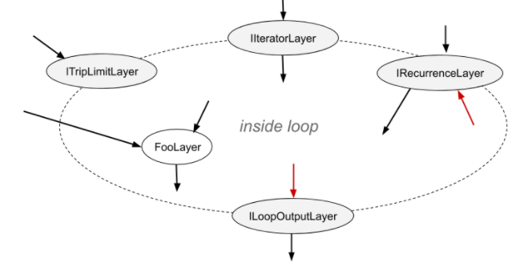

循环可以有多个 IIteratorLayer、IRecurrenceLayer 和 ILoopOutputLayer，并且最多可以有两个 ITripLimitLayers，后面会解释。没有 ILoopOutputLayer 的循环没有输出，并且由 TensorRT 进行优化。

_NVIDIA TensorRT Support Matrix_ 中的 [Layers For Flow-Control Constructs](https://docs.nvidia.com/deeplearning/tensorrt/support-matrix/index.html#layers-flow-control-constructs) 部分描述了可能在循环内部使用的 TensorRT 层。
内部层可以使用在循环内部或外部定义的张量。内部层可以包含其他循环（参见[嵌套循环](#nested-loops "TensorRT从数据流中推断循环的嵌套关系。例如，如果循环B使用在循环A内定义的值，则循环B被认为是嵌套在循环A内的。"））和其他条件结构（参见[条件嵌套](#nesting-loops "条件分支可以嵌套其他条件分支，也可以嵌套循环。循环可以嵌套条件分支。与循环嵌套类似，TensorRT从数据流中推断条件和循环的嵌套关系。例如，如果条件B使用在循环A内定义的值，则条件B被认为是嵌套在循环A内的。"））。

要定义一个循环，首先使用INetworkDefinition::addLoop方法创建一个ILoop对象。然后添加边界层和内部层。本节的其余部分描述了边界层的特性，使用_loop_表示INetworkDefinition::addLoop返回的ILoop\*对象。

ITripLimitLayer支持计数循环和while循环。

*   _loop_\->addTripLimit(_t_,TripLimit::kCOUNT)创建一个ITripLimitLayer，其输入_t_是一个0维INT32张量，指定循环迭代的次数。
    
*   _loop_\->addTripLimit(_t_,TripLimit::kWHILE)创建一个ITripLimitLayer，其输入_t_是一个0维布尔张量，指定是否应进行迭代。通常_t_是IRecurrenceLayer的输出或基于该输出的计算结果。
    

一个循环最多可以有每种限制一次。

IIteratorLayer支持在任何轴上向前或向后迭代。

*   _loop_\->addIterator(_t_)添加一个IIteratorLayer，它在张量_t_的轴0上进行迭代。例如，如果输入是矩阵：
    
    ```shell
    2 3 5
    4 6 8
    ```
    
    第一次迭代的输出是1维张量{2, 3, 5}，第二次迭代的输出是{4, 6, 8}。超出张量边界进行迭代是无效的。
* _loop_->addIterator(_t_, _axis_)类似，但是该层沿给定的轴迭代。例如，如果axis=1，并且输入是一个矩阵，则每次迭代都会输出矩阵的一列。

* _loop_->addIterator(_t_, _axis, reverse_)类似，但是如果reverse_=true，则该层以相反的顺序生成输出。

ILoopOutputLayer支持三种形式的循环输出：

* _loop_->addLoopOutput(_t_, _LoopOutput::kLAST_VALUE)输出_t_的最后一个值，其中_t_必须是IRecurrenceLayer的输出。

* _loop_->addLoopOutput(_t_, LoopOutput::kCONCATENATE, _axis_)输出每次迭代的输入与_t_的连接。例如，如果输入是一个1D张量，在第一次迭代时值为{a,b,c}，在第二次迭代时值为{d,e,f}，并且_axis_=0，则输出是矩阵：

    ```shell
    a b c
    d e f
    ```

    如果_axis_=1，则输出为：

    ```c++
    a d
    b e
    c f
    ```

* _loop_->addLoopOutput(_t_, LoopOutput::kREVERSE, _axis_)类似，但是反转顺序。

ILoopOutputLayer的kCONCATENATE和kREVERSE形式都需要第二个输入，它是一个0D INT32形状张量，指定新的输出维度的长度。当长度大于迭代次数时，额外的元素包含任意值。第二个输入，例如_u_，应使用ILoopOutputLayer::setInput(1, _u_)进行设置。

最后，有IRecurrenceLayer。它的第一个输入指定初始输出值，第二个输入指定下一个输出值。第一个输入必须来自循环外部；第二个输入通常来自循环内部。例如，以下C++代码片段的TensorRT类比形式：

```c++
for (int32_t i = j; ...; i += k) ...
```

可以通过以下调用创建，其中j和k为ITensor*：

```c++
ILoop* loop = n.addLoop();
IRecurrenceLayer* iRec = loop->addRecurrence(j);
ITensor* i = iRec->getOutput(0);
ITensor* iNext = addElementWise(*i, *k, 
    ElementWiseOperation::kADD)->getOutput(0);
```
您好，作为一名专业的翻译员，我将其翻译为简体中文，不修改任何现有的Markdown命令：iRec->setInput(1, *iNext);

```
IRecurrenceLayer的第二个输入是TensorRT允许存在回边的唯一情况。如果删除了这样的输入，则剩余的网络必须是无环的。
```
### [10.2. 形式语义学](#loops-semantics)

TensorRT具有应用语义学，意味着除了引擎的输入和输出之外，没有其他可见的副作用。由于没有副作用，关于命令式语言中循环的直觉并不总是适用。本节为TensorRT的循环结构定义了形式语义学。

形式语义学基于张量的“惰性序列”。循环的每次迭代对应于序列中的一个元素。循环内部张量_X_的序列表示为⟨_X_0, _X_1, _X_2, ...⟩。序列的元素是惰性求值的，即按需求进行求值。

IIteratorLayer(X)的输出是⟨X[0], X[1], X[2], ...⟩，其中X[i]表示对IIteratorLayer指定的轴进行下标操作。

IRecurrenceLayer(X,Y)的输出是⟨X, Y0, Y1, Y2, ...⟩。

ILoopOutputLayer的输入和输出取决于LoopOutput的类型。

*   kLAST\_VALUE：输入是单个张量X，输出是n次循环的Xn。
    
*   kCONCATENATE：第一个输入是张量X，第二个输入是标量形状张量Y。结果是X0、X1、X2、... Xn-1的连接，如果需要，进行后补齐，使其长度符合Y指定的长度。如果Y < n，则会引发运行时错误。Y是一个构建时常量。请注意与IIteratorLayer的反向关系。IIteratorLayer将一个张量映射到一个子张量序列；具有kCONCATENATE的ILoopOutputLayer将一个子张量序列映射到一个张量。
    
*   kREVERSE：类似于kCONCATENATE，但输出是反向的。
    

对于ILoopOutputLayer输出定义中的n的值取决于循环的ITripLimitLayer：

*   对于计数循环，它是迭代计数，即ITripLimitLayer的输入。
    
*   对于while循环，它是最小的n，使得Xn为false，其中X是ITripLimitLayer输入张量的序列。

非循环层的输出是对该层函数的逐序应用。例如，对于一个两输入的非循环层 F(X,Y) = ⟨f(X0,Y0), f(X1,Y1), f(X2,Y2)...⟩。如果一个张量来自循环外部，即循环不变量，则其序列是通过复制该张量创建的。
### [10.3. 嵌套循环](#nested-loops)

TensorRT从数据流中推断循环的嵌套关系。例如，如果循环B使用在循环A内部定义的值，则认为B嵌套在A内部。

TensorRT拒绝循环嵌套不清晰的网络，例如如果循环A使用在循环B内部定义的值，反之亦然。
### [10.4. 限制](#limitations-loops)

一个引用了多个动态维度的循环可能会占用意外的大量内存。

在循环中，内存分配的方式是假设所有动态维度都取最大值。例如，如果一个循环引用了具有维度[4,x,y]和[6,y]的两个张量，那么这些张量的内存分配就相当于它们的维度是[4,max(x,y),max(x,y)]和[6,max(x,y)]。

使用kLAST\_VALUE的LoopOutputLayer的输入必须是IRecurrenceLayer的输出。

循环API仅支持FP32和FP16精度。
### [10.5. 使用循环替换IRNNv2Layer](#replacing-with-loops)

在TensorRT 7.2.1中，IRNNv2Layer已被弃用，并将在TensorRT 9.0中移除。使用循环API来合成一个循环子网络。有关示例，请参考sampleCharRNN，方法SampleCharRNNLoop::addLSTMCell。您可以使用循环API来表达通用的循环网络，而不仅仅限于IRNNLayer和IRNNv2Layer中的预制单元。

有关更多信息，请参考[sampleCharRNN](https://github.com/NVIDIA/TensorRT/blob/main/samples/sampleCharRNN)。
## [11. 使用条件语句](#work-with-conditionals)

NVIDIA TensorRT 支持条件 if-then-else 流程控制。TensorRT 条件语句用于实现网络子图的条件执行。
### [11.1. 定义条件语句](#define-conditional)

条件语句由条件边界层定义：

*   IConditionLayer表示谓词并指定条件语句应执行真分支（then分支）还是假分支（else分支）。
*   IIfConditionalInputLayer指定条件语句分支之一的输入。
*   IIfConditionalOutputLayer指定条件语句的输出。

每个边界层都继承自IIfConditionalBoundaryLayer类，该类具有一个用于获取关联IIfConditional的方法getConditional()。IIfConditional实例标识条件语句。具有相同IIfConditional的所有条件边界层属于该条件语句。

条件语句必须具有一个IConditionLayer实例，零个或多个IIfConditionalInputLayer实例，以及至少一个IIfConditionalOutputLayer实例。

IIfConditional实现了一个if-then-else流控制结构，根据动态布尔输入对网络子图进行条件执行。它由一个布尔标量谓词条件和两个分支子图定义：当条件求值为true时执行trueSubgraph，当条件求值为false时执行falseSubgraph：

```c++
如果条件为真，则：
	output = trueSubgraph(trueInputs);
否则，
	output = falseSubgraph(falseInputs);
输出 output
```

真分支和假分支都必须被定义，类似于许多编程语言中的三元运算符。

要定义一个条件语句，请使用方法INetworkDefinition::addIfConditional创建一个IIfConditional实例，然后添加边界和分支层。

```c++
IIfConditional* simpleIf = network->addIfConditional();
```
IIfConditional::setCondition方法接受一个参数：条件张量。这个0D布尔张量（标量）可以由网络中的前一层动态计算得到。它用于决定执行哪个分支。IConditionLayer只有一个输入（条件），没有输出，因为它在条件实现中内部使用。

```c++
// 创建一个同时也是网络输入的条件谓词。
auto cond = network->addInput("cond", DataType::kBOOL, Dims{0});
IConditionLayer* condition = simpleIf->setCondition(*cond);
```

TensorRT不支持使用子图抽象来实现条件分支，而是使用IIfConditionalInputLayer和IIfConditionalOutputLayer来定义条件的边界。

*   IIfConditionalInputLayer抽象了IIfConditional的分支子图中的一个或两个输入。特定的IIfConditionalInputLayer的输出可以同时供给两个分支。
    
    ```c++
    // 创建一个if-conditional输入。
    // x是某个任意的网络张量。
    IIfConditionalInputLayer* inputX = simpleIf->addInput(*x);
    ```
    
    then分支和else分支的输入**不必**是相同类型和形状。每个分支可以独立地包含零个或多个输入。
IIfConditionalInputLayer是可选的，用于控制哪些层将成为分支的一部分（参见[条件执行](#conditional-execution "条件执行是一种网络评估策略，其中分支层（属于条件子图的层）仅在需要分支输出的值时执行。在条件执行中，true分支或false分支将被执行并允许更改网络状态。")）。如果一个分支的所有输出都不依赖于IIfConditionalInputLayer实例，则该分支为空。当条件为false时，一个空的else分支可以在没有需要评估的层时很有用，并且网络评估应该按照条件继续进行（参见[条件示例](#conditional-examples)）。

* IIfConditionalOutputLayer抽象了if条件的单个输出。它有两个输入：true子图的输出（输入索引为0）和false子图的输出（输入索引为1）。IIfConditionalOutputLayer的输出可以被视为在运行时确定的最终输出的占位符。

  IIfConditionalOutputLayer在传统的SSA控制流图中扮演着Φ（Phi）函数节点的类似角色。它的语义是：选择true子图的输出或false子图的输出。

  ```c++
  // trueSubgraph和falseSubgraph表示网络子图
  IIfConditionalOutputLayer* outputLayer = simpleIf->addOutput(
      *trueSubgraph->getOutput(0), 
      *falseSubgraph->getOutput(0));
  ```

  IIfConditional的所有输出都必须源自于IIfConditionalOutputLayer实例。
如果没有输出的if条件对网络的其余部分没有影响，因此被认为是不合法的。每个分支（子图）也必须至少有一个输出。除非该if条件嵌套在另一个if条件或循环中，否则if条件的输出可以被标记为网络的输出。

下图提供了if条件抽象模型的图形表示。绿色矩形表示条件的内部，该内部仅限于[NVIDIA TensorRT支持矩阵](https://docs.nvidia.com/deeplearning/tensorrt/support-matrix/index.html#layers-flow-control-constructs)中列出的层类型。

图13. if条件构造的抽象模型 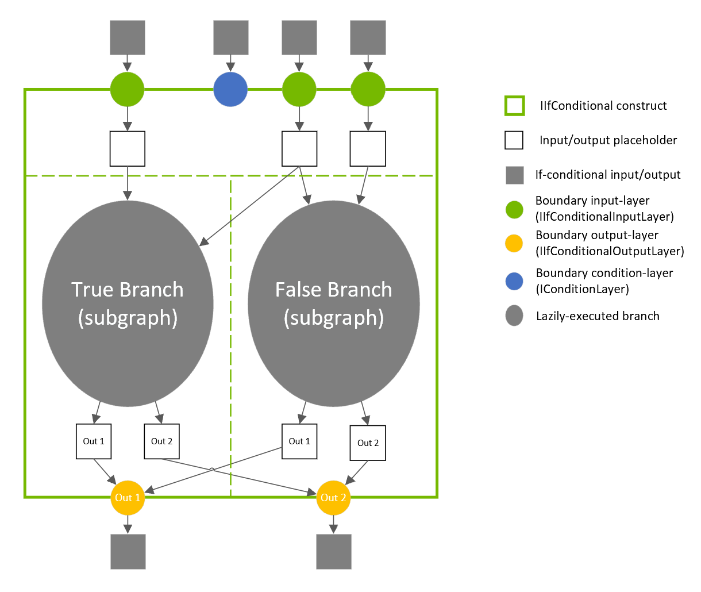
### [11.2. 条件执行](#conditional-execution)

条件执行是一种网络评估策略，其中分支层（属于条件子图的层）仅在分支输出的值被需要时执行。在条件执行中，要么执行真分支，要么执行假分支，并允许改变网络状态。

相比之下，在预测执行中，真分支和假分支都会执行，只允许其中一个根据条件谓词的值（即，仅将一个子图的输出馈送到后续层）改变网络评估状态。

条件执行有时被称为“惰性评估”，而预测执行有时被称为“急切评估”。

可以使用IIfConditionalInputLayer的实例来指定哪些层被急切调用，哪些层被惰性调用。这是通过反向跟踪网络层开始，从每个条件输出开始进行的。对于至少一个IIfConditionalInputLayer的输出有数据依赖的层被认为是条件内部的，并因此被惰性评估。在没有添加任何IIfConditionalInputLayer实例到条件的极端情况下，所有的层都会急切执行，类似于ISelectLayer。

下面的三个图表描述了如何通过IIfConditionalInputLayer的放置来控制执行调度。

图14. 使用IIfConditionalInputLayer放置来控制条件执行 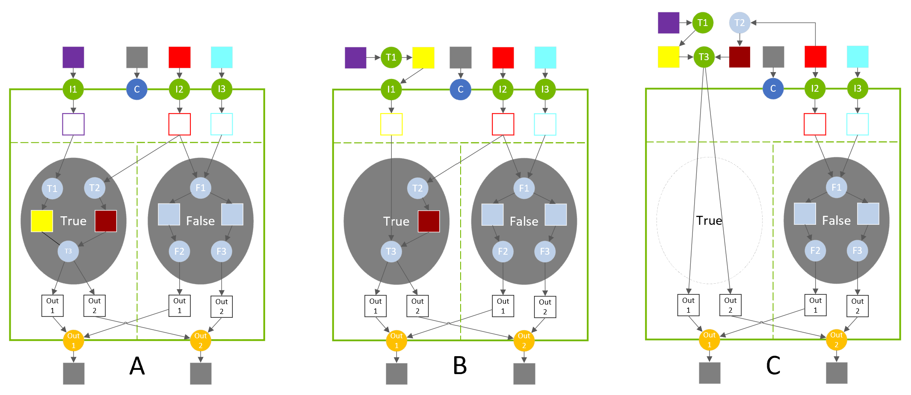

在图A中，真分支由三个层（T1、T2、T3）组成。当条件评估为真时，这些层会惰性执行。

在图B中，输入层I1被放置在层T1之后，这将T1移出了真分支。层T1在评估if构造之前会急切执行。
在图C中，输入层I1被完全移除，这将T3移出了条件语句。重新配置T2的输入以创建一个合法的网络，并且T2也移出了真分支。当条件评估为真时，条件语句不会计算任何内容，因为输出已经被急切地计算出来了（但它会将条件相关的输入复制到其输出中）。
### [11.3. 嵌套和循环](#nesting-loops)

条件分支可以嵌套其他条件分支，也可以嵌套循环。循环可以嵌套条件分支。与循环嵌套一样，TensorRT可以从数据流中推断条件分支和循环的嵌套关系。例如，如果条件分支B使用在循环A内定义的值，那么B被认为是嵌套在A内部的。

真分支中的层与假分支中的层之间不能有交叉边，反之亦然。换句话说，一个分支的输出不能依赖于另一个分支中的层。

例如，参考[条件示例](#conditional-examples)以了解如何指定嵌套。
### [11.4. 限制](#limitations)

真/假子图分支的输出张量数量必须相同。分支中每个输出张量的类型和形状必须相同。

请注意，这比ONNX规范更加严格，ONNX规范要求真/假子图具有相同数量的输出，并使用相同的输出数据类型，但允许不同的输出形状。
### [11.5. 条件示例](#conditional-examples)
### [11.5.1.简单的If-条件](#ifconditional-example)

下面的示例展示了如何实现一个简单的条件语句，根据条件在两个张量上进行算术运算。
#### 条件

```c++
condition = true
如果 condition 为真:
        output = x + y
否则:
        output = x - y
```
#### 示例

```c++
ITensor* addCondition(INetworkDefinition& n, bool predicate)
{
    // 条件值是一个常量 int32 输入，被转换为布尔值，因为 TensorRT 不支持布尔常量层。

    static const Dims scalarDims = Dims{0, {}};
    static float constexpr zero{0};
    static float constexpr one{1};

    float* const val = predicate ? &one : &zero;

    ITensor* cond = 
        n.addConstant(scalarDims, DataType::kINT32, val, 1})->getOutput(0);

    auto* cast = n.addIdentity(cond);
    cast->setOutputType(0, DataType::kBOOL);
    cast->getOutput(0)->setType(DataType::kBOOL);

    return cast->getOutput(0);
}

IBuilder* builder = createInferBuilder(gLogger);
INetworkDefinition& n = *builder->createNetworkV2(0U);
auto x = n.addInput("x", DataType::kFLOAT, Dims{1, {5}});
auto y = n.addInput("y", DataType::kFLOAT, Dims{1, {5}});
ITensor* cond = addCondition(n, true);

auto* simpleIf = n.addIfConditional();
simpleIf->setCondition(*cond);

// 添加输入层以标记进入真/假分支。
x = simpleIf->addInput(*x)->getOutput(0);
y = simpleIf->addInput(*y)->getOutput(0);

auto* trueSubgraph = n.addElementWise(*x, *y, ElementWiseOperation::kSUM)->getOutput(0);
auto* falseSubgraph = n.addElementWise(*x, *y, ElementWiseOperation::kSUB)->getOutput(0);

auto* output = simpleIf->addOutput(*trueSubgraph, *falseSubgraph)->getOutput(0);
n.markOutput(*output);
```
### [11.5.2. 从PyTorch导出](#export-pytorch-example)

以下示例展示了如何将脚本化的PyTorch代码导出为ONNX格式。函数sum\_even中的代码在循环中嵌套了if条件语句。

```c++
import torch.onnx
import torch
import tensorrt as trt
import numpy as np

TRT_LOGGER = trt.Logger(trt.Logger.WARNING)
EXPLICIT_BATCH = 1 << (int)(trt.NetworkDefinitionCreationFlag.EXPLICIT_BATCH)

@torch.jit.script
def sum_even(items):
    s = torch.zeros(1, dtype=torch.float)
    for c in items:
        if c % 2 == 0:
            s += c
    return s

class ExampleModel(torch.nn.Module):
    def __init__(self):
        super().__init__()

    def forward(self, items):
        return sum_even(items)

def build_engine(model_file):
    builder = trt.Builder(TRT_LOGGER)
    network = builder.create_network(EXPLICIT_BATCH)
    config = builder.create_builder_config()
    parser = trt.OnnxParser(network, TRT_LOGGER)

    with open(model_file, 'rb') as model:
        assert parser.parse(model.read())
        return builder.build_engine(network, config)

def export_to_onnx():
    items = torch.zeros(4, dtype=torch.float)
    example = ExampleModel()
    torch.onnx.export(example, (items), "example.onnx", verbose=False, opset_version=13, enable_onnx_checker=False, do_constant_folding=True)

export_to_onnx()
build_engine("example.onnx")
```


## [12. 使用 DLA 进行工作](#dla_topic)

NVIDIA DLA（深度学习加速器）是一个专为深度学习操作而设计的固定功能加速器引擎。DLA旨在对卷积神经网络进行全硬件加速。DLA支持各种层，如卷积、反卷积、全连接、激活、池化、批归一化等。DLA不支持[显式量化](#work-with-qat-networks "当TensorRT在网络中检测到Q/DQ层时，使用显式精度处理逻辑构建引擎。")。有关TensorRT层中DLA支持的更多信息，请参阅[DLA支持的层和限制](#dla_layers "本节列出了DLA支持的层以及每个层相关的约束条件。")。

DLA对于从iGPU卸载CNN处理非常有用，并且在这些工作负载中具有显着的功耗效率。此外，在冗余性很重要的情况下，例如在关键任务或安全应用中，它可以提供独立的执行流水线。

有关DLA的更多信息，请参阅[DLA开发者页面](https://developer.nvidia.com/deep-learning-accelerator)和DLA教程[在NVIDIA Jetson Orin上入门深度学习加速器](https://github.com/NVIDIA-AI-IOT/jetson_dla_tutorial)。

在构建DLA模型时，TensorRT构建器解析网络并调用DLA编译器将网络编译为DLA可加载文件。请参阅[使用trtexec](#dla-using-trtexec)了解如何在DLA上构建和运行网络。

图15. DLA构建和运行阶段的工作流程

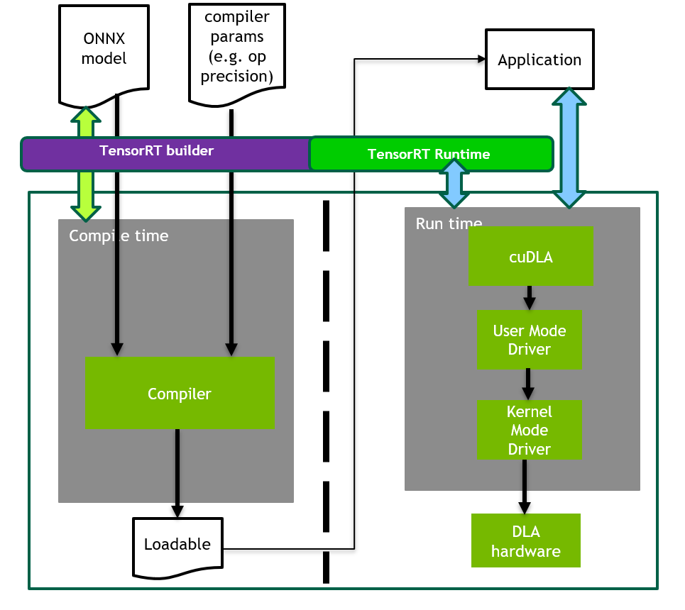
### [12.1. 构建和启动可加载的](#build-launch-load)

构建和启动DLA可加载的方法有几种，可以将其嵌入到TensorRT引擎中，也可以以独立形式运行。

要生成一个独立的DLA可加载文件，以在TensorRT之外使用，请参考[DLA独立模式](#dla-standalone-mode)。
### [12.1.1. 使用 trtexec](#dla-using-trtexec)

要让 trtexec 使用 DLA，您可以使用 --useDLACore 标志。例如，要在 DLA 核心 0 上以 FP16 模式运行 ResNet-50 网络，并使用[GPU 回退模式](#gpu_fallback "如果一个被标记为在 DLA 上运行的层无法在 DLA 上运行，那么 GPUFallbackMode 将使构建器使用 GPU。由于以下原因，层无法在 DLA 上运行：")来处理不受支持的层，执行以下命令：

```c++
 ./trtexec --onnx=data/resnet50/ResNet50.onnx --useDLACore=0 --fp16 --allowGPUFallback
```

trtexec 工具还有其他参数可以在 DLA 上运行网络。更多信息，请参阅[命令行程序](#command-line-programs)。
### [12.1.2. 使用TensorRT API](#dla-using-trt-api)

您可以使用TensorRT API来构建和运行DLA推理，并在层级别上启用DLA。相关的API和示例在以下章节中提供。
### [12.1.2.1. 在 TensorRT 推理期间运行 DLA](#run_dla_inference)

TensorRT 构建器可以配置为在 DLA 上进行推理。目前，DLA 仅支持以 FP16 和 INT8 模式运行的网络。DeviceType 枚举用于指定网络或层执行的设备。IBuilderConfig 类中的以下 API 函数可用于配置网络以使用 DLA：

setDeviceType(ILayer\* layer, DeviceType deviceType)

此函数可用于设置层必须执行的 deviceType。

getDeviceType(const ILayer\* layer)

此函数可用于返回此层执行的 deviceType。如果层在 GPU 上执行，则返回 DeviceType::kGPU。

canRunOnDLA(const ILayer\* layer)

此函数可用于检查层是否可以在 DLA 上运行。

setDefaultDeviceType(DeviceType deviceType)

此函数将默认 deviceType 设置为构建器使用的 deviceType。它确保所有可以在 DLA 上运行的层都在 DLA 上运行，除非使用 setDeviceType 来覆盖层的 deviceType。

getDefaultDeviceType()

此函数返回由 setDefaultDeviceType 设置的默认 deviceType。

isDeviceTypeSet(const ILayer\* layer)

此函数检查是否已为此层显式设置了 deviceType。

resetDeviceType(ILayer\* layer)

此函数重置此层的 deviceType。值将重置为由 setDefaultDeviceType 指定的 deviceType，如果未指定，则为 DeviceType::kGPU。

allowGPUFallback(bool setFallBackMode)

此函数通知构建器，如果无法在 DLA 上运行应该在 DLA 上运行的层，则使用 GPU。有关详细信息，请参阅 [GPU 回退模式](#gpu_fallback "如果由于以下原因，层无法在 DLA 上运行，则 GPUFallbackMode 设置构建器使用 GPU：")。

reset()
这个函数可以用来重置IBuilderConfig状态，将所有层的deviceType设置为DeviceType :: kGPU。重置后，可以重用builder来构建另一个具有不同DLA配置的网络。

IBuilder类中的以下API函数可用于帮助配置使用DLA的网络：

getMaxDLABatchSize（）

此函数返回DLA可以支持的最大批处理大小。

注意：对于任何张量，索引维度的总体积与请求的批处理大小的结合不能超过此函数返回的值。

getNbDLACores（）

此函数返回用户可用的DLA核心数。

如果无法访问构建器，例如在在线推理应用程序中加载计划文件的情况下，则可以通过使用IRuntime的DLA扩展来指定不同的DLA使用方式。IRuntime类中的以下API函数可用于配置网络以使用DLA：

getNbDLACores（）

此函数返回用户可访问的DLA核心数。

setDLACore（int dlaCore）

要执行的DLA核心。其中dlaCore是一个介于0和getNbDLACores（）-1之间的值。默认值为0。

getDLACore（）

运行时执行分配的DLA核心。默认值为0。
### [12.1.2.2. 示例：使用DLA的sampleMNIST](#example1_samplemnist_dla)

本节介绍如何在启用DLA的情况下运行TensorRT示例。

sampleMNIST演示了如何导入训练模型，构建TensorRT引擎，序列化和反序列化引擎，并最终使用引擎进行推理。

示例首先创建构建器：

```c++
auto builder = SampleUniquePtr<nvinfer1::IBuilder>(nvinfer1::createInferBuilder(gLogger));
if (!builder) return false;
builder->setMaxBatchSize(batchSize);
config->setMaxWorkspaceSize(16_MB);
```

然后，启用GPUFallback模式：

```c++
config->setFlag(BuilderFlag::kGPU_FALLBACK);
config->setFlag(BuilderFlag::kFP16); 或者 config->setFlag(BuilderFlag::kINT8);
```

启用DLA上的执行，其中dlaCore指定要在其上执行的DLA核心：

```c++
config->setDefaultDeviceType(DeviceType::kDLA);
config->setDLACore(dlaCore);
```

通过这些附加更改，sampleMNIST已准备好在DLA上执行。要在DLA Core 1上运行sampleMNIST，请使用以下命令：

```c++
 ./sample_mnist --useDLACore=0 [--int8|--fp16]
```

### [12.1.2.3. 示例：在网络创建期间为一个层启用 DLA 模式](#example2_dla_network_creation)

在这个示例中，让我们创建一个简单的网络，包括输入层、卷积层和输出层。

1. 创建构建器、构建器配置和网络：

    ```c++
    IBuilder* builder = createInferBuilder(gLogger);
    IBuilderConfig* config = builder.createBuilderConfig();
    INetworkDefinition* network = builder->createNetworkV2(0U);
    ```

2. 向网络添加输入层，并设置输入维度：

    ```c++
    auto data = network->addInput(INPUT_BLOB_NAME, dt, Dims3{1, INPUT_H, INPUT_W});
    ```

3. 添加卷积层，包括隐藏层输入节点、步长以及用于过滤器和偏置的权重：

    ```c++
    auto conv1 = network->addConvolution(*data->getOutput(0), 20, DimsHW{5, 5}, weightMap["conv1filter"], weightMap["conv1bias"]);
    conv1->setStride(DimsHW{1, 1});
    ```

4. 将卷积层设置为在 DLA 上运行：

    ```c++
    if(canRunOnDLA(conv1))
    {
    config->setFlag(BuilderFlag::kFP16); 或 config->setFlag(BuilderFlag::kINT8);
    builder->setDeviceType(conv1, DeviceType::kDLA); 
    
    }
    ```

5. 标记输出：

    ```c++
    network->markOutput(*conv1->getOutput(0));
    ```

6. 设置 DLA 核心执行：

    ```c++
    config->setDLACore(0)
    ```
### [12.1.3. 使用 cuDLA API](#using-cudla-api)

cuDLA 是 CUDA 编程模型的扩展，将 DLA 运行时软件与 CUDA 集成。这种集成使得可以使用 CUDA 编程构造，如流和图，来启动 DLA 可加载项。

cuDLA 透明地处理共享缓冲区的管理以及 GPU 和 DLA 之间的任务同步。在编写 cuDLA 应用程序时，可以参考 [cuDLA 文档](https://docs.nvidia.com/cuda/cuda-for-tegra-appnote/index.html#cudla-intro) 了解如何使用 cuDLA API 来处理这些用例。

有关如何使用 TensorRT 构建可与 cuDLA 一起使用的独立 DLA 可加载项的更多信息，请参考 [DLA 独立模式](#dla-standalone-mode) 部分。
### [12.2. DLA 支持的层和限制](#dla_layers)

本节列出了 DLA 支持的层，并附带了每个层的限制。
### [12.2.1. 常规限制](#dla-supp-lay-rest)

在 DLA 上运行时，以下限制适用于所有层：

*   最大支持的批处理大小为 4096。
*   DLA 不支持动态维度。因此，对于通配符维度，配置文件的最小值、最大值和优化值必须相等。
*   运行时维度（特别是批处理大小）必须与构建时使用的维度相同。
*   如果任何中间层无法在 DLA 上运行且启用了 GPUFallback，TensorRT 可能会将网络拆分为多个 DLA 可加载项。否则，TensorRT 可能会发出错误并回退。有关更多信息，请参阅 [GPU 回退模式](#gpu_fallback "GPUFallbackMode 设置构建器在标记为在 DLA 上运行的层无法在 DLA 上运行时使用 GPU。由于以下原因，层无法在 DLA 上运行：")。
*   由于硬件和软件内存限制，每个核心最多可以同时加载 16 个 DLA 可加载项。

注意：DLA 的批处理大小是除了 CHW 维度之外的所有索引维度的乘积。例如，如果输入维度是 NPQRS，则有效批处理大小为 N\*P。
### [12.2.2. 层支持和限制](#dla-lay-supp-rest)

在 DLA 上运行时，以下列表提供了对指定层的支持和限制：
#### 卷积和全连接层

*   仅支持两个空间维度的操作。
*   支持FP16和INT8。
*   卷积核大小的每个维度必须在[1, 32]范围内。
*   填充必须在[0, 31]范围内。
*   填充的维度必须小于相应的卷积核维度。
*   步长的维度必须在[1, 8]范围内。
*   输出映射的数量必须在[1, 8192]范围内。
*   使用TensorFormat::kLINEAR、TensorFormat::kCHW16和TensorFormat::kCHW32格式的操作的组数必须在[1, 8192]范围内。
*   使用TensorFormat::kDLA_HWC4格式的操作的组数必须在[1, 4]范围内。
*   扩张卷积必须在[1, 32]范围内。
*   如果CBUF大小需求wtBanksForOneKernel + minDataBanks超过numConvBufBankAllotted限制16，则不支持操作。CBUF是存储输入权重和激活函数的内部卷积缓存，wtBanksForOneKernel是存储卷积所需的最小权重/卷积核元素的最小银行数，minDataBanks是存储卷积所需的最小激活数据的最小银行数。当卷积层由于CBUF约束而无法通过验证时，详细信息将显示在日志输出中。
#### 反卷积层

*   仅支持两个空间维度。
*   支持FP16和INT8。
*   核的维度必须在[1, 32]范围内，另外还包括1x[64, 96, 128]和[64, 96, 128]x1。
*   TensorRT在DLA上禁用了范围在[23 - 32]的反卷积方形核和步长，因为它们会显著减慢编译速度。
*   填充必须为0。
*   分组反卷积必须为1。
*   膨胀反卷积必须为1。
*   输入通道数必须在[1, 8192]范围内。
*   输出通道数必须在[1, 8192]范围内。
#### 池化层

*   仅支持两个空间维度的操作。
*   支持FP16和INT8。
*   支持的操作：kMAX，kAVERAGE。
*   窗口的尺寸必须在[1, 8]范围内。
*   填充的尺寸必须在[0, 7]范围内。
*   步长的尺寸必须在[1, 16]范围内。
*   在INT8模式下，输入和输出张量的尺度必须相同。
#### 激活层

*   仅支持两个空间维度操作。
*   支持FP16和INT8。
*   支持的函数：ReLU、Sigmoid、TanH、Clipped ReLU和Leaky ReLU。
    *   ReLU不支持负斜率。
    *   Clipped ReLU仅支持范围在[1, 127]内的值。
    *   TanH、Sigmoid INT8支持通过自动升级为FP16来实现。
#### 参数化ReLU层

* 斜率输入必须是构建时常数，并且与输入张量的秩相同。
#### 逐元素层

*   仅支持两个空间维度的操作。
*   支持FP16和INT8。
*   支持的操作：求和、减法、乘法、最大值、最小值和相等（分别描述）。

    注意：在Xavier上，TensorRT使用DLA Scale层和DLA ElementWise层连接操作Sum来支持减法操作，而单个Xavier DLA ElementWise层不支持减法操作。
#### 等于操作

*   仅支持INT8作为层和输入精度。
    *   在构建引擎时必须启用INT8精度。
*   DLA要求等于操作的输出为FP16或INT8类型。因此，等于层必须紧接着一个Cast操作，将其转换为FP16或INT8，并且除了这个Cast操作之外，不能有其他直接的消费者。
    *   如果您希望在DLA上运行等于层时获得布尔张量输出，请添加另一个Cast操作，将FP16和INT8输出转换回BOOL在GPU上。
*   对于ElementWise等于层和上述提到的后续IIdentityLayer，明确将设备类型设置为DLA，精度设置为INT8。否则，TensorRT会默认将这些层运行在GPU上。
*   ElementWise等于层的输出只能由后续的Cast操作消费。输出不能是DLA子网络或整个网络的输出。然而，后续的Cast操作的输出（FP16或INT8张量）可以是网络或DLA子网络的输出。
    *   您始终可以在GPU端添加另一个Cast操作，将此FP16或INT8输出转换回BOOL，如前面所述。
*   即使允许GPU回退，也应该预期在某些情况下构建引擎时会出现故障。如果出现这种情况，请取消设置ElementWise等于层和IIdentityLayer的设备类型和/或精度，以便将它们都卸载到GPU上。
#### 缩放层

*   仅支持两个空间维度的操作。
*   支持FP16和INT8。
*   支持的模式：统一、逐通道和逐元素。
*   仅支持缩放和偏移操作。
#### LRN（本地响应归一化）层

*   允许的窗口大小为3、5、7或9。
*   支持的归一化区域是ACROSS\_CHANNELS。
*   支持将LRN INT8自动升级到FP16。
#### 连接层

*   DLA仅支持沿通道轴进行连接。
*   连接层必须至少有两个输入。
*   所有输入必须具有相同的空间维度。
*   在INT8模式下，所有输入的动态范围必须相同。
*   在INT8模式下，输出的动态范围必须等于每个输入的动态范围。
#### 调整图层大小

*   尺度数必须为4。
*   尺度中的前两个元素必须为1（用于保持批次和通道维度不变）。
*   尺度中的后两个元素分别表示高度和宽度维度上的比例值，必须为整数，范围在[1, 32]之间，使用最近邻模式；或者范围在[1, 4]之间，使用双线性模式。
#### 一元层

*   仅支持绝对值操作。
#### 切片层

*   仅支持FP16精度。
*   支持批处理大小最多为通用DLA最大值。
*   所有非批处理维度的输入必须在[1, 8192]范围内。
*   仅支持4-D输入和在CHW维度上进行切片。
*   仅支持静态切片，因此切片参数必须以静态方式提供，可以使用TensorRT ISliceLayer设置器API或作为常量输入张量。
#### SoftMax层

*   仅支持NVIDIA Orin™，不支持Xavier™。
*   所有输入的非批次维度必须在[1, 8192]范围内。
*   仅支持FP16精度。
*   在内部，有两种模式，根据给定的输入张量形状选择模式。
    *   当所有非批次、非轴维度为1时，触发准确模式。
    *   优化模式允许非批次、非轴维度大于1，但限制轴维度为1024，并涉及可能导致输出中出现小误差的近似。误差的大小随着轴维度的增加逐渐增加，接近1024。
#### Shuffle层

*   仅支持4维输入张量。
*   所有非批量维度必须在[1, 8192]范围内。
*   请注意，DLA将该层分解为独立的转置和重塑操作。这意味着上述限制分别适用于每个分解操作。
*   批量维度不能参与重塑或转置操作。
### [12.2.3. NVIDIA Orin 上的推断](#推断-orin)

由于 NVIDIA Orin 和 Xavier DLA 之间硬件规格的差异，对于 NVIDIA Orin 上的 FP16 卷积操作，延迟可能增加至 2 倍。

在 NVIDIA Orin 上，DLA 将非卷积操作（FP16 和 INT8）的权重存储为 FP19 值（使用 4 字节容器）。这些 FP19 值的通道维度被填充为 16 的倍数（FP16）或 32 的倍数（INT8）。特别是在每个元素的 Scale、Add 或 Sub 操作较大的情况下，这可能会增加 DLA loadable 的大小，从而增加包含此类 loadable 的引擎的大小。图形优化可能会通过更改层的类型（例如，将具有常量层作为权重的 ElementWise 乘法层融合到一个 Scale 层中）无意中触发此行为。
### [12.3. GPU 回退模式](#gpu_fallback)

GPU 回退模式设置构建器在 DLA 上无法运行的层时使用 GPU。由于以下原因，层无法在 DLA 上运行：

1. 层操作在 DLA 上不受支持。
2. 指定的参数超出了 DLA 的支持范围。
3. 给定的批量大小超过了 DLA 的最大允许批量大小。有关更多信息，请参阅[DLA 支持的层和限制](#dla_layers "此部分列出了 DLA 支持的层以及每个层相关的约束。")。
4. 网络中的层组合导致内部状态超过 DLA 的支持能力。
5. 平台上没有可用的 DLA 引擎。

当禁用 GPU 回退时，如果层无法在 DLA 上运行，则会发出错误提示。
### [12.4. DLA上的I/O格式](#restrictions-with-dla)

DLA支持设备独有的格式，并且由于矢量宽度字节要求的限制，对其布局有约束。

对于DLA输入张量，支持kDLA_LINEAR(FP16, INT8)，kDLA_HWC4(FP16, INT8)，kCHW16(FP16)和kCHW32(INT8)格式。对于DLA输出张量，仅支持kDLA_LINEAR(FP16, INT8)，kCHW16(FP16)和kCHW32(INT8)格式。对于kCHW16和kCHW32格式，如果C不是整数倍数，则必须填充到下一个32字节边界。

对于kDLA_LINEAR格式，沿W维度的步幅必须填充到64字节。内存格式相当于具有维度[N][C][H][roundUp(W, 64/elementSize)]的C数组，其中elementSize为FP16时为2，Int8时为1，张量坐标(n, c, h, w)映射到数组下标[n][c][h][w]。

对于kDLA_HWC4格式，在Xavier上，沿W维度的步幅必须是32字节的倍数，在NVIDIA Orin上必须是64字节的倍数。

*   当C == 1时，TensorRT将该格式映射到本机灰度图像格式。
*   当C == 3或C == 4时，它映射到本机彩色图像格式。如果C == 3，则沿W轴的步幅必须填充为4个元素。
    
    在这种情况下，填充的通道位于第4索引处。理想情况下，填充值不重要，因为DLA编译器会将权重的第4个通道填充为零；但是，应用程序可以安全地分配一个四通道的零填充缓冲区，并填充三个有效通道。
    
*   当C为{1, 3, 4}时，填充后的C'分别为{1, 4, 4}，内存布局相当于具有维度[N][H][roundUp(W, 32/C'/elementSize)][C']的C数组，其中elementSize为FP16时为2，Int8时为1。张量坐标(n, c, h, w)映射到数组下标[n][h][w][c]，roundUp计算大于或等于W的最小64/elementSize的倍数。

当使用kDLA_HWC4作为DLA输入格式时，有以下要求：

*   C必须为1、3或4。
* 第一层必须是卷积层。
* 卷积参数必须符合DLA的要求。有关更多信息，请参阅[DLA支持的层和限制](#dla_layers "本节列出了DLA支持的层以及每个层的约束条件。")。

当启用GPU回退时，TensorRT可能会插入重新格式化层以满足DLA的要求。否则，输入和输出格式必须与DLA兼容。在所有情况下，TensorRT期望数据以特定步长进行格式化，可以通过查询IExecutionContext::getStrides来获取这些步长。
### [12.5. DLA独立模式](#dla-standalone-mode)

如果您需要在TensorRT之外运行推理，您可以使用EngineCapability::kDLA_STANDALONE来生成一个DLA可加载项，而不是一个TensorRT引擎。然后，您可以使用类似[使用cuDLA API](#using-cudla-api "cuDLA是CUDA编程模型的扩展，将DLA运行时软件与CUDA集成。这种集成使得可以使用CUDA编程构造，如流和图，来启动DLA可加载项。")的API来使用这个可加载项。
### [12.5.1. 使用C++构建DLA可加载项](#building-safety-nvmedia-dla-engine)

1. 将默认设备类型和引擎能力设置为DLA独立模式。

    ```c++
    builderConfig->setDefaultDeviceType(DeviceType::kDLA);
    builderConfig->setEngineCapability(EngineCapability::kDLA_STANDALONE);
    ```

2. 指定FP16、INT8或两者。例如：

    ```c++
    builderConfig->setFlag(BuilderFlag::kFP16);
    ```

3. DLA独立模式不允许重新格式化，因此需要设置BuilderFlag::kDIRECT_IO。

    ```c++
    builderConfig->setFlag(BuilderFlag::kDIRECT_IO);
    ```

4. 必须将I/O张量的允许格式设置为DLA支持的一个或多个格式。有关详细信息，请参阅TensorFormat枚举的文档。

5. 最后，按照正常流程进行构建。
### [12.5.1.1. 使用 trtexec 生成 DLA 可加载文件](#using-trtexec-gen-dla-load)

trtexec 工具可以生成 DLA 可加载文件，而不是 TensorRT 引擎。通过指定 \--useDLACore 和 \--safe 参数，将构建器能力设置为 EngineCapability::kDLA_STANDALONE。此外，通过指定 \--inputIOFormats 和 \--outputIOFormats 参数，可以限制 I/O 数据类型和内存布局。通过指定 \--saveEngine 参数，将 DLA 可加载文件保存到文件中。

例如，使用 trtexec 生成一个 ONNX 模型的 FP16 DLA 可加载文件，可以执行以下命令：

```c++
./trtexec --onnx=model.onnx --saveEngine=model_loadable.bin --useDLACore=0 --fp16 --inputIOFormats=fp16:chw16 --outputIOFormats=fp16:chw16 --buildOnly --safe
```
### [12.6. 自定义 DLA 内存池](#customize-dla-mem-pools)

您可以使用 IBuilderConfig::setMemoryPoolLimit C++ API 或 IBuilderConfig.set\_memory\_pool\_limit Python API 自定义网络中每个 DLA 子网络分配的内存池的大小。DLA 内存池有三种类型（详见 MemoryPoolType 枚举）：

Managed SRAM

*   表现得像缓存，较大的值可能会提高性能。
*   如果没有可用的 Managed SRAM，则 DLA 仍可通过回退到本地 DRAM 运行。
*   在 Orin 上，每个 DLA 核心都有 1 MiB 的专用 SRAM。在 Xavier 上，4 MiB 的 SRAM 被多个核心共享，包括 2 个 DLA 核心。

Local DRAM

用于存储 DLA 子网络中的中间张量。较大的值可能允许较大的子网络被卸载到 DLA。

Global DRAM

用于存储 DLA 子网络中的权重。较大的值可能允许较大的子网络被卸载到 DLA。

每个子网络所需的内存量可能小于内存池大小，如果是这种情况，则会分配较小的内存量。内存池大小仅作为一个上限。

请注意，所有 DLA 内存池的大小都需要是 2 的幂次方，且最小为 4 KiB。违反此要求将导致 DLA 可加载编译失败。

在多子网络的情况下，重要的是要记住内存池大小适用于每个 DLA 子网络，而不是整个网络，因此需要注意正在消耗的资源总量。特别地，您的网络在总计上最多可以消耗两倍于内存池大小的 Managed SRAM。
对于NVIDIA Orin来说，默认的管理SRAM池大小设置为0.5 MiB，而Xavier的默认大小为1 MiB。这是因为Orin有严格的每个核心限制，而Xavier具有一定的灵活性。这个Orin默认设置确保在所有情况下，您的引擎的总管理SRAM消耗保持在硬件限制以下，但如果您的引擎只有一个DLA子网络，这意味着您的引擎只消耗硬件限制的一半，因此通过增加池大小到1 MiB，您可能会看到性能提升。
### [12.6.1. 确定 DLA 内存池使用情况](#determine-dla-memory-pool-usage)

在成功编译给定网络的可加载模块后，构建器会报告成功编译为可加载模块的子网络候选数，以及这些可加载模块在每个内存池中使用的总内存量。对于由于内存不足而失败的每个子网络候选，都会发出一条消息指出哪个内存池不足。在详细日志中，构建器还会报告每个可加载模块的内存池需求。
### [12.7. DLA上的稀疏性](#dla-sparsity)

在NVIDIA Orin平台上，DLA支持结构化稀疏性（SS），这提供了在生产中最小化延迟和最大化吞吐量的机会。
### [12.7.1. 结构化稀疏性](#dla-structured-sparsity)

结构化稀疏性（SS）在C维度上加速2:4的稀疏模式。在每个连续的四个值的块中，C维度上必须有两个值为零。通常情况下，SS对于数学计算密集的INT8卷积有最大的好处，并且通道维度是128的倍数。

结构化稀疏性有几个要求和限制。
#### 要求

*   仅适用于除NHWC以外的其他格式的INT8卷积。
*   通道大小必须大于64。
#### 限制条件

*   只有量化为INT8的权重不超过256K的卷积才能从SS中受益-实际上，限制条件可能更为严格。
*   只有满足 K % 64 在 {0, 1, 2, 4, 8, 16, 32} 的卷积（其中K是卷积核的数量，对应于输出通道的数量）才能在此版本中从SS中受益。

## [13. 性能最佳实践](#performance)
### [13.1. 性能测量](#measure-performance)

在开始使用TensorRT进行任何优化工作之前，确定应该测量什么是至关重要的。没有测量，就无法进行可靠的进展，也无法衡量是否取得了成功。
### 延迟

网络推理的性能测量是从输入被呈现给网络到输出可用之间经过的时间。这是网络对于单个推理的**延迟**。较低的延迟更好。在某些应用中，低延迟是一个关键的安全要求。在其他应用中，延迟直接影响用户体验，成为服务质量问题。对于批量处理，延迟可能并不重要。
### 吞吐量

另一个性能测量指标是在固定时间单位内可以完成多少推理。这是网络的**吞吐量**。吞吐量越高越好。较高的吞吐量表示对固定计算资源的更高效利用。对于批量处理，所需的总时间将由网络的吞吐量确定。

另一种观察延迟和吞吐量的方法是固定最大延迟，并在该延迟下测量吞吐量。这样的服务质量测量可以在用户体验和系统效率之间做出合理的折衷。

在测量延迟和吞吐量之前，您必须选择确切的计时起点和终点。根据网络和应用程序的不同，选择不同的点可能是有意义的。

在许多应用程序中，存在一个处理流水线，整个处理流水线的性能可以通过延迟和吞吐量来衡量。由于预处理和后处理步骤在很大程度上取决于特定的应用程序，本节仅考虑网络推理的延迟和吞吐量。
### [13.1.1. 墙钟计时](#cpu-timing)

墙钟时间（计算开始和结束之间的经过时间）对于测量应用程序的整体吞吐量和延迟以及将推理时间放置在更大系统的上下文中非常有用。C++11在<chrono>标准库中提供了高精度计时器。例如，std::chrono::system\_clock表示系统范围的墙钟时间，而std::chrono::high\_resolution\_clock以最高可用精度测量时间。

下面的示例代码段显示了测量网络推理主机时间的方法：

```c++
#include <chrono>

auto startTime = std::chrono::high_resolution_clock::now();
context->enqueueV2(&buffers[0], stream, nullptr);
cudaStreamSynchronize(stream);
auto endTime = std::chrono::high_resolution_clock::now();
float totalTime = std::chrono::duration<float, std::milli>
(endTime - startTime).count();
```

如果设备上只有一个推理同时进行，则这是一种简单的方法来分析不同操作所需的时间。推理通常是异步的，因此请确保添加显式的CUDA流或设备同步以等待结果可用。
### [13.1.2. CUDA事件](#cuda-events)

使用主机进行计时的一个问题是它需要主机/设备同步。优化的应用程序可能会在设备上并行运行许多推理，并且具有重叠的数据移动。此外，同步本身会给计时测量带来一定的噪声。

为了解决这些问题，CUDA提供了一个[事件API](http://docs.nvidia.com/cuda/cuda-runtime-api/index.html#group__CUDART__EVENT)。该API允许您将事件放入CUDA流中，GPU会在遇到这些事件时为其打上时间戳。时间戳的差异可以告诉您不同操作所花费的时间。

以下示例代码片段展示了计算两个CUDA事件之间时间的方法：

```c++
cudaEvent_t start, end;
cudaEventCreate(&start);
cudaEventCreate(&end);

cudaEventRecord(start, stream);
context->enqueueV2(&buffers[0], stream, nullptr);
cudaEventRecord(end, stream);

cudaEventSynchronize(end);
float totalTime;
cudaEventElapsedTime(&totalTime, start, end);
```

### [13.1.3. 内置的TensorRT性能分析](#profiling)

深入了解推理性能需要在优化网络中进行更细粒度的时间测量。

TensorRT具有_Profiler_（[C++](https://docs.nvidia.com/deeplearning/tensorrt/api/c_api/classnvinfer1_1_1_i_profiler.html)，[Python](https://docs.nvidia.com/deeplearning/tensorrt/api/python_api/infer/Core/Profiler.html)）接口，您可以实现该接口，以便TensorRT将性能分析信息传递给您的应用程序。当调用时，网络将以性能分析模式运行。推理完成后，会调用您的类的分析器对象，以报告网络中每个层的时间。这些时间可以用于定位瓶颈，比较序列化引擎的不同版本，并调试性能问题。

性能分析信息可以从常规推理enqueueV2()启动或CUDA图启动中收集。有关更多信息，请参阅IExecutionContext::setProfiler()和IExecutionContext::reportToProfiler()（[C++](https://docs.nvidia.com/deeplearning/tensorrt/api/c_api/classnvinfer1_1_1_i_execution_context.html#a0e7271a7ea69c348f64db31b96103620)，[Python](https://docs.nvidia.com/deeplearning/tensorrt/api/python_api/infer/Core/ExecutionContext.html?highlight=report_to_profiler#tensorrt.IExecutionContext.report_to_profiler)）。

循环内部的层编译为单个单块层，因此，这些层的独立时间不可用。

在常见示例代码（common.h）中提供了一个使用IProfiler接口的示例。

您还可以使用trtexec来对使用TensorRT的网络进行性能分析，给定输入网络或计划文件。有关详细信息，请参阅[trtexec](#trtexec "在示例目录中包含一个命令行包装工具，称为trtexec。trtexec是一个快速利用TensorRT的工具，无需开发自己的应用程序。trtexec工具有三个主要目的:")部分。
### [13.1.4. CUDA性能分析工具](#nvprof)

推荐使用的CUDA性能分析工具是[NVIDIA Nsight™ Systems](https://developer.nvidia.com/nsight-systems)。一些CUDA开发人员可能更熟悉nvprof和nvvp，但是这些工具已经被弃用。无论如何，这些性能分析工具可以用于任何CUDA程序，以报告在执行期间启动的内核的时间信息、主机和设备之间的数据传输以及使用的CUDA API调用。

Nsight Systems可以以多种方式配置，以仅报告程序执行的部分的时间信息，或者同时报告传统的CPU采样分析信息和GPU信息。

Nsight Systems的基本用法是首先运行命令`nsys profile -o <OUTPUT> <INFERENCE\_COMMAND>`，然后在Nsight Systems GUI中打开生成的`<OUTPUT>.nsys-rep`文件，以可视化捕获的性能分析结果。
#### 仅推理阶段的配置文件

在对TensorRT应用程序进行配置文件设置时，应该在引擎构建完成后才启用配置文件设置。在构建阶段，会尝试并计时所有可能的策略。对该执行阶段进行配置文件设置将不会显示任何有意义的性能测量结果，并且将包括所有可能的内核，而不是实际用于推理的内核。限制配置文件设置范围的一种方法是：

*   **第一阶段：** 结构化应用程序以在一个阶段中构建和序列化引擎。
*   **第二阶段：** 在第二阶段中加载序列化的引擎并运行推理，仅在第二阶段中进行配置文件设置。

如果应用程序无法序列化引擎，或者应用程序必须连续运行两个阶段，则还可以在第二阶段周围添加cudaProfilerStart()/cudaProfilerStop() CUDA API，并在Nsight Systems命令中添加\-c cudaProfilerApi标志以仅对cudaProfilerStart()和cudaProfilerStop()之间的部分进行配置文件设置。
#### 理解Nsight Systems时间轴视图

在Nsight Systems时间轴视图中，GPU的活动显示在**CUDA HW**下的行中，而CPU的活动显示在**Threads**下的行中。默认情况下，**CUDA HW**下的行是折叠的，因此，您必须点击它以展开行。

在典型的推理工作流中，应用程序调用context->enqueueV3()或context->executeV3() API来排队作业，然后在流上进行同步，等待GPU完成作业。如果只查看CPU活动，cudaStreamSychronize()调用时系统可能会出现一段时间不做任何操作的情况。实际上，GPU可能正在执行排队的作业，而CPU正在等待。下图显示了一个查询推理的示例时间轴。

trtexec工具使用了稍微复杂的方法来排队作业，即在GPU仍在执行上一个查询的作业时，排队下一个查询。有关更多信息，请参阅[trtexec](#trtexec "在示例目录中包含一个命令行包装工具，称为trtexec。trtexec是一个快速利用TensorRT而无需开发自己应用程序的工具。trtexec工具有三个主要用途：")部分。

图16. Nsight Systems时间轴视图中正常推理工作负载的典型视图，显示在不同行上的CPU和GPU活动。

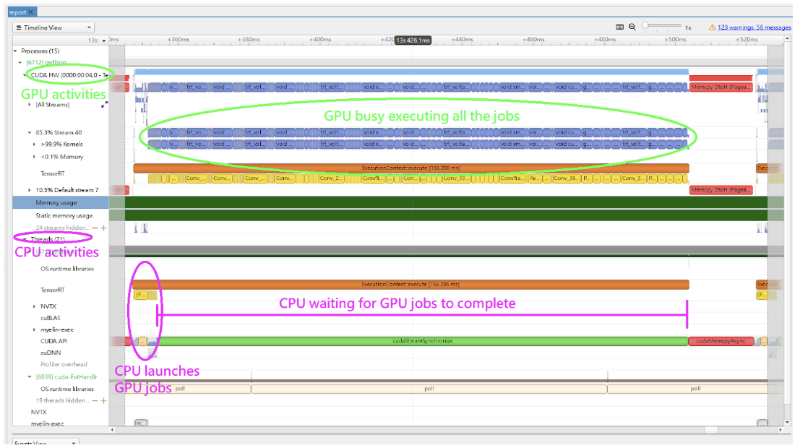
#### 在Nsight Systems中使用NVTX跟踪

启用[NVIDIA工具扩展SDK（NVTX）](https://docs.nvidia.com/nsight-visual-studio-edition/2020.1/nvtx/index.html)跟踪功能可以让Nsight Compute和Nsight Systems收集由TensorRT应用程序生成的数据。NVTX是一个基于C的API，用于标记应用程序中的事件和范围。

将内核名称解码回原始网络中的层可能会很复杂。因此，TensorRT使用NVTX为每个层标记一个范围，这样CUDA分析器就可以将每个层与调用实现它的内核相关联。在TensorRT中，NVTX有助于将运行时引擎层执行与CUDA内核调用相关联。Nsight Systems支持在时间轴上收集和可视化这些事件和范围。当应用程序暂停时，Nsight Compute还支持收集和显示给定线程中所有活动NVTX域和范围的状态。

在TensorRT中，每个层可能会启动一个或多个内核来执行其操作。启动的确切内核取决于优化后的网络和当前硬件。根据构建器的选择，可能会有多个额外的操作来重新排序与层计算交错的数据；这些重新格式化操作可以实现为设备到设备的内存复制或自定义内核。

例如，以下截图来自Nsight Systems。

图17. 在CPU端执行的层和被启动的内核。


图18. 实际在GPU上运行的内核，换句话说，它显示了在CPU端执行的层和内核启动与它们在GPU端的执行之间的关联。
您是一名专业的翻译员。将其翻译成简体中文，不要修改任何现有的Markdown命令：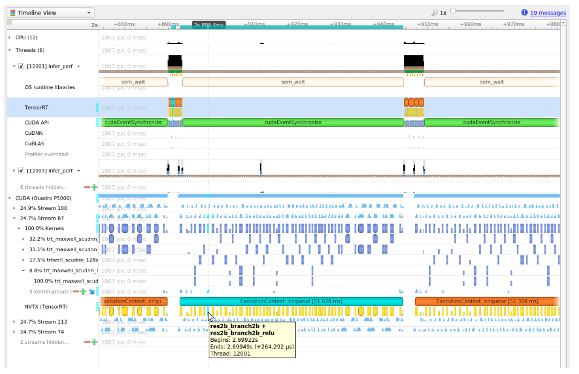
#### 控制NVTX跟踪中的细节级别

默认情况下，TensorRT只在NVTX标记中显示层名称，而用户可以通过在构建引擎时设置IBuilderConfig中的ProfilingVerbosity来控制详细级别。例如，要禁用NVTX跟踪，请将ProfilingVerbosity设置为kNONE：

C++

```c++
builderConfig->setProfilingVerbosity(ProfilingVerbosity::kNONE);
```

Python

```c++
builder_config.profilling_verbosity = trt.ProfilingVerbosity.NONE
```

另一方面，您可以选择允许TensorRT在NVTX标记中打印更详细的层信息，包括输入和输出维度、操作、参数、策略编号等，方法是将ProfilingVerbosity设置为kDETAILED：

C++

```c++
builderConfig->setProfilingVerbosity(ProfilingVerbosity::kDETAILED);
```

Python

```c++
builder_config.profilling_verbosity = trt.ProfilingVerbosity.DETAILED
```
#### 使用trtexec运行Nsight Systems

以下是使用[trtexec](#trtexec "在示例目录中包含了一个命令行包装工具，称为trtexec。trtexec是一个快速利用TensorRT的工具，无需开发自己的应用程序。trtexec工具有三个主要用途：")工具收集Nsight Systems配置文件的命令示例：

```c++
trtexec --onnx=foo.onnx --profilingVerbosity=detailed --saveEngine=foo.plan
nsys profile -o foo_profile --capture-range cudaProfilerApi trtexec --loadEngine=foo.plan --warmUp=0 --duration=0 --iterations=50
```

第一个命令用于构建和序列化引擎到foo.plan文件，第二个命令使用foo.plan进行推理，并生成一个foo\_profile.qdrep文件，可以在Nsight Systems用户界面中打开该文件进行可视化。

\--profilingVerbosity=detailed标志允许TensorRT在NVTX标记中显示更详细的层信息，\--warmUp=0 --duration=0 --iterations=50标志允许您控制推理迭代的次数。默认情况下，trtexec进行三秒钟的推理，可能会生成非常大的输出qdrep文件。
#### （可选）在Nsys中启用GPU指标采样

在dGPU系统上，向nsys命令添加\--gpu-metrics-device all标志以采样GPU指标，包括GPU时钟频率、DRAM带宽、Tensor Core利用率等等。如果添加了该标志，这些GPU指标将出现在Nsight Systems的Web界面中。
### [13.1.4.1. DLA性能分析](#dla-profiling)

要对DLA进行性能分析，使用NVIDIA Nsight Systems CLI时，添加\--accelerator-trace nvmedia标志，或者在使用用户界面时启用**收集其他加速器跟踪**。例如，可以使用以下命令与NVIDIA Nsight Systems CLI一起使用：

```c++
nsys profile -t cuda,nvtx,nvmedia,osrt --accelerator-trace=nvmedia  --show-output=true  /usr/src/tensorrt/bin/trtexec --loadEngine=alexnet_int8.plan --iterations=20
```

下面是一个示例报告。

*   NvMediaDLASubmit为每个DLA子图提交一个DLA任务。DLA任务的运行时间可以在**其他加速器跟踪**下的DLA时间线中找到。
*   由于允许了GPU回退，TensorRT会自动添加一些CUDA内核，例如permutationKernelPLC3和copyPackedKernel，用于数据重新格式化。
*   TensorRT使用EGLStreams在GPU内存和DLA之间进行数据传输，因此执行了EGLStream API。

图19. DLA性能分析报告示例。为了最大化GPU利用率，trtexec提前一个批次排队查询。

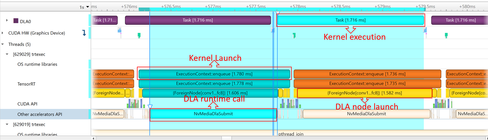

图20. DLA性能分析报告示例。DLA任务的运行时间可以在_其他加速器API_下找到。一些CUDA内核和EGLStream API用于GPU和DLA之间的交互。

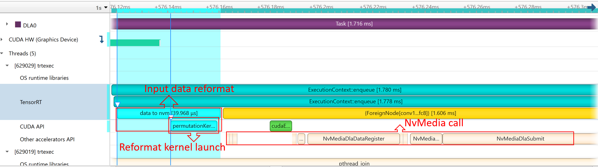
### [13.1.5. 内存跟踪](#bp-memory)

跟踪内存使用情况与执行性能一样重要。通常，设备上的内存限制比主机上的内存限制更严格。为了跟踪设备内存，推荐的机制是创建一个简单的自定义GPU分配器，该分配器在内部保持一些统计信息，然后使用常规的CUDA内存分配函数cudaMalloc和cudaFree。

可以为构建器IBuilder设置自定义的GPU分配器，用于网络优化，以及在使用IGpuAllocator API反序列化引擎时为IRuntime设置自定义的GPU分配器。一个自定义分配器的想法是跟踪当前分配的内存量，并将带有时间戳和其他信息的分配事件推送到全局的分配事件列表中。通过查看分配事件列表，可以对内存使用情况进行分析。

在移动平台上，GPU内存和CPU内存共享系统内存。在内存非常有限的设备上，如Nano，系统内存可能会因为大型网络而耗尽；即使所需的GPU内存小于系统内存。在这种情况下，增加系统交换空间的大小可以解决一些问题。下面是一个示例脚本：

```c++
echo "######alloc swap######"
if [ ! -e /swapfile ];then
    sudo fallocate -l 4G /swapfile
    sudo chmod 600 /swapfile
    sudo mkswap /swapfile
    sudo /bin/sh -c 'echo  "/swapfile \t none \t swap \t defaults \t 0 \t 0" >> /etc/fstab'
    sudo swapon -a
fi
```
### [13.2.性能测量的硬件/软件环境](#hw-sw-environ-perf-measure)

性能测量受许多因素的影响，包括硬件环境差异，如机器的冷却能力，以及软件环境差异，如GPU时钟设置。本节总结了可能影响性能测量的几个因素。

请注意，涉及nvidia-smi的项目仅支持dGPU系统，而不支持移动系统。
### [13.2.1. GPU信息查询和GPU监控](#gpu-info-query-monitor)

在测量性能时，建议您同时记录和监控GPU的状态以及推理工作负载。拥有监控数据可以帮助您在出现意外的性能测量结果时确定可能的根本原因。

在推理开始之前，调用nvidia-smi -q命令获取GPU的详细信息，包括产品名称、功耗限制、时钟设置等。然后，在推理工作负载运行时，同时运行nvidia-smi dmon -s pcu -f <FILE> -c <COUNT>命令，将GPU的时钟频率、功耗、温度和利用率打印到一个文件中。调用nvidia-smi dmon --help以获取有关nvidia-smi设备监控工具的更多选项。
### [13.2.2. GPU 时钟锁定和浮动时钟](#gpu-clock-lock-float)

默认情况下，GPU 时钟频率是浮动的，这意味着当没有活动负载时，时钟频率保持在空闲频率，当有负载开始时，它会提升到增强时钟频率。通常情况下，这是期望的行为，因为它允许 GPU 在空闲时产生较少的热量，并在有活动负载时以最大速度运行。

另外，您可以通过调用 sudo nvidia-smi -lgc <freq> 命令将时钟锁定在特定频率上（反之，您可以使用 sudo nvidia-smi -rgc 命令使时钟再次浮动）。支持的时钟频率可以通过 sudo nvidia-smi -q -d SUPPORTED\_CLOCKS 命令找到。时钟频率锁定后，除非发生功耗限制或热限制，否则它应该保持在该频率。这将在下一节中进行解释。当限制开始时，设备的行为就像时钟是浮动的一样。

在使用浮动时钟或发生限制的情况下运行 TensorRT 工作负载可能会导致策略选择的不确定性增加，并且推理过程中的性能测量不稳定，因为每个 CUDA 内核可能在稍微不同的时钟频率下运行，这取决于驱动程序在该时刻将时钟提升或限制到哪个频率。另一方面，使用锁定时钟运行 TensorRT 工作负载可以实现更确定的策略选择和一致的性能测量，但平均性能不如时钟浮动或在发生限制时锁定在最大频率时好。

在运行 TensorRT 工作负载时，没有明确的建议是否应该锁定时钟或将 GPU 锁定在哪个时钟频率上。这取决于是希望确定性和稳定性性能，还是希望获得最佳平均性能。
### [13.2.3. GPU功耗和功耗限制](#gpu-power-consumption-throttle)

当平均GPU功耗达到由sudo nvidia-smi -pl <power\_cap>命令设置的功耗限制时，就会发生功耗限制。在这种情况下，驱动程序必须将时钟降低到较低的频率，以使平均功耗保持在限制以下。如果在短时间内（例如20毫秒内）进行测量，则不断变化的时钟频率可能会导致性能测量不稳定。

功耗限制是设计上的问题，是GPU时钟未锁定或锁定在较高频率时的自然现象，特别是对于功耗限制较低的GPU，如NVIDIA T4和NVIDIA A2 GPU。为了避免功耗限制引起的性能变化，可以将GPU时钟锁定在较低的频率上，以使性能数据更加稳定。然而，尽管在这种情况下会发生功耗限制，但平均性能数据将低于浮动时钟或时钟锁定在较高频率时的性能数据。

功耗限制的另一个问题是，如果性能基准应用程序中的推理之间存在间隔，它可能会扭曲性能数据。例如，如果应用程序在每个推理处进行同步，那么在推理之间会有空闲时间。这些间隔导致GPU平均消耗较少的功耗，从而时钟降低较少，GPU平均可以以较高的时钟频率运行。然而，以这种方式测量的吞吐量数据并不准确，因为当GPU在没有推理之间的间隔时完全负载时，实际时钟频率将较低，实际吞吐量将无法达到使用基准应用程序测量的吞吐量数据。
为了避免这种情况，trtexec工具被设计成最大化GPU执行能力，几乎不留下GPU内核执行之间的间隙，以便能够测量TensorRT工作负载的真实吞吐量。因此，如果您在基准测试应用程序和trtexec报告之间看到性能差距，请检查功率限制和推理之间的间隙是否是原因。
### [13.2.4. GPU 温度和热节流](#gpu-temp-thermal-throttle)

当 GPU 温度达到预定阈值时（大多数 GPU 约为 85 摄氏度），热节流就会发生，驱动程序必须将时钟降低到较低的频率，以防止 GPU 过热。您可以通过查看 nvidia-smi dmon 命令记录的温度逐渐增加，直到达到约 85°C 并且时钟频率开始下降来判断是否发生了热节流。

如果 Quadro A8000 等主动散热的 GPU 发生热节流，那么可能是 GPU 上的风扇损坏或有障碍物阻挡了空气流动。

如果 NVIDIA A10 等被动散热的 GPU 发生热节流，那么很可能是 GPU 的散热不当。被动散热的 GPU 需要外部风扇或空调来降温，空气流动必须通过 GPU 进行有效散热。常见的散热问题包括将 GPU 安装在不适合 GPU 的服务器上或将错误数量的 GPU 安装到服务器中。在某些情况下，空气流动绕过 GPU（即通过最少摩擦的“易行路径”）而不是通过 GPU。解决这个问题需要检查服务器中的空气流动情况，并在必要时安装空气流动指导。

请注意，更高的 GPU 温度也会导致电路中的漏电流增加，从而增加 GPU 在特定时钟频率下消耗的功率。因此，对于像 NVIDIA T4 这样更容易受到功率节流影响的 GPU，散热不良可能导致功率节流时更低的稳定时钟频率，从而导致性能下降，即使 GPU 的时钟尚未发生热节流。
另一方面，环境温度，也就是服务器周围的温度，通常不会影响GPU的性能，只要GPU得到适当的冷却，除非是功率限制较低的GPU，其性能可能会稍有影响。
### [13.2.5. H2D/D2H 数据传输和 PCIe 带宽](#h2d-d2h-data-trans-pci-band)

在 dGPU 系统中，通常在推理开始之前，输入数据必须从主机内存复制到设备内存（H2D），并且在推理结束后，输出数据必须从设备内存复制回主机内存（D2H）。这些 H2D/D2H 数据传输通过 PCIe 总线进行，并且它们有时会影响推理性能，甚至成为性能瓶颈。H2D/D2H 的复制也可以在 Nsight Systems profiles 中看到，它们会显示为 cudaMemcpy() 或 cudaMemcpyAsync() CUDA API 调用。

为了实现最大吞吐量，H2D/D2H 数据传输应该与其他推理的 GPU 执行并行运行，这样当进行 H2D/D2H 复制时，GPU 不会空闲。可以通过在不同流中并行运行多个推理，或者通过在与 GPU 执行不同的流中启动 H2D/D2H 复制，并使用 CUDA 事件在流之间进行同步来实现。trtexec 工具作为后一种实现的示例。

当 H2D/D2H 复制与 GPU 执行并行运行时，它们可能会干扰 GPU 执行，特别是当主机内存是可分页的时候，这是默认情况。因此，建议您使用 cudaHostAlloc() 或 cudaMallocHost() CUDA API 为输入和输出数据分配固定的主机内存。

要检查 PCIe 带宽是否成为性能瓶颈，您可以检查 Nsight Systems profiles，并查看推理查询的 H2D 或 D2H 复制是否具有比 GPU 执行部分更长的延迟。如果 PCIe 带宽成为性能瓶颈，下面是一些可能的解决方案。
首先，检查GPU的PCIe总线配置是否正确，包括使用的是哪一代（例如Gen3或Gen4）以及使用了多少条通道（例如x8或x16）。接下来，尝试减少通过PCIe总线传输的数据量。例如，如果输入图像具有较高的分辨率，并且H2D复制成为瓶颈，那么可以考虑通过PCIe总线传输JPEG压缩图像，并在推理流程之前在GPU上解码图像，而不是传输原始像素。最后，您可以考虑使用NVIDIA GPUDirect技术直接从/到网络或文件系统加载数据，而无需经过主机内存。

此外，如果您的系统使用AMD x86_64 CPU，请使用numactl --hardware命令检查机器的NUMA（非统一内存访问）配置。位于两个不同NUMA节点上的主机内存和设备内存之间的PCIe带宽要比位于同一NUMA节点上的主机/设备内存之间的带宽受限得多。将主机内存分配到将要复制数据的GPU所在的NUMA节点上。此外，将触发H2D/D2H复制的CPU线程固定在该特定NUMA节点上。

请注意，在移动平台上，主机和设备共享同一内存，因此如果使用CUDA API分配主机内存并将其固定而不是可分页，则不需要进行H2D/D2H数据传输。

默认情况下，trtexec工具会测量H2D/D2H数据传输的延迟，以告知用户TensorRT工作负载是否可能受到H2D/D2H复制的限制。然而，如果H2D/D2H复制影响GPU计算时间的稳定性，您可以添加\--noDataTransfers标志来禁用H2D/D2H传输，仅测量GPU执行部分的延迟。
### [13.2.6. TCC模式和WDDM模式](#tcc-mode-wddm-mode)

在Windows机器上，有两种驱动模式：您可以将GPU配置为TCC模式和WDDM模式。可以通过调用sudo nvidia-smi -dm [0|1]命令来指定模式，但连接到显示器的GPU不应配置为TCC模式。有关TCC模式的更多信息和限制，请参阅[TCC模式文档](https://docs.nvidia.com/nsight-visual-studio-edition/reference/index.html#tesla-compute-cluster)。

在TCC模式下，GPU被配置为专注于计算工作，图形支持（如OpenGL或监视器显示）被禁用。这是运行TensorRT推理工作负载的推荐模式。另一方面，WDDM模式在使用TensorRT运行推理工作负载时往往会导致GPU性能较差且不稳定。

此适用于基于Linux的操作系统。
### [13.2.7. 排队绑定的工作负载和CUDA图](#enqueue-bound-workload)

IExecutionContext的enqueue()函数是异步的，也就是说，在所有CUDA内核启动后立即返回，而不等待CUDA内核执行完成。然而，在某些情况下，enqueue()函数的执行时间可能比实际的GPU执行时间更长，导致enqueue()调用的延迟成为性能瓶颈。我们称这种类型的工作负载为“排队绑定”。有两个原因可能导致工作负载成为排队绑定。

首先，如果工作负载在计算量方面非常小，例如包含具有小输入/输出大小的卷积、具有小GEMM大小的矩阵乘法，或者网络中主要是逐元素操作，那么工作负载往往是排队绑定的。这是因为大多数CUDA内核需要CPU和驱动程序大约5-15微秒的时间来启动每个内核，因此如果每个CUDA内核的执行时间平均只有几微秒，内核启动时间就成为主要的性能瓶颈。

为了解决这个问题，尝试增加每个CUDA内核的计算量，例如增加批处理大小。或者您可以使用[CUDA图](#cuda-graphs)将内核启动捕捉到一个图中，然后启动该图而不是调用enqueue()。

其次，如果工作负载包含需要设备同步的操作，例如循环或if-else条件，那么工作负载自然就是排队绑定的。在这种情况下，增加批处理大小可能有助于提高吞吐量，而不会显著增加延迟。

在trtexec中，如果报告的Enqueue Time接近或长于报告的GPU Compute Time，您可以确定工作负载是排队绑定的。在这种情况下，建议您在trtexec中添加\--useCudaGraph标志，以启用CUDA图，这将减少Enqueue Time，前提是工作负载不包含任何同步操作。
### [13.2.8. 阻塞同步和自旋等待同步模式](#synch-modes)

如果使用cudaStreamSynchronize()或cudaEventSynchronize()来测量性能，同步开销的变化可能会导致性能测量结果的变化。本节介绍了这种变化的原因以及如何避免它们。

当调用cudaStreamSynchronize()时，驱动程序等待流完成的方式有两种。如果使用cudaSetDeviceFlags()调用设置了cudaDeviceScheduleBlockingSync标志，则cudaStreamSynchronize()使用阻塞同步机制。否则，它使用自旋等待机制。

对CUDA事件也适用类似的思想。如果使用cudaEventDefault标志创建CUDA事件，则cudaEventSynchronize()调用使用自旋等待机制；如果使用cudaEventBlockingSync标志创建CUDA事件，则cudaEventSynchronize()调用将使用阻塞同步机制。

当使用阻塞同步模式时，主机线程会让出给其他线程，直到设备工作完成。这样可以使CPU空闲以节省功耗，或在设备仍在执行时由其他CPU工作负载使用。然而，在某些操作系统中，阻塞同步模式往往会导致流/事件同步的开销相对不稳定，从而导致延迟测量结果的变化。

另一方面，当使用自旋等待模式时，主机线程会不断轮询，直到设备工作完成。使用自旋等待可以使延迟测量结果更稳定，因为流/事件同步的开销更短且更稳定，但会消耗一些CPU计算资源，并导致CPU的功耗增加。

因此，如果您希望减少CPU功耗，或者不希望流/事件同步消耗CPU资源（例如，同时运行其他繁重的CPU工作负载），请使用阻塞同步模式。如果您更关心稳定的性能测量结果，请使用自旋等待模式。
在trtexec中，默认的同步机制是阻塞同步模式。添加\--useSpinWait标志以启用使用自旋等待模式进行更稳定的延迟测量，但会增加CPU利用率和功耗的成本。
### [13.3. 优化TensorRT性能](#优化性能)

以下部分重点介绍了在GPU上的一般推理流程以及一些提高性能的通用策略。这些想法适用于大多数CUDA程序员，但对于来自其他背景的开发人员可能不太明显。
### [13.3.1. 批处理](#批处理)

最重要的优化是使用批处理尽可能并行计算尽可能多的结果。在TensorRT中，一个_批次_是一组可以统一处理的输入。批次中的每个实例具有相同的形状，并以完全相同的方式通过网络。因此，每个实例可以轻松地并行计算。

网络的每一层都需要一定的开销和同步来计算前向推理。通过并行计算更多的结果，可以更高效地摊销这些开销。此外，许多层的性能受到输入的最小维度的限制。如果批量大小为一或较小，则此大小通常可以成为性能限制维度。例如，具有V个输入和K个输出的全连接层可以为一个批次实例实现为一个1xV矩阵与一个VxK权重矩阵的矩阵乘法。如果有N个实例进行批处理，则变为一个NxV乘以VxK的矩阵。向量-矩阵乘法器变成了矩阵-矩阵乘法器，这更加高效。

较大的批量大小在GPU上几乎总是更高效的。非常大的批次，例如N > 2^16，有时可能需要扩展索引计算，因此应尽量避免。但一般来说，增加批量大小可以提高总吞吐量。此外，当网络包含MatrixMultiply层或FullyConnected层时，对于FP16和INT8推理，32的倍数的批量大小通常具有最佳性能，因为硬件支持Tensor Cores的利用。
有时由于应用程序的组织结构，无法对推理工作进行批处理。在一些常见的应用程序中，比如按请求进行推理的服务器，可以实现机会性批处理。对于每个传入的请求，等待一段时间T。如果在此期间有其他请求到达，则将它们一起进行批处理。否则，继续进行单个实例的推理。这种策略会为每个请求增加固定的延迟，但可以将系统的最大吞吐量提高数倍。
#### 使用批处理

如果在创建网络时使用显式批处理模式，则批处理维度是张量维度的一部分，您可以通过添加优化配置文件来指定批处理大小的范围和批处理大小，以便为引擎进行优化。有关详细信息，请参阅[使用动态形状](#work_dynamic_shapes "动态形状是延迟到运行时指定某些或所有张量维度的能力。动态形状可以通过C++和Python接口使用。")部分。

如果在创建网络时使用隐式批处理模式，则IExecutionContext::execute（Python中的IExecutionContext.execute）和IExecutionContext::enqueue（Python中的IExecutionContext.execute\_async）方法需要一个批处理大小参数。在使用IBuilder::setMaxBatchSize（Python中的Builder.max\_batch\_size）构建优化网络时，还应设置最大批处理大小。在调用IExecutionContext::execute或enqueue时，作为绑定参数传递的绑定是按张量而不是按实例组织的。换句话说，一个输入实例的数据不会被组织在内存的一个连续区域中。相反，每个张量绑定都是该张量的实例数据数组。

另一个考虑因素是构建优化网络时会针对给定的最大批处理大小进行优化。最终结果将针对最大批处理大小进行调优，但对于任何较小的批处理大小仍然可以正常工作。可以运行多个构建操作以创建多个针对不同批处理大小进行优化的引擎，然后根据运行时的实际批处理大小选择要使用的引擎。
### [13.3.2. 流式处理](#streaming)

一般来说，CUDA编程中的流式处理是一种组织异步工作的方式。放入流中的异步命令保证按顺序运行，但可能与其他流无序执行。特别是，两个流中的异步命令可能被调度为并发运行（受硬件限制）。

在TensorRT和推理的上下文中，优化的最终网络的每个层都需要在GPU上进行计算。然而，并非所有层都能充分利用硬件的计算能力。在单独的流中调度请求可以在硬件可用时立即进行调度，而无需进行不必要的同步。即使只有一些层可以重叠，整体性能也会提高。
#### 使用流式处理

1. 识别独立的推断批次。
2. 为网络创建一个单一的引擎。
3. 为每个独立批次使用cudaStreamCreate创建一个CUDA流，并为每个独立批次创建一个IExecutionContext。
4. 通过从适当的IExecutionContext请求异步结果并传入适当的流来启动推断工作，使用IExecutionContext::enqueue。
5. 在所有工作都已启动后，与所有流同步以等待结果。执行上下文和流可以在后续独立工作的批次中重复使用。
#### 多个流

同时运行多个并发流通常会导致多个流在同一时间共享计算资源。这意味着在推理过程中，网络可能比在优化TensorRT引擎时拥有更少的计算资源可用。资源可用性的差异可能导致TensorRT选择一个对实际运行时条件不太优化的核函数。为了减轻这种影响，您可以在引擎创建过程中限制可用的计算资源数量，以更接近实际运行时条件。这种方法通常会以延迟为代价来提高吞吐量。有关更多信息，请参阅[限制计算资源](#limit-compute-resources "在引擎创建过程中限制TensorRT可用的计算资源数量，当减少的数量更好地代表运行时预期条件时，这是有益的。例如，当GPU预计在与TensorRT引擎并行执行其他工作时，或者当引擎预计在具有较少资源的不同GPU上运行时（请注意，推荐的方法是在用于推理的GPU上构建引擎，但这并不总是可行的）。")。

还可以使用多个主机线程和流。一个常见的模式是将传入的请求分派给一个等待工作线程池。在这种情况下，工作线程池中的每个线程都会有一个执行上下文和CUDA流。每个线程在其自己的流中请求工作，一旦工作可用。每个线程将与其流同步，等待结果而不阻塞其他工作线程。
### [13.3.3. CUDA图形](#cuda-graphs)

[CUDA图形](https://docs.nvidia.com/cuda/cuda-c-programming-guide/index.html#cuda-graphs)是一种表示核函数序列（或更一般地说是图形）的方式，可以通过CUDA对其进行优化调度。当应用程序的性能对CPU用于排队核函数的时间敏感时，这非常有用。

TensorRT的enqueuev3()方法支持对不需要在管道中间与CPU进行交互的模型进行CUDA图形捕获。例如：

C++

```c++
// 在输入形状发生变化后调用enqueueV3()一次以更新内部状态。
context->enqueueV3(stream);

// 捕获CUDA图形实例
cudaGraph_t graph;
cudaGraphExec_t instance;
cudaStreamBeginCapture(stream, cudaStreamCaptureModeGlobal);
context->enqueueV3(stream);
cudaStreamEndCapture(stream, &graph);
cudaGraphInstantiate(&instance, graph, NULL, NULL, 0);

// 运行推理时，启动图形而不是调用enqueueV3()。
for (int i = 0; i < iterations; ++i) { 
    cudaGraphLaunch(instance, stream);
    cudaStreamSynchronize(stream);
}
```

不支持图形的模型包括具有循环或条件语句的模型。在这种情况下，cudaStreamEndCapture()将返回cudaErrorStreamCapture\*错误，表示图形捕获失败，但上下文仍然可以用于正常的CUDA图形推理。

在捕获图形时，重要的是要考虑到在存在动态形状的情况下使用的两阶段执行策略。

1. 更新模型的内部状态以适应输入大小的任何更改。
2. 将工作流传输到GPU

对于在构建时输入大小固定的模型，第一阶段不需要每次调用时的工作。否则，如果输入大小自上次调用以来发生了变化，则需要一些工作来更新派生属性。
工作的第一阶段不是为了捕捉设计的，即使捕捉成功，也可能会增加模型执行的时间。因此，在更改输入的形状或形状张量的值之后，在捕捉图形之前调用enqueueV2()一次以刷新延迟更新。

使用TensorRT捕捉的图形特定于它们被捕捉的输入大小，也特定于执行上下文的状态。如果修改了捕捉图形的上下文，执行图形时将导致未定义的行为 - 特别是，如果应用程序使用createExecutionContextWithoutDeviceMemory()为激活提供自己的内存，则内存地址也被捕捉为图形的一部分。绑定位置也被捕捉为图形的一部分。

因此，最佳实践是为每个捕捉图形使用一个执行上下文，并使用createExecutionContextWithoutDeviceMemory()在上下文之间共享内存。

trtexec允许您检查构建的TensorRT引擎是否与CUDA图形捕捉兼容。有关更多信息，请参阅[trtexec](#trtexec "在示例目录中包含一个命令行包装工具，称为trtexec。trtexec是一个工具，可以快速利用TensorRT，而无需开发自己的应用程序。trtexec工具有三个主要目的：")部分。
### [13.3.4. 启用融合](#enable-fusion)
### [13.3.4.1. 层融合](#层融合)

TensorRT在网络的构建阶段尝试执行许多不同类型的优化。在第一阶段，尽可能地将层进行融合。融合将网络转化为更简单的形式，但保持相同的整体行为。在内部，许多层的实现具有额外的参数和选项，这些参数和选项在创建网络时无法直接访问。相反，融合优化步骤会检测到支持的操作模式，并将多个层融合为一个层，并设置内部选项。

考虑卷积后面跟着ReLU激活的常见情况。要创建具有这些操作的网络，需要使用addConvolution添加一个卷积层，然后使用addActivation添加一个ActivationType为kRELU的激活层。未经优化的图形将包含独立的卷积层和激活层。卷积的内部实现支持在一步中直接从卷积核计算输出的ReLU函数，而无需进行第二次卷积核调用。融合优化步骤将检测到卷积后面跟着ReLU。验证这些操作是否由实现支持，然后将它们融合为一个层。

要调查已经发生或尚未发生的融合，生成器将其操作记录到在构造过程中提供的日志记录器对象中。优化步骤位于kINFO日志级别。要查看这些消息，请确保在ILogger回调中记录它们。

通常，融合是通过创建一个新层来处理的，该层的名称包含已融合的两个层的名称。例如，在MNIST中，一个名为ip1的全连接层（InnerProduct）与一个名为relu1的ReLU激活层融合在一起，创建一个名为ip1 + relu1的新层。
### [13.3.4.2. 融合类型](#fusion-types)

以下列表描述了支持的融合类型。
#####支持的层融合

ReLU激活

执行ReLU的激活层后跟执行ReLU的激活层将被替换为单个激活层。

卷积和ReLU激活

卷积层可以是任何类型且对值没有限制。激活层必须是ReLU类型。

卷积和GELU激活

输入和输出的精度应该相同，两者都应为FP16或INT8。激活层必须是GELU类型。TensorRT应在支持CUDA版本10.0或更高的NVIDIA Turing或更高设备上运行。

卷积和Clip激活

卷积层可以是任何类型且对值没有限制。激活层必须是Clip类型。

缩放和激活

缩放层后跟激活层可以融合为单个激活层。

卷积和逐元素操作

卷积层后跟ElementWise层中的简单求和、最小值或最大值可以融合为卷积层。求和不能使用广播，除非广播是跨批次大小进行的。

填充和卷积/反卷积

填充后跟卷积或反卷积可以融合为单个卷积/反卷积层，如果所有填充尺寸都是非负的。

Shuffle和Reduce

没有reshape的Shuffle层后跟Reduce层可以融合为单个Reduce层。Shuffle层可以执行排列操作，但不能执行任何reshape操作。Reduce层必须具有设置为维度的keepDimensions。

Shuffle和Shuffle

每个Shuffle层由一个转置、一个reshape和一个第二个转置组成。Shuffle层后跟另一个Shuffle层可以被替换为单个Shuffle（或不执行任何操作）。如果两个Shuffle层都执行reshape操作，则只有在第一个Shuffle的第二个转置是第二个Shuffle的第一个转置的逆时，才允许进行此融合。

缩放

添加0、乘以1或计算为1的缩放层可以被删除。
卷积和缩放

一个后面跟着kUNIFORM或kCHANNEL的缩放层的卷积层可以通过调整卷积权重来融合成一个单独的卷积层。如果缩放层具有非常数功率参数，则禁用此融合。

卷积和通用激活

此融合发生在下面提到的逐点融合之后。具有一个输入和一个输出的逐点层可以称为通用激活层。卷积层后面跟着通用激活层可以融合成一个单独的卷积层。

减少

执行平均池化的减少层将被替换为池化层。在批处理之前，减少层必须设置keepDimensions，并在CHW输入格式上减少H和W维度，使用kAVG操作。

卷积和池化

卷积和池化层必须具有相同的精度。卷积层可能已经具有来自先前融合的融合激活操作。

深度可分离卷积

具有激活的深度可分离卷积后面跟着具有激活的卷积有时可以融合成一个优化的DepSepConvolution层。两个卷积的精度必须为INT8，并且设备的计算能力必须为7.2或更高。

SoftMax和Log

如果SoftMax尚未与先前的对数操作融合，则可以将其融合成一个单独的SoftMax层。

SoftMax和TopK

可以融合成一个单独的层。SoftMax可以包括Log操作，也可以不包括。

全连接

全连接层将被转换为卷积层。所有卷积的融合都将生效。
##### 支持的降维操作融合

GELU

一组一元层和逐元素层，代表以下方程，可以融合成一个单独的GELU降维操作。

$0.5x\text{ } \times \text{ }\left(1 + tanh\text{ }\left(2/ π\text{ }\left(x + 0.044715x^{3}\right)\right)\right)$

或者另一种表示形式：

$0.5x\text{ } \times \text{ }\left(1 + erf\text{ }\left(x/ \sqrt{2}\right)\right)$

L1Norm

一个一元层的kABS操作，后跟一个Reduce层的kSUM操作，可以融合成一个单独的L1Norm降维操作。

平方和

相同输入的乘积逐元素层（平方操作），后跟一个kSUM降维操作，可以融合成一个单独的平方和降维操作。

L2Norm

一个平方和操作，后跟一个kSQRT一元操作，可以融合成一个单独的L2Norm降维操作。

LogSum

一个kSUM降维操作，后跟一个kLOG一元操作，可以融合成一个单独的LogSum降维操作。

LogSumExp

一个一元kEXP逐元素操作，后跟一个LogSum融合操作，可以融合成一个单独的LogSumExp降维操作。
### [13.3.4.3. 点对点融合](#点对点融合)

多个相邻的点对点层可以融合成一个单独的点对点层，以提高性能。

支持以下类型的点对点层，但有一些限制：

激活

支持所有的激活类型。

常数

只支持具有单个值的常数（大小 == 1）。

逐元素

支持所有的逐元素操作。

点对点

点对点本身也是一个点对点层。

缩放

只支持ScaleMode::kUNIFORM。

一元

支持所有的一元操作。

融合的点对点层的大小是有限的，因此，某些点对点层可能无法融合。

融合会创建一个新的层，名称由被融合的两个层的名称组成。例如，一个名为add1的逐元素层与一个名为relu1的ReLU激活层融合后，新的层名称为：fusedPointwiseNode(add1, relu1)。
### [13.3.4.4. Q/DQ 融合](#qdq-fusion)

由 QAT 工具（如[NVIDIA的PyTorch量化工具包](https://github.com/NVIDIA/TensorRT/tree/main/tools/pytorch-quantization)）生成的量化 INT8 图包括具有比例和零点的 onnx::QuantizeLinear 和 onnx::DequantizeLinear 节点对（Q/DQ）。从 TensorRT 7.0 开始，要求零点为 0。

Q/DQ 节点帮助将 FP32 值转换为 INT8 值，反之亦然。这样的图仍然使用 FP32 精度存储权重和偏置。

权重后面跟着一个 Q/DQ 节点对，以便在需要时对其进行量化/反量化。使用激活和权重的比例执行偏置量化，因此对于偏置输入不需要额外的 Q/DQ 节点对。偏置量化的假设是 $S\_weights\text{ }*\text{ }S\_input\text{ } = \text{ }S\_bias$。

与 Q/DQ 节点相关的融合包括权重的量化/反量化、交换 Q/DQ 节点而不改变模型的数学等价性以及消除冗余的 Q/DQ 节点。应用 Q/DQ 融合后，将对图应用其余的构建器优化。

将 Q/DQ 与加权节点（Conv、FC、Deconv）融合

如果我们有一个

```c++
[DequantizeLinear（激活），DequantizeLinear（权重）] > 节点 >
        QuantizeLinear
```

（[DQ，DQ] > 节点 > Q）序列，则融合为量化节点（QNode）。

支持权重的 Q/DQ 节点对要求加权节点支持多个输入。因此，我们支持添加第二个输入（用于权重张量）和第三个输入（用于偏置张量）。可以使用 setInput(index, tensor) API 为卷积、反卷积和全连接层设置额外的输入，其中 index = 2 表示权重张量，index = 3 表示偏置张量。

在与加权节点融合时，我们将 FP32 权重量化为 INT8 并与相应的加权节点融合。类似地，FP32 偏置将被量化为 INT32 并融合。

将 Q/DQ 与非加权节点融合
如果我们有一个DequantizeLinear > Node > QuantizeLinear (DQ > Node > Q)的序列，那么它将被融合到量化节点(QNode)中。

交换Q/DQ节点

当$\Phi \text{ }\left(DQ\text{ }\left(x\right)\right)\text{ } = = \text{ }DQ\text{ }\left(\Phi \text{ }\left(x\right)\right)$时，允许进行DequantizeLinear的交换。当$Q\text{ }\left(\Phi \text{ }\left(x\right)\right)\text{ } = = \text{ }\Phi \text{ }\left(Q\text{ }\left(x\right)\right)$时，允许进行QuantizeLinear的交换。

此外，交换逻辑还考虑到可用的内核实现，以确保数学等价性。

插入缺失的Q/DQ节点

如果一个节点缺少Q/DQ节点对，并且$\max \text{ }\left(abs\text{ }\left(\Phi \text{ }\left(x\right)\right)\right)\text{ } = = \text{ }\max \text{ }\left(abs\text{ }\left(x\right)\right)$；（例如，MaxPool），则会插入缺失的Q/DQ对以使用INT8精度运行更多节点。

删除多余的Q/DQ节点

在应用所有优化后，图中仍然可能存在Q/DQ节点对本身是无操作的情况。Q/DQ节点擦除融合将删除这些多余的对。
### [13.3.5. 限制计算资源](#limit-compute-resources)

在创建TensorRT引擎时限制计算资源的数量，当减少的数量更好地代表运行时的预期条件时，是有益的。例如，当GPU预计在TensorRT引擎并行执行其他工作时，或者当预计在具有较少资源的不同GPU上运行引擎时（请注意，建议的方法是在用于推理的GPU上构建引擎，但这并不总是可行的）。

您可以通过以下步骤限制可用的计算资源：

1. 启动CUDA MPS控制守护程序。

   ```c++
   nvidia-cuda-mps-control -d
   ```

2. 使用CUDA\_MPS\_ACTIVE\_THREAD\_PERCENTAGE环境变量设置要使用的计算资源数量。例如，export CUDA\_MPS\_ACTIVE\_THREAD\_PERCENTAGE=50。
3. 构建网络引擎。
4. 停止CUDA MPS控制守护程序。

   ```c++
   echo quit | nvidia-cuda-mps-control
   ```

生成的引擎针对减少的计算核心数量（本示例中为50%）进行了优化，并在使用类似条件进行推理时提供更好的吞吐量。鼓励您尝试不同数量的流和不同的MPS值，以确定网络的最佳性能。

有关nvidia-cuda-mps-control的更多详细信息，请参阅[nvidia-cuda-mps-control](https://docs.nvidia.com/deploy/mps/index.html#topic_5_1_1)文档以及相关的GPU要求[此处](https://docs.nvidia.com/deploy/mps/index.html#topic_3_3_1_1)。
### [13.3.6. 确定性策略选择](#deterministic-tactic-selection)

在引擎构建阶段，TensorRT会遍历所有可能的策略并选择最快的策略。由于策略的选择是基于策略的延迟测量结果，如果某些策略的延迟非常相似，TensorRT可能会在不同的运行中选择不同的策略。因此，从相同的INetworkDefinition构建的不同引擎在输出值和性能方面可能会略有不同。您可以使用[Engine Inspector](#engine-inspector "TensorRT提供了IEngineInspector API来检查TensorRT引擎中的信息。从反序列化的引擎中调用createEngineInspector()来创建一个引擎检查器，然后调用getLayerInformation()或getEngineInformation()检查器API来获取引擎中特定层的信息或整个引擎的信息。您可以按照以下方式打印给定引擎的第一层的信息，以及引擎的整体信息：")来检查引擎的选定策略，或者在构建引擎时启用详细日志记录。

如果需要确定性的策略选择，以下列出了一些可能有助于提高策略选择确定性的建议。
#### 锁定GPU时钟频率

默认情况下，GPU的时钟频率未锁定，这意味着GPU通常处于空闲时钟频率，并且只在有活动的GPU工作负载时才会提升到最大时钟频率。然而，从空闲频率提升时钟存在一定的延迟，这可能会导致TensorRT在运行策略并选择最佳策略时出现性能变化，从而导致非确定性策略选择。

因此，在开始构建TensorRT引擎之前锁定GPU时钟频率可能会提高策略选择的确定性。您可以通过调用sudo nvidia-smi -lgc <freq>命令来锁定GPU时钟频率，其中<freq>是要锁定的期望频率。您可以调用nvidia-smi -q -d SUPPORTED\_CLOCKS命令来查找GPU支持的时钟频率。

因此，在开始构建TensorRT引擎之前锁定GPU时钟频率可能会提高策略选择的确定性。有关如何锁定和监视GPU时钟以及可能影响GPU时钟频率的因素的更多信息，请参阅[性能测量的硬件/软件环境](#hw-sw-environ-perf-measure "性能测量受许多因素的影响，包括硬件环境差异（如机器的冷却能力）和软件环境差异（如GPU时钟设置）。本节总结了可能影响性能测量的一些因素。")部分。
#### 增加平均计时迭代次数

默认情况下，TensorRT对每个策略至少运行四次迭代，并取平均延迟时间。您可以通过调用setAvgTimingIterations() API来增加迭代次数：

C++

```c++
builderConfig->setAvgTimingIterations(8);
```

Python

```c++
Builder_config.avg_timing_iterations = 8
```

增加平均计时迭代次数可能会改善策略选择的确定性，但是构建引擎所需的时间会变长。
#### 使用时序缓存

[时序缓存](#timing-cache "为了减少构建时间，TensorRT创建了一个时序缓存来保存层的分析信息。它所包含的信息是针对目标设备、CUDA、TensorRT版本和BuilderConfig参数的，这些参数可以改变层的实现，比如BuilderFlag::kTF32或BuilderFlag::kREFIT。")记录了特定层配置下每个策略的延迟时间。如果TensorRT遇到另一个具有相同配置的层，则会重复使用策略延迟时间。因此，通过在相同的INetworkDefinition和构建器配置下重复使用相同的时序缓存，您可以使TensorRT在生成的引擎中选择相同的策略集。

有关更多信息，请参阅[时序缓存](#timing-cache "为了减少构建时间，TensorRT创建了一个时序缓存来保存层的分析信息。它所包含的信息是针对目标设备、CUDA、TensorRT版本和BuilderConfig参数的，这些参数可以改变层的实现，比如BuilderFlag::kTF32或BuilderFlag::kREFIT。")部分。
### [13.3.7. Transformer 性能](#transformers-performance)

使用基于 Transformer 的网络在 NVIDIA GPU 上进行推理有几种方式，包括使用原生的 TensorRT（例如使用 ONNX），使用 TensorRT OSS 的 [demoBERT](https://github.com/NVIDIA/TensorRT/tree/main/demo/BERT) 示例与插件，以及使用 [FasterTransformer](https://github.com/NVIDIA/FasterTransformer)。每种方法都有其自身的优点，并适用于不同的用例。

使用原生的 TensorRT 可以在不改变代码的情况下最大限度地灵活调整网络的结构或参数，而 demoBERT 和 FasterTransformer 则专注于特定的网络，并可能需要在配置文件甚至代码中手动更新以进行网络更改。此外，使用原生的 TensorRT 还可以使用 [Triton 推理服务器](https://github.com/triton-inference-server) 无缝部署推理服务。

TensorRT 使用先进的图编译技术来加速基于 Transformer 的模型（如 BERT、GPT、T5 等），其中包括在自注意力块和层归一化块内部融合操作，使用诸如带有幂运算的降维融合、带有 SoftMax 的比例融合，以及带有 ReLU 和 GELU 激活函数的 GEMM 融合。此外，TensorRT 还优化图形，以消除转置操作，并将 Key、Value 和 Query 的所有 GEMM 融合为一个大型 GEMM。

截至 TensorRT 8.4，TensorRT 仅加速了基于 Transformer 的模型的显式量化模式。对于隐式量化模型，TensorRT 更喜欢为相关的计算密集型 Transformer 层使用 FP16（如果 BuilderFlag 中启用了 FP16 标志）或 FP32 精度。唯一的例外是在 NVIDIA T4 GPU 上，当启用了 Transformer 的隐式量化模式时，TensorRT 更喜欢保持带有 INT8 精度的 GEMM。
然而，demoBERT和FasterTransformer具有更激进的性能优化，这些优化尚未添加到TensorRT中。例如，demoBERT和FasterTransformer支持可变序列长度特性，可以在连接的输入序列上运行推理，避免对填充部分进行不必要的计算，但这需要在应用程序中进行预处理，将输入数据连接起来。此外，FasterTransformer为贪婪搜索和波束搜索算法提供了CUDA内核，并且还具有多GPU/多节点支持，而TensorRT尚未具备这些功能。

如果您的Transformer模型不基于任何常见的架构，或者您已经调整了网络结构或参数，您应该考虑直接使用TensorRT API运行网络。另一方面，如果您希望实现最大可能的性能，并愿意在部署模型方面投入更多的工程工作，那么您可以考虑使用demoBERT或FasterTransformer。

表4. 三种性能方法之间的差异
|     | 使用ONNX解析器的TensorRT | TensorRT OSS[demoBERT](https://github.com/NVIDIA/TensorRT/tree/main/demo/BERT)示例 | [FasterTransformer](https://github.com/NVIDIA/FasterTransformer) |
| --- | --- | --- | --- |
| 模型支持 | 大多数ONNX模型 | 仅限BERT | 仅限选定的模型 |
| 适用于调整网络结构或参数 | 简单，直接从ONNX加载 | 否 | 需要手动更新代码和配置文件 |
| 使用TensorRT | 是 | 是，使用插件 | 否 |
| 支持完整的MHA融合 | 否（将在未来的TensorRT版本中改进） | 是 | 是 |
| 支持GEMM+GELU融合 | 是 | 是 | 否 |
| 支持无填充的可变序列长度 | 否 | 是 | 是 |
| 支持自回归Transformer的KV缓存 | 否（将在未来的TensorRT版本中改进） | 对于BERT不适用 | 是 |
| 支持贪婪/束搜索用于自回归变压器 | 通常在TensorRT之外完成，例如使用HuggingFace的API | 对于BERT不适用 | 是的，本地支持 |
| 支持多GPU/多节点推理 | 否 | 否 | 是 |
| 支持INT8 | 是，但仅限显式量化模式（隐式量化模式功能正常，但性能不保证）| 是 | 是，但仅适用于部分选定模型 |
### [13.3.8. 形状变化和优化配置切换的开销](#overhead-shape-prof-switch)

当IExecutionContext切换到新的优化配置，或者输入绑定的形状发生变化时，TensorRT必须重新计算整个网络中的张量形状，并重新计算一些策略所需的资源，以适应新的形状，然后才能开始下一次推理。这意味着，在形状/配置变化后的第一次enqueue()调用可能比后续的enqueue()调用时间更长。

优化形状/配置切换的成本是一个正在积极开发的领域。然而，仍然有一些情况下，开销可能会影响推理应用的性能。例如，一些用于NVIDIA Volta GPU或旧GPU的卷积策略，即使它们的推理性能在所有可用策略中是最好的，但其形状/配置切换的开销会更长。在这种情况下，在构建引擎时禁用来自策略源的kEDGE\_MASK\_CONVOLUTIONS策略可能有助于减少形状/配置切换的开销。
### [13.4. 优化层性能](#optimize-layer)

以下描述详细介绍了如何优化所列出的层。

连接层

如果使用隐式批次维度，则连接层的主要考虑因素是，如果将多个输出连接在一起，则不能在批次维度上进行广播，必须显式复制。大多数层支持在批次维度上进行广播，以避免不必要的数据复制，但如果输出与其他张量连接，则将禁用此功能。

聚集层

为了获得最佳性能，使用轴为0的聚集层。聚集层没有可用的融合。

缩减层

为了获得最佳性能，对最后维度（尾部缩减）进行缩减。这样可以通过顺序内存位置进行最佳内存读写模式。如果进行常见的缩减操作，请尽可能以可融合为单个操作的方式表达缩减。

循环神经网络层

如果可能，优先使用较新的RNNv2接口而不是传统的RNN接口。较新的接口支持可变序列长度和可变批次大小，并具有更一致的接口。为了获得最佳性能，较大的批次大小更好。一般来说，64的倍数的大小可以实现最高性能。双向RNN模式会因为增加的依赖关系而阻止波前传播，因此速度较慢。
此外，新引入的基于循环的API提供了一种更灵活的机制，可以在不受限于一小组预定义的RNNv2接口的情况下使用通用层进行循环。ILoopLayer循环使得一系列自动循环优化成为可能，包括循环融合、展开和循环不变代码移动等。例如，当多个相同的MatrixMultiply或FullyConnected层的实例在序列维度上经过循环展开后进行适当组合以最大化机器利用率时，通常可以获得显著的性能提升。如果能够避免在序列维度上存在循环数据依赖的MatrixMultiply或FullyConnected层，则效果最佳。

洗牌

如果输入张量仅在洗牌层中使用，并且此层的输入和输出张量不是网络的输入和输出张量，则等效于基础数据上的身份操作的洗牌操作将被省略。对于这种操作，TensorRT不执行额外的内核或内存复制。

TopK

为了获得TopK层的最佳性能，使用较小的K值来减少数据的最后一个维度，以允许最佳的顺序内存访问。可以通过使用Shuffle层来重新塑形数据，然后适当解释索引值来模拟同时沿多个维度进行的减少操作。

有关层的更多信息，请参阅[TensorRT运算符参考](https://docs.nvidia.com/deeplearning/tensorrt/operators/docs/index.html)。
### [13.5. 优化 Tensor Cores](#optimize-tensor-cores)

Tensor Core 是在 NVIDIA GPU 上实现高性能推理的关键技术。在 TensorRT 中，Tensor Core 操作由所有计算密集型层支持 - 矩阵乘法、全连接、卷积和反卷积。

如果 I/O 张量的维度与某个最小粒度对齐，Tensor Core 层通常能够实现更好的性能：

*   在卷积和反卷积层中，对 I/O 通道维度有对齐要求。
*   在矩阵乘法和全连接层中，对矩阵维度 K 和 N 有对齐要求，这是一个 M x K 乘以 K x N 的矩阵乘法。

下表列出了为了获得更好的 Tensor Core 性能而建议的张量维度对齐。

表 5. Tensor Core 类型
| Tensor Core 操作类型 | 建议的张量维度对齐(以元素为单位) |
| --- | --- |
| TF32 | 4   |
| FP16 | 密集数学运算为 8，稀疏数学运算为 16 |
| INT8 | 32  |

当在不满足这些要求的情况下使用 Tensor Core 实现时，TensorRT 会隐式地将张量填充到最接近对齐的倍数，向上舍入模型定义中的维度，以便在模型中增加额外的容量而不增加计算或内存流量。

TensorRT 总是使用最快的实现方式来处理层，因此在某些情况下，即使 Tensor Core 可用，也可能不使用 Tensor Core 实现。

要检查某个层是否使用了 Tensor Core，请在使用 Nsight Systems 对 TensorRT 应用程序进行分析时，运行带有 \--gpu-metrics-device all 标志。在 Nsight Systems 用户界面的 **SM instructions/Tensor Active** 行下可以找到 Tensor Core 使用率的分析结果。有关如何使用 Nsight Systems 对 TensorRT 应用程序进行分析的更多信息，请参阅 [CUDA Profiling Tools](#nvprof)。
请注意，期望CUDA内核达到100% Tensor Core使用率是不现实的，因为还有其他开销，如DRAM读写、指令停顿、其他计算单元等。一般来说，计算密集型操作越多，CUDA内核可以实现的Tensor Core使用率就越高。

图21. Nsight Systems分析结果示例，显示了在启用FP16的情况下，A100 GPU上运行ResNet-50时的Tensor Core活动。

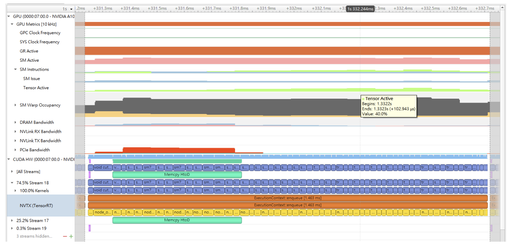
### [13.6. 优化插件](#optimize-plugins)

TensorRT提供了一种注册自定义插件的机制，用于执行层操作。注册插件创建者后，您可以查找注册表以找到创建者，并在序列化/反序列化期间将相应的插件对象添加到网络中。

一旦加载插件库，所有TensorRT插件都会自动注册。有关自定义插件的更多信息，请参阅[使用自定义层扩展TensorRT](#extending "NVIDIA TensorRT支持多种类型的层，并且其功能不断扩展；但是，有时支持的层不满足模型的特定需求。在这种情况下，可以通过实现自定义层来扩展TensorRT，通常称为插件。")。

插件的性能取决于执行插件操作的CUDA代码。适用于标准的[CUDA最佳实践](https://docs.nvidia.com/cuda/cuda-c-best-practices-guide/index.html)。在开发插件时，可以从执行插件操作并验证正确性的简单独立CUDA应用程序开始，这对于插件的性能测试、更多单元测试和备选实现非常有帮助。在代码工作和优化后，可以将其集成为TensorRT的插件。

为了获得最佳性能，支持尽可能多的格式在插件中是很重要的。这样可以在网络执行期间避免内部重新格式化操作。请参阅[使用自定义层扩展TensorRT](#extending "NVIDIA TensorRT支持多种类型的层，并且其功能不断扩展；但是，有时支持的层不满足模型的特定需求。在这种情况下，可以通过实现自定义层来扩展TensorRT，通常称为插件。")部分获取示例。
### [13.7. 优化Python性能](#optimize-python)

在使用Python API时，大部分相同的性能考虑也适用。在构建引擎时，优化构建器阶段通常是性能瓶颈，而不是构建网络的API调用。在推理时间方面，Python API和C++ API之间几乎没有区别。

在Python API中设置输入缓冲区涉及使用pycuda或其他CUDA Python库（如cupy）将数据从主机内存传输到设备内存。这个过程的具体细节将取决于主机数据的来源。在内部，pycuda支持[Python缓冲区协议](https://docs.python.org/3/c-api/buffer.html)，它允许有效地访问内存区域。这意味着，如果输入数据以numpy数组或其他也支持缓冲区协议的类型的合适格式可用，这将允许有效地访问和传输到GPU。为了获得更好的性能，确保使用pycuda分配一个页面锁定的缓冲区，并将最终预处理的输入写入其中。

有关使用Python API的更多信息，请参阅[Python API](#python_topics)。
### [13.8. 提高模型准确性](#model-accuracy)

TensorRT可以根据构建器配置以FP32、FP16或INT8精度执行层。默认情况下，TensorRT选择以实现最佳性能的精度运行层。有时，这可能导致准确性较差。通常情况下，以更高的精度运行层可以提高准确性，但会带来一定的性能损失。

有几个步骤可以提高模型的准确性：

1. 验证层输出：
    1. 使用[Polygraphy](https://github.com/NVIDIA/TensorRT/tree/main/tools/Polygraphy)来转储层输出并验证是否存在NaN或Inf。\--validate选项可以检查NaN和Inf。此外，我们还可以将层输出与来自ONNX Runtime的黄金值进行比较。
    2. 对于FP16，可能需要重新训练模型，以确保中间层输出可以以FP16精度表示，而不会溢出/下溢。
    3. 对于INT8，考虑使用更具代表性的校准数据集重新校准。如果您的模型来自PyTorch，我们还提供了[NVIDIA的PyTorch量化工具包](https://github.com/NVIDIA/TensorRT/tree/main/tools/pytorch-quantization)，用于框架中的QAT，除了TensorRT中的PTQ。您可以尝试两种方法，并选择准确性更高的方法。

2. 调整层精度：
    1. 有时以某种精度运行层会导致错误的输出。这可能是由于固有的层约束（例如，LayerNorm输出不应为INT8）、模型约束（输出发散导致准确性较差）或报告[TensorRT错误](#bug-reporting)。
    2. 您可以控制层的执行精度和输出精度。
    3. 一个实验性的[调试精度](https://github.com/NVIDIA/TensorRT/tree/main/tools/Polygraphy/polygraphy/tools/debug)工具可以帮助自动找到需要以高精度运行的层。
3. 使用[算法选择和可复现构建](#algorithm-select "TensorRT优化器的默认行为是选择全局最小化引擎执行时间的算法。它通过计时每个实现来实现此目的，有时，当实现具有相似的计时时，系统噪声可能确定在构建器的任何特定运行中选择哪个。不同的实现通常会使用不同的浮点值累积顺序，并且两个实现可能使用不同的算法甚至以不同的精度运行。因此，构建器的不同调用通常不会导致返回位相同的引擎。")来禁用不稳定的策略：
    1. 当准确性在构建+运行和构建+运行之间发生变化时，可能是由于选择了一个错误的层策略。
    2. 使用算法选择器从良好运行和错误运行中转储策略。配置算法选择器仅允许一部分策略（即，仅允许来自良好运行的策略等）。
    3. 您可以使用[Polygraphy](https://github.com/NVIDIA/TensorRT/tree/main/tools/Polygraphy)来[自动化](https://github.com/NVIDIA/TensorRT/tree/main/tools/Polygraphy/examples/cli/debug/01_debugging_flaky_trt_tactics)此过程。

运行到运行的准确性变化不应该改变；一旦为特定GPU构建了引擎，它应该在多次运行中产生位准确的输出。如果没有，请提交[TensorRT错误报告](#bug-reporting)。
### [13.9. 优化构建器性能](#opt-builder-perf)

对于每个层，TensorRT构建器会对所有可用的策略进行分析，以寻找最快的推理引擎方案。如果模型具有大量层或复杂的拓扑结构，构建器的时间可能会很长。以下部分提供了减少构建器时间的选项。
### [13.9.1. 定时缓存](#timing-cache)

为了减少构建时间，TensorRT创建了一个层定时缓存来保存层分析信息。它包含的信息是针对目标设备、CUDA、TensorRT版本和可以改变层实现的BuilderConfig参数（例如BuilderFlag::kTF32或BuilderFlag::kREFIT）。

如果存在具有相同IO张量配置和层参数的其他层，TensorRT构建器会跳过分析并重用重复层的缓存结果。如果定时查询未命中缓存，构建器会计时该层并更新缓存。

定时缓存可以进行序列化和反序列化。您可以使用IBuilderConfig::createTimingCache从缓冲区加载序列化的缓存：

```c++
ITimingCache* cache = 
 config->createTimingCache(cacheFile.data(), cacheFile.size());
```

将缓冲区大小设置为0会创建一个新的空定时缓存。

然后，在构建之前将缓存附加到构建器配置中。

```c++
config->setTimingCache(*cache, false);
```

在构建过程中，由于缓存未命中，定时缓存可以通过更多信息进行增强。构建完成后，可以将其序列化以供另一个构建器使用。

```c++
IHostMemory* serializedCache = cache->serialize();
```

如果构建器没有附加定时缓存，构建器会创建自己的临时本地缓存，并在完成后销毁该缓存。
缓存与算法选择不兼容（参见[算法选择和可复现构建](#algorithm-select "TensorRT优化器的默认行为是选择全局最小化引擎执行时间的算法。它通过计时每个实现来实现此目标，并且有时，当实现具有相似的计时时，系统噪音可能决定在构建器的任何特定运行中选择哪个。不同的实现通常会使用不同的浮点值累积顺序，并且两个实现可能使用不同的算法，甚至以不同的精度运行。因此，构建器的不同调用通常不会产生返回位相同结果的引擎。")部分）。可以通过设置BuilderFlag来禁用它。

```c++
config->setFlag(BuilderFlag::kDISABLE_TIMING_CACHE);
```

注意：定时缓存支持最常用的层类型：卷积、反卷积、池化、SoftMax、矩阵乘法、逐元素操作、Shuffle和张量内存布局转换。将在未来版本中添加更多层类型。
### [13.9.2. 策略选择启发式](#tactic-selection-heuristic)

TensorRT允许基于启发式的策略选择来最小化层分析阶段的构建时间。构建器预测给定问题规模的策略时序，并在层分析阶段之前剪枝那些不太可能快速的策略。在预测错误的情况下，引擎的性能将不如基于分析的构建器构建的性能好。通过设置BuilderFlag可以启用此功能。

```c++
config->setFlag(BuilderFlag::kENABLE_TACTIC_HEURISTIC);
```

注意：策略选择启发式功能仅支持NVIDIA Ampere和更新的GPU。

## [14. 故障排除](#故障排除)

以下部分将帮助回答关于典型使用情况的最常见问题。
### [14.1. 常见问题解答](#faq)

本节旨在帮助解决问题并回答我们最常被问到的问题。
### 问题：如何创建一个针对多个不同批次大小进行优化的引擎？

答：尽管TensorRT允许对于给定批次大小进行优化的引擎在任何较小的大小上运行，但是对于那些较小的大小，性能无法进行很好的优化。要针对多个不同批次大小进行优化，需要在分配给OptProfilerSelector::kOPT的维度上创建优化配置文件。
### 问题：TensorRT版本之间的引擎和校准表是否可以进行移植？

答：不可以。内部实现和格式会持续优化，并且在不同版本之间可能发生变化。因此，引擎和校准表不能保证与不同版本的TensorRT二进制兼容。当使用新版本的TensorRT时，应用程序必须构建新的引擎和INT8校准表。
### 问题：如何选择最佳的工作空间大小？

答：一些TensorRT算法需要额外的GPU工作空间。方法IBuilderConfig::setMemoryPoolLimit()控制可以分配的最大工作空间量，并防止构建器考虑需要更多工作空间的算法。在运行时，创建IExecutionContext时会自动分配空间。分配的量不会超过所需量，即使IBuilderConfig::setMemoryPoolLimit()中设置的量要高得多。因此，应用程序应该尽可能为TensorRT构建器提供尽可能多的工作空间；在运行时，TensorRT分配的空间不会超过这个值，通常会更少。
### 问题：如何在多个GPU上使用TensorRT？

答：每个ICudaEngine对象在实例化时，可以通过构建器或反序列化时绑定到特定的GPU。要选择GPU，请在调用构建器或反序列化引擎之前使用cudaSetDevice()。每个IExecutionContext与创建它的引擎绑定到相同的GPU。在调用execute()或enqueue()时，请确保线程通过调用cudaSetDevice()与正确的设备关联，如果需要的话。
### 问题：如何从库文件中获取TensorRT的版本？

答：符号表中有一个名为tensorrt\_version\_#\_#\_#\_#的符号，其中包含TensorRT的版本号。在Linux上读取此符号的一种可能方法是使用nm命令，如下例所示：

```c++
$ nm -D libnvinfer.so.* | grep tensorrt_version
00000000abcd1234 B tensorrt_version_#_#_#_#
```
### 问题：如果我的网络生成了错误的答案，我该怎么办？

答：有几个原因可能导致您的网络产生错误的答案。以下是一些故障排除方法，可以帮助诊断问题：

*   打开日志流中的VERBOSE级别消息，并检查TensorRT的报告。
*   检查您的输入预处理是否生成了网络所需的确切输入格式。
*   如果您正在使用降低的精度，请在FP32中运行网络。如果它产生了正确的结果，可能是较低的精度对于网络来说动态范围不足。
*   尝试将网络中的中间张量标记为输出，并验证它们是否与您的预期相匹配。

    注意：将张量标记为输出可能会抑制优化，因此可能会改变结果。

您可以使用[Polygraphy](https://github.com/NVIDIA/TensorRT/tree/main/tools/Polygraphy)来辅助您进行调试和诊断。
### 问题：如何在TensorRT中实现批量归一化？

答：可以使用一系列的IElementWiseLayer在TensorRT中实现批量归一化。具体来说：

```c++
adjustedScale = scale / sqrt(variance + epsilon) 
batchNorm = (input + bias - (adjustedScale * mean)) * adjustedScale
```
### 问题：为什么使用DLA时，我的网络比不使用DLA时运行得更慢？

答：DLA的设计目标是最大化能源效率。根据DLA和GPU支持的特性，两种实现方式中的某一种可能更高效。使用哪种实现方式取决于您的延迟或吞吐量需求以及功耗预算。由于所有DLA引擎都独立于GPU和彼此，您还可以同时使用两种实现方式来进一步增加网络的吞吐量。
### 问题：TensorRT是否支持INT4量化或INT16量化？

答：目前TensorRT不支持INT4量化或INT16量化。
### 问：TensorRT何时支持UFF解析器中我网络所需的XYZ层？

答：UFF已被弃用。我们建议用户将工作流程切换到ONNX。TensorRT ONNX解析器是一个开源项目。
### Q：我可以使用多个TensorRT构建器在不同的目标上进行编译吗？

A：TensorRT假设正在构建的设备上的所有资源都可用于优化目的。同时使用多个TensorRT构建器（例如，多个trtexec实例）在不同的目标（DLA0、DLA1和GPU）上进行编译可能会过度使用系统资源，导致未定义行为（即，低效的计划、构建器失败或系统不稳定）。

建议使用trtexec的\--saveEngine参数分别为不同的目标（DLA和GPU）进行编译并保存其计划文件。然后，可以重用这些计划文件来加载（使用trtexec的\--loadEngine参数）并在相应的目标（DLA0、DLA1、GPU）上提交多个推理作业。这个两步的过程可以减轻在构建阶段过度使用系统资源的问题，同时也允许计划文件的执行在构建器的干扰下进行。


### 问：哪些层被张量核心加速？

答：大多数与数学相关的操作都可以通过张量核心进行加速 - 卷积、反卷积、全连接和矩阵乘法。在某些情况下，特别是在通道数较小或组大小较小的情况下，可能会选择其他实现方式，而不是使用张量核心进行加速。
### Q: **为什么在没有警告消息“****no implementation obeys reformatting-free rules ...****”的情况下，仍然观察到重新格式化层？**

A: 无重新格式化的网络I/O并不意味着整个网络中没有插入重新格式化层。只是输入和输出的网络张量有可能不需要重新格式化层。换句话说，TensorRT可以为内部张量插入重新格式化层以提高性能。
### [14.2. 理解错误消息](#error-messaging)

如果在执行过程中遇到错误，TensorRT会报告一个错误消息，旨在帮助调试问题。下面的部分讨论了开发人员可能遇到的一些常见错误消息。
### UFF解析器错误信息

以下表格记录了常见的UFF解析器错误信息。

| 错误信息 | 描述 |
| --- | --- |
| ```c++<br>要求Scale层的输入至少具有3个维度。<br>``` | 此错误信息可能是由于输入维度不正确引起的。在UFF中，输入维度应始终在规范中不包括隐式的批次维度。 |
| ```c++<br>无效的缩放模式，权重数：<X><br>``` |
| ```c++<br>核心权重的数量为<X>，但期望值为<Y><br>``` |
| ```c++<br><NODE>轴节点具有操作<OP>，但期望为Const。轴必须被指定为Const节点。<br>``` | 正如错误信息所示，为了使UFF正确解析节点，轴必须是构建时常数。 |
### ONNX 解析器错误消息

以下表格记录了常见的 ONNX 解析器错误消息。有关特定 ONNX 节点支持的更多信息，请参考[运算符支持](https://github.com/onnx/onnx/blob/main/docs/Operators.md)文档。

| 错误消息 | 描述 |
| --- | --- |
| <X> 必须是一个初始化器！ | 这些错误消息表示在 TensorRT 中期望 ONNX 节点输入张量是一个初始化器。可能的修复方法是使用 TensorRT 的 [Polygraphy](https://github.com/NVIDIA/TensorRT/tree/main/tools/Polygraphy) 工具对模型进行常量折叠：<br><br>```c++<br>polygraphy surgeon sanitize model.onnx --fold-constants --output model_folded.onnx<br>``` |
| !inputs.at(X).is\_weights() |
| ```c++<br>getPluginCreator() 无法找到插件 <operator name> 版本<br>    1<br>``` | 这是一个错误，表示 ONNX 解析器没有为特定运算符定义导入函数，并且在加载的注册表中没有找到相应的插件。 |
### TensorRT 核心库错误信息

下表列出了常见的 TensorRT 核心库错误信息。

|     | 错误信息 | 描述 |
| --- | --- | --- |
| **安装错误** | CUDA 初始化失败，错误代码为 <code>。请检查 CUDA 安装：[http://docs.nvidia.com/cuda/cuda-installation-guide-linux/index.html](http://docs.nvidia.com/cuda/cuda-installation-guide-linux/index.html)。 | 如果 CUDA 或 NVIDIA 驱动程序安装损坏，可能会出现此错误信息。请参考链接中的说明，安装 CUDA 和 NVIDIA 驱动程序。 |
| **构建器错误** | ```c++<br>内部错误：无法找到节点 <name> 的任何实现。请尝试使用 IBuilderConfig::setMemoryPoolLimit() 增加工作空间大小。<br>``` | 此错误信息是由于网络中给定节点的层实现无法使用给定的工作空间大小。这通常是因为工作空间大小不足，但也可能表示存在 bug。如果按照建议增加工作空间大小仍然无法解决问题，请报告 bug（参考[报告 TensorRT 问题](#reporting-issues)）。 |
| <layer-name>: (kernel\|bias) 权重的非零计数但空值<br><br>```c++<br><layer-name>: (kernel\|bias) 权重的零计数但非空<br>    值<br>``` | 当传递给构建器的权重数据结构的值和计数字段不匹配时，会出现此错误信息。如果计数为 0，则值字段必须包含空指针；否则，计数必须为非零，并且值必须包含非空指针。 |
| 构建器创建于与当前设备不同的设备上。 | 如果出现以下情况，可能会显示此错误信息：<br><br>1. 创建了一个针对一个 GPU 的 IBuilder，然后<br>2. 调用了 cudaSetDevice() 来针对另一个 GPU，然后<br>3. 尝试使用 IBuilder 创建引擎。<br><br>确保只在与创建 IBuilder 使用的 GPU 相同的 GPU 上使用 IBuilder。 |
| 您可能会遇到错误消息，指示张量的维度与给定层的语义不匹配。仔细阅读[NvInfer.h](https://docs.nvidia.com/deeplearning/sdk/tensorrt-api/c_api/namespacenvinfer1.html)上的文档，了解每个层的使用方法以及输入和输出张量的预期维度。 |     |
| **INT8校准错误** | ```c++<br>张量<X>均匀为零。<br>``` | 当张量的数据分布均匀为零时，会出现此警告并应将其视为错误。在网络中，输出张量分布在以下情况下可能均匀为零：<br><br>1. 所有值为零的常量张量；不是错误。<br>2. 所有负输入的激活（ReLU）输出：不是错误。<br>3. 由于前一层的计算错误，数据分布被强制为全零；在此处发出警告。[1](#fntarg_1)<br>4. 用户没有提供任何校准图像；在此处发出警告。1 |
|     | ```c++<br>找不到张量<X>的缩放因子。<br>``` | 此错误消息表示校准失败，未检测到缩放因子。这可能是由于没有INT8校准器或网络层的自定义缩放不足所导致的。有关更多信息，请参阅GitHub存储库中的opensource/sampleINT8目录中的[sampleINT8](https://github.com/NVIDIA/TensorRT/tree/main/samples/sampleINT8)，以正确设置校准。 |
|     | ```c++<br>引擎计划文件与此版本的TensorRT不兼容，期望（格式\|库）版本<X>，得到<Y>，请重新构建。<br>``` | 如果您正在使用与当前TensorRT版本不兼容的引擎计划文件运行TensorRT，则可能会出现此错误消息。确保在生成引擎和运行引擎时使用相同版本的TensorRT。 |
|     | ```c++<br>在不兼容的设备上生成了引擎计划文件，期望的计算能力为 <X>，实际的计算能力为 <Y>，请重新构建。<br>``` | 如果您在一个计算能力不同的设备上构建引擎，并在另一个设备上运行引擎，可能会出现此错误消息。|
|     | ```c++<br>不推荐在不同型号的设备上使用同一个引擎计划文件，这可能会影响性能甚至导致错误。<br>``` | 如果您在一个与运行引擎的设备相同计算能力但不完全相同的设备上构建引擎，可能会出现此警告消息。<br><br>如警告所示，强烈建议在生成引擎和部署引擎时使用相同型号的设备，以避免兼容性问题。|
|     | ```c++<br>在初始化 (张量\|层) 时，GPU 内存分配失败： <名称><br>GPU 内存不足<br>``` | 如果没有足够的 GPU 内存来实例化给定的 TensorRT 引擎，可能会出现这些错误消息。请验证 GPU 是否有足够的可用内存来容纳所需的层权重和激活张量。|
|     | ```c++<br>在反序列化权重时分配失败。<br>``` |
|     | ```c++<br>GPU 不满足运行此引擎的最低内存要求...<br>``` |
|     | ```c++<br>网络需要本机 FP16，但平台不支持本机 FP16<br>``` | 如果您尝试在不支持 FP16 运算的 GPU 上反序列化使用 FP16 算术的引擎，可能会出现此错误消息。您可以选择重新构建引擎，不使用 FP16 精度推理，或者升级 GPU 到支持 FP16 精度推理的型号。|
|     | ```c++<br>Custom layer <name> returned non-zero initialization<br>``` | 如果给定的插件层的initialize()方法返回非零值，则可能会出现此错误消息。请参考该层的实现以进一步调试此错误。有关更多信息，请参阅[TensorRT运算符参考](https://docs.nvidia.com/deeplearning/tensorrt/operators/docs/index.html)。 |
### [14.3. 代码分析工具](#code-analysis-tools-ovr)
### [14.3.1. 编译器消毒剂](#compiler-sanitizers)

Google消毒剂是一套[代码分析工具](https://github.com/google/sanitizers)。
### [14.3.1.1. dlopen和Address Sanitizer的问题](#issues-dlopen-address-sanitizer)

关于sanitizer，有一个已知的问题，[在这里有详细记录](https://github.com/google/sanitizers/issues/89)。在sanitizer下使用TensorRT的dlopen时，如果不采用以下两种解决方案之一，将会报告内存泄漏：

1. 在sanitizer下运行时，不要调用dlclose。
2. 在sanitizer下运行时，将标志RTLD\_NODELETE传递给dlopen。
### [14.3.1.2. dlopen和Thread Sanitizer的问题](#issues-dlopen-thread-sanitizer)

当使用多个线程从dlopen中调用时，线程检测器可以列出错误。为了抑制此警告，创建一个名为tsan.supp的文件，并将以下内容添加到文件中：

```c++
race::dlopen
```

在使用线程检测器运行应用程序时，使用以下命令设置环境变量：

```c++
export TSAN_OPTIONS=”suppressions=tsan.supp”
```
### [14.3.1.3. CUDA和地址消毒器的问题](#issues-cuda-address-sanitizer)

地址消毒器与CUDA应用程序存在已知问题，详见[此处](https://github.com/google/sanitizers/issues/629)。为了在地址消毒器下成功运行TensorRT等CUDA库，将选项protect\_shadow\_gap=0添加到ASAN\_OPTIONS环境变量中。

在CUDA 11.4上，存在已知错误可能触发地址消毒器中的不匹配分配和释放错误。将选项alloc\_dealloc\_mismatch=0添加到ASAN\_OPTIONS以禁用这些错误。
### [14.3.1.4. Undefined Behavior Sanitizer的问题](#ubsan)

[UndefinedBehaviorSanitizer (UBSan)](https://clang.llvm.org/docs/UndefinedBehaviorSanitizer.html) 在使用-fvisibility=hidden选项时会报告错误的正例，详见[此处](https://gcc.gnu.org/bugzilla/show_bug.cgi?id=80963)。添加\-fno-sanitize=vptr选项可避免UBSan报告此类错误的正例。
### [14.3.2. Valgrind](#valgrind)

[Valgrind](https://www.valgrind.org/) 是一个动态分析工具框架，可用于自动检测应用程序中的内存管理和线程错误。

某些版本的 valgrind 和 glibc 受到一个[错误](https://stackoverflow.com/questions/1542457/memory-leak-reported-by-valgrind-in-dlopen)的影响，当使用 dlopen 时会导致错误的内存泄漏被报告，这可能在使用 valgrind 的 memcheck 工具运行 TensorRT 应用程序时产生虚假错误。为了解决这个问题，请按照[这里](https://valgrind.org/docs/manual/manual-core.html#manual-core.suppress)的文档将以下内容添加到 valgrind 的抑制文件中：

```c++
{
   Memory leak errors with dlopen
   Memcheck:Leak
   match-leak-kinds: definite
   ...
   fun:*dlopen*
   ...
}
```

在 CUDA 11.4 上，存在一个已知的 bug，可能会触发 valgrind 中的不匹配的分配和释放错误。在 valgrind 命令行中添加选项 \--show-mismatched-frees=no 来抑制这些错误。
### [14.3.3. 计算卫士](#compute-sanitizer)

在使用计算卫士运行TensorRT应用程序时，由于缺少函数，cuGetProcAddress可能会失败并返回错误代码500。可以使用\--report-api-errors no选项来忽略或抑制此错误。这是由于CUDA向后兼容性检查，以确定函数是否可在CUDA工具包/驱动程序组合上使用。这些函数在较新版本的CUDA中引入，但在当前平台上不可用。
### [14.4. 理解日志中打印的格式](#format-printed-logs)

在TensorRT的日志中，格式被打印为类型后跟步长和向量化信息。例如：

```c++
Half(60,1:8,12,3)
```

Half表示元素类型为DataType::kHALF，即16位浮点数。:8表示格式每个向量中打包了八个元素，并且向量化沿第二个轴进行。其余的数字是以向量为单位的步长。对于这个张量，坐标(n,c,h,w)到地址的映射是：

```c++
((half*)base_address) + (60*n + 1*floor(c/8) + 12*h + 3*w) * 8 + (c mod 8)
```

1:对于NHWC格式是常见的。例如，这是另一个NCHW格式的例子：

```c++
Int8(105,15:4,3,1)
```

INT8表示元素类型为DataType::kINT8，:4表示向量大小为4。对于这个张量，坐标(n,c,h,w)到地址的映射是：

```c++
(int8_t*)base_address + (105*n + 15*floor(c/4) + 3*h + w) * 4 + (c mod 4)
```

标量格式的向量大小为1。为了简洁起见，打印时省略了_:1_。

一般来说，坐标到地址的映射具有以下形式：

```c++
(type*)base_address + (vec_coordinate · strides) * vec_size + vec_mod
```

其中点表示内积，且：

*   strides是打印的步长，即以向量为单位的步长。
*   vec_size是每个向量中的元素数。
*   vec_coordinate是原始坐标，向量化轴上的坐标除以vec_size。
*   vec_mod是沿向量化轴的原始坐标对vec_size取模。
### [14.5. 报告TensorRT问题](#报告问题)

如果在使用TensorRT时遇到问题，请首先确认是否按照开发者指南中的说明进行操作。此外，请检查[常见问题解答](#常见问题 "本部分旨在帮助排除问题并回答我们经常遇到的问题。")和[理解错误消息](#错误消息 "如果在执行过程中遇到错误，TensorRT会报告一条错误消息，旨在帮助调试问题。以下部分讨论了开发者可能遇到的一些常见错误消息。")部分，查找类似的失败模式。例如，许多引擎构建失败可以通过使用[Polygraphy](https://github.com/NVIDIA/TensorRT/tree/main/tools/Polygraphy)对ONNX模型进行消毒和常数折叠来解决，具体命令如下：

```c++
polygraphy surgeon sanitize model.onnx --fold-constants --output
        model_folded.onnx
```

此外，强烈建议在提交问题之前先尝试我们最新的TensorRT版本，因为您的问题可能已经在最新版本中修复。
### [14.5.1. TensorRT问题报告渠道](#channel-issue-reporting)

如果[常见问题解答](#faq "本节旨在帮助解决问题并回答我们最常见的问题。")或[错误消息理解](#error-messaging "如果在执行过程中遇到错误，TensorRT会报告一个旨在帮助调试问题的错误消息。以下部分讨论了开发者可能遇到的一些常见错误消息。")无法解决问题，您可以通过两个主要渠道报告问题：[NVIDIA开发者论坛](https://forums.developer.nvidia.com/c/ai-data-science/deep-learning/tensorrt/92)或[TensorRT GitHub问题页面](https://github.com/NVIDIA/TensorRT/issues)。这些渠道会持续监控并提供反馈。

以下是在NVIDIA开发者论坛上报告问题的步骤：

1.  注册[NVIDIA开发者网站](https://developer.nvidia.com/)。
2.  登录开发者网站。
3.  点击右上角的用户名。
4.  点击**我的帐户** > **我的错误**，然后选择**提交新错误**。
5.  填写错误报告页面。请详细描述问题，并尽可能提供重现问题的步骤。
6.  点击**提交错误**。

在报告问题时，请提供设置详细信息，并包括以下信息：

*   环境信息：
    *   操作系统或Linux发行版及版本
    *   GPU类型
    *   NVIDIA驱动程序版本
    *   CUDA版本
    *   cuDNN版本
    *   Python版本（如果使用Python）。
    *   TensorFlow、PyTorch和ONNX版本（如果使用其中任何一个）。
    *   TensorRT版本
    *   NGC TensorRT容器版本（如果使用TensorRT容器）。
    *   Jetson（如果使用），包括操作系统和硬件版本
*   问题的详细描述。
*   重现问题的步骤：
    *   ONNX文件（如果使用ONNX）。
    *   触发问题的最小命令或脚本
    *   启用ILogger中的kVERBOSE以获取详细日志
根据问题的类型，提供以下更多信息可以加快响应和调试过程。
### [14.5.2. 报告功能问题](#report-functional-issue)

在报告功能问题时，例如链接器错误、分段错误、引擎构建失败、推理失败等等，请提供脚本和命令以重现问题，并提供详细的环境描述。提供更多细节有助于我们更快地调试功能问题。

由于TensorRT引擎是特定于特定的TensorRT版本和特定的GPU类型，因此请不要在一个环境中构建引擎，然后在具有不同GPU或依赖软件堆栈（如TensorRT版本、CUDA版本、cuDNN版本等）的另一个环境中运行它。同时，请通过检查环境变量LD\_LIBRARY\_PATH（或Windows上的%PATH%）确保应用程序链接到正确的TensorRT和cuDNN共享对象文件。
### [14.5.3. 报告准确性问题](#report-accuracy-issue)

在报告准确性问题时，请提供脚本和用于计算准确性指标的命令。描述预期的准确性水平，并在可能的情况下，分享使用其他框架（如ONNX-Runtime）获取预期结果的步骤。

可以使用[Polygraphy](https://github.com/NVIDIA/TensorRT/tree/main/tools/Polygraphy)工具来调试准确性问题并生成最小失败案例。请参考[调试TensorRT准确性问题](https://github.com/NVIDIA/TensorRT/blob/main/tools/Polygraphy/how-to/debug_accuracy.md)文档中的说明。拥有显示准确性问题的Polygraphy命令或最小失败案例可以加快我们调试您的准确性问题所需的时间。

请注意，即使在FP32精度下，也不实际期望在TensorRT和PyTorch、TensorFlow或ONNX-Runtime等其他框架之间获得完全一致的结果，因为浮点数计算的顺序可能导致输出值的微小差异。在实践中，小的数值差异不应显著影响应用程序的准确性指标，例如目标检测网络的mAP分数或翻译网络的BLEU分数。如果您在使用TensorRT和使用PyTorch、TensorFlow或ONNX-Runtime等其他框架之间看到准确性指标显著下降，可能是TensorRT的真正错误。

如果在启用FP16精度时，在TensorRT引擎输出中看到NaN或无穷大值，可能是网络中间层输出在FP16中溢出。一些减轻此问题的方法包括：

*   确保网络权重和输入限制在合理的范围内（例如\[-1, 1\]而不是\[-100, 100\]）。这可能需要对网络进行更改和重新训练。
*   在将输入传递到网络进行推理之前，考虑对输入进行预处理，将其缩放或剪裁到受限范围内。
*   对于容易溢出的单个层（例如，Reduce和Element-Wise Power操作），覆盖精度为FP32。

Polygraphy可以帮助您诊断使用降低精度时的常见问题。有关更多详细信息，请参阅Polygraphy的[使用降低精度](https://github.com/NVIDIA/TensorRT/blob/main/tools/Polygraphy/how-to/work_with_reduced_precision.md)指南。

请参阅[改进模型准确性](#model-accuracy "TensorRT可以根据构建器配置以FP32、FP16或INT8精度执行层。默认情况下，TensorRT选择以获得最佳性能的精度运行层。有时，这可能导致准确性下降。通常，以更高的精度运行层有助于提高准确性，但会带来一些性能损失。")部分，了解一些可能解决准确性问题的解决方案，以及[使用INT8精度](#working-with-int8)部分，了解有关使用INT8精度的说明。
### [14.5.4. 报告性能问题](#report-performance-issue)

如果您要报告性能问题，请使用以下命令共享完整的 trtexec 日志：

```c++
trtexec --onnx=<onnx_file> <precision_and_shape_flags> --verbose --profilingVerbosity=detailed --dumpLayerInfo --dumpProfile --separateProfileRun --useCudaGraph --noDataTransfers --useSpinWait --duration=60
```

详细的日志可以帮助我们确定性能问题。如果可能的话，还请使用以下命令共享[Nsight Systems](https://developer.nvidia.com/nsight-systems)性能分析文件：

```c++
trtexec --onnx=<onnx_file> <precision_and_shape_flags> --verbose --profilingVerbosity=detailed --dumpLayerInfo --saveEngine=<engine_path>
nsys profile -o <output_profile> trtexec --loadEngine=<engine_path> <precision_and_shape_flags> --noDataTransfers --useSpinWait --warmUp=0 --duration=0 --iterations=20
```

有关如何使用 trtexec 工具以及这些标志的含义，请参阅[trtexec](#trtexec "在示例目录中包含了一个命令行包装工具，名为 trtexec。trtexec 是一个可以快速利用 TensorRT 的工具，而不需要开发自己的应用程序。trtexec 工具有三个主要目的：")部分的更多说明。

如果您没有使用 trtexec 来测量性能，请提供您用于测量性能的脚本和命令。如果可能，请将您的脚本的性能测量结果与 trtexec 工具的结果进行比较。如果两个数字不同，可能是您的脚本中的性能测量方法存在一些问题。

有关可能影响性能的一些环境因素，请参阅[性能测量的硬件/软件环境](#hw-sw-environ-perf-measure "性能测量受许多因素的影响，包括硬件环境差异（如机器的散热能力）和软件环境差异（如 GPU 时钟设置）。本节总结了可能影响性能的几个因素。")部分。


## [附录](#appendix)
### [A.1. 数据格式说明](#data-format-desc)

TensorRT支持不同的数据格式。有两个方面需要考虑：数据类型和布局。
### 数据类型格式

数据类型是每个个体值的表示方式。它的大小决定了数值范围和表示精度，包括FP32（32位浮点数，或单精度）、FP16（16位浮点数，或半精度）、INT32（32位整数表示）和INT8（8位表示）。
### 布局格式

布局格式确定了值的存储顺序。通常，批处理维度位于最左边，其他维度指的是每个数据项的各个方面，例如C表示通道，H表示高度，W表示宽度，在图像中。忽略批处理大小，C、H和W通常按照CHW（参见[图22](#data-format-desc__fig1)）或HWC（参见[图23](#data-format-desc__fig2)）的顺序进行排序。

图22. CHW布局格式：图像被分成HxW的矩阵，每个通道一个矩阵，并且这些矩阵按顺序存储；一个通道的所有值是连续存储的。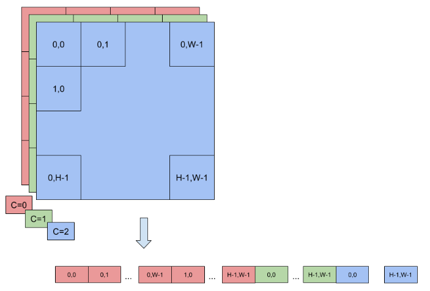

图23. HWC布局格式：图像被作为一个单独的HxW矩阵存储，其值实际上是C元组，每个通道一个值；一个点（像素）的所有值是连续存储的。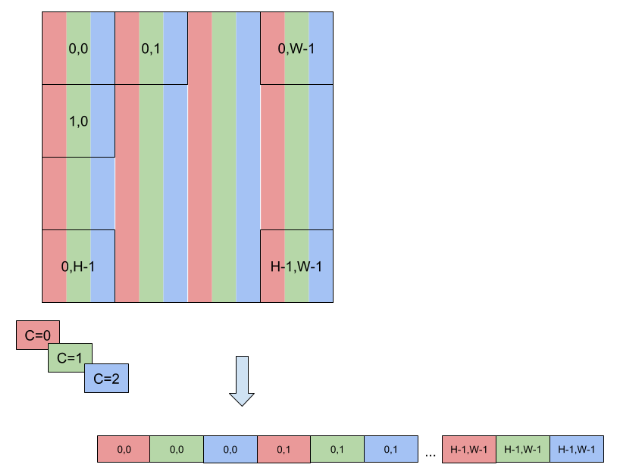

为了实现更快的计算，还定义了更多的格式来打包通道值并使用降低的精度。因此，TensorRT还支持类似于NC/2HW2和NHWC8的格式。

在NC/2HW2（TensorFormat::kCHW2）中，每个HxW矩阵中的通道值被打包在一起（如果通道数为奇数，则为空值）。结果是一种格式，其中⌈C/2⌉HxW矩阵的值是两个连续通道的值的对（参见[图24](#data-format-desc__fig3)）；请注意，如果它们在同一对中，则此顺序将通道值的维度交错为具有步长1的通道值，并且否则为2xHxW的步长。
图24. 每个HxW矩阵中将一对通道值打包在一起。结果是一种格式，其中\[C/2\]个HxW矩阵的值是两个连续通道的值的一对。![每个HxW矩阵中将一对通道值打包在一起。结果是一种格式，其中\[C/2\]个HxW矩阵的值是两个连续通道的值的一对。](assets/1695349016-584559c808bb6b459734d88699daabe1.png)

在NHWC8（TensorFormat::kHWC8）中，HxW矩阵的条目包括所有通道的值（参见[图25](#data-format-desc__fig4)）。此外，这些值以⌈C/8⌉个8元组的形式打包在一起，其中C向上取整为最接近的8的倍数。

图25. 在NHWC8格式中，HxW矩阵的条目包括所有通道的值。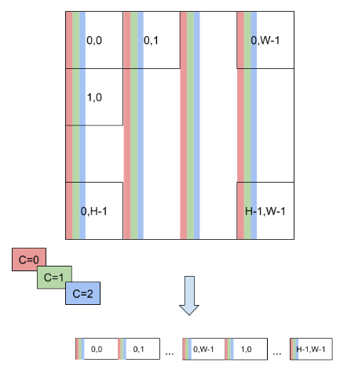

其他TensorFormat遵循与之前提到的TensorFormat::kCHW2和TensorFormat::kHWC8类似的规则。
### [A.2. 命令行程序](#command-line-programs)
### [A.2.1. trtexec](#trtexec)

在示例目录中包含了一个命令行包装工具，名为trtexec。trtexec是一个工具，可以快速利用TensorRT而无需开发自己的应用程序。trtexec工具有三个主要用途：

*   它可以用于在随机或用户提供的输入数据上进行网络基准测试。
*   它可以用于从模型生成序列化引擎。
*   它可以用于从构建器生成序列化时间缓存。
### [A.2.1.1. 基准测试网络](#trtexec-benchmark)

如果您有一个保存为ONNX文件、UFF文件，或者使用Caffe prototxt格式的网络描述，您可以使用trtexec工具测试在您的网络上运行推理的性能。trtexec工具有很多选项，用于指定输入和输出、性能计时的迭代次数、允许的精度以及其他选项。

为了最大化GPU利用率，trtexec提前将查询排队一个批次。换句话说，它执行以下操作：

```c++
排队批次0 -> 排队批次1 -> 等待批次0完成 -> 排队批次2 -> 等待批次1完成 -> 排队批次3 -> 等待批次2完成 -> 排队批次4 -> ...
```

如果使用了多流(\--streams=N标志)，则trtexec会在每个流上按照此模式进行操作。

trtexec工具会打印以下性能指标。下图显示了一个带有标记的trtexec运行的Nsight System分析示例，显示了每个性能指标的含义。

吞吐量

通过将查询数量除以总主机墙时计算得到。如果这个值明显低于GPU计算时间的倒数，那么GPU可能由于主机端开销或数据传输而未充分利用。使用CUDA图形(\--useCudaGraph)或禁用H2D/D2H传输(\--noDataTransfer)可能会提高GPU利用率。输出日志会在trtexec检测到GPU未充分利用时提供使用哪个标志的指导。

主机延迟

H2D延迟、GPU计算时间和D2H延迟的总和。这是推理单个查询的延迟。

排队时间

将查询排队的主机延迟，包括调用H2D/D2H CUDA API、运行主机端启发式算法和启动CUDA内核。如果这个时间比GPU计算时间长，那么GPU可能未充分利用，吞吐量可能受到主机端开销的影响。使用CUDA图形(\--useCudaGraph)可以减少排队时间。

H2D延迟
主机到设备数据传输的延迟，适用于单个查询的输入张量。添加\--noDataTransfer以禁用H2D/D2H数据传输。

D2H延迟

设备到主机数据传输的延迟，适用于单个查询的输出张量。添加\--noDataTransfer以禁用H2D/D2H数据传输。

GPU计算时间

执行CUDA内核以完成查询的GPU延迟。

总主机墙钟时间

从第一个查询（热身之后）入队到最后一个查询完成的主机墙钟时间。

总GPU计算时间

所有查询的GPU计算时间总和。如果这个时间明显短于总主机墙钟时间，则可能是由于主机端开销或数据传输导致GPU利用率不足。

图26. 在Nsight Systems下正常运行的trtexec性能指标（ShuffleNet，BS=16，最佳，1200 MHz的TitanRTX）。注意：在最新的Nsight Systems中，GPU行出现在CPU行之上而不是之下。

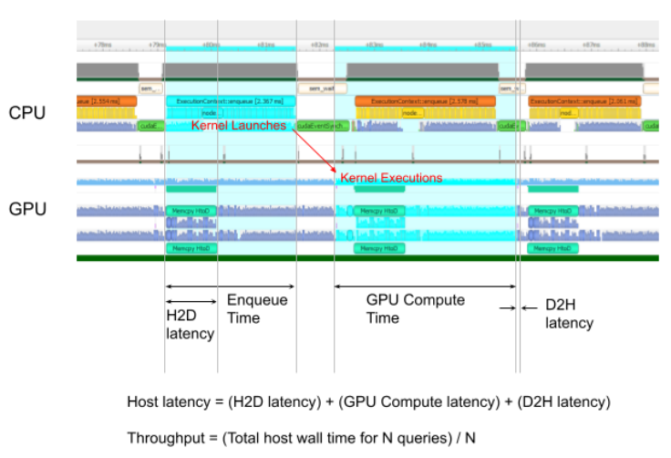

添加\--dumpProfile标志到trtexec以显示每层性能概要，这使用户可以了解网络中哪些层在GPU执行中花费了最多的时间。每层性能概要分析也适用于以CUDA图形方式启动推理（需要CUDA 11.1及更高版本）。此外，使用\--profilingVerbosity=detailed标志构建引擎，并添加\--dumpLayerInfo标志以显示详细的引擎信息，包括每层的详细信息和绑定信息。这使您可以了解引擎中每个层对应的操作及其参数。
### [A.2.1.2. 序列化引擎生成](#trtexec-serialized-engine)

如果您生成了一个保存的序列化引擎文件，您可以将其导入到另一个运行推理的应用程序中。例如，您可以使用[Triton推理服务器](https://github.com/triton-inference-server/server)以完全流水线化的异步方式从多个线程中运行引擎，以测试并行推理性能。但需要注意的是，在INT8模式下，trtexec会为张量设置随机动态范围，除非提供了带有\--calib=<file>标志的校准缓存文件，否则得到的准确性将不如预期。
### [A.2.1.3. 序列化定时缓存生成](#trtexec-serialized-timing-cache)

如果您提供一个定时缓存文件给\--timingCacheFile选项，构建器可以从中加载现有的分析数据，并在层分析期间添加新的分析数据条目。定时缓存文件可以在其他构建器实例中重复使用，以提高构建器的执行时间。建议仅在相同的硬件/软件配置中重复使用此缓存（例如，CUDA/cuDNN/TensorRT版本、设备型号和时钟频率）；否则可能会出现功能或性能问题。
### [A.2.1.4. 常用命令行标志](#trtexec-flags)

本节列出了常用的trtexec命令行标志。
##### 用于构建阶段的标志

*   \--onnx=<model>: 指定输入的ONNX模型。
*   \--deploy=<caffe\_prototxt>: 指定输入的Caffe prototxt模型。
*   \--uff=<model>: 指定输入的UFF模型。
*   \--output=<tensor>: 指定输出的张量名称。仅在输入模型为UFF或Caffe格式时需要。
*   \--maxBatch=<BS>: 指定用于构建引擎的最大批处理大小。仅在输入模型为UFF或Caffe格式时需要。如果输入模型为ONNX格式，请使用\--minShapes、\--optShapes、\--maxShapes标志来控制输入形状（包括批处理大小）的范围。
*   \--minShapes=<shapes>, \--optShapes=<shapes>, \--maxShapes=<shapes>: 指定用于构建引擎的输入形状范围。仅在输入模型为ONNX格式时需要。
*   \--workspace=<size in MB>: 指定策略允许使用的工作空间的最大大小。此标志已弃用。您可以使用–-memPoolSize=<pool\_spec>标志代替。
*   –-memPoolSize=<pool\_spec>: 指定策略允许使用的工作空间的最大大小，以及DLA将为每个可加载项分配的内存池的大小。
*   \--saveEngine=<file>: 指定要保存引擎的路径。
*   \--fp16, \--int8, \--noTF32, \--best: 指定网络级精度。
*   \--sparsity=[disable|enable|force]: 指定是否使用支持结构化稀疏性的策略。
    *   disable: 禁用所有使用结构化稀疏性的策略。这是默认设置。
    *   enable: 启用使用结构化稀疏性的策略。只有当ONNX文件中的权重满足结构化稀疏性的要求时，才会使用策略。
    *   force: 启用使用结构化稀疏性的策略，并允许trtexec覆盖ONNX文件中的权重，以强制其具有结构化稀疏性模式。请注意，这不保留准确性，仅用于获得推理性能。
*   \--timingCacheFile=<file>: 指定要加载和保存的计时缓存文件。
*   \--verbose: 打开详细日志记录。
*   \--buildOnly: 仅构建并保存引擎，不运行推理。
*   \--profilingVerbosity=[layer_names_only|detailed|none]: 指定构建引擎时的分析详细程度。
*   \--dumpLayerInfo, \--exportLayerInfo=<file>: 打印/保存引擎的层信息。
*   \--precisionConstraints=spec: 控制精度约束设置。
    *   none: 没有约束。
    *   prefer: 尽可能满足\--layerPrecisions/\--layerOutputTypes设置的精度约束。
    *   obey: 满足\--layerPrecisions/\--layerOutputTypes设置的精度约束，否则失败。
*   \--layerPrecisions=spec: 控制每层的精度约束。只在precisionConstraints设置为obey或prefer时有效。规范从左到右读取，后面的规范会覆盖前面的规范。可以使用"\*"作为layerName来指定所有未指定层的默认精度。
    *   例如：\--layerPrecisions=\*:fp16,layer\_1:fp32将所有层的精度设置为FP16，除了layer\_1，它将被设置为FP32。
*   \--layerOutputTypes=spec: 控制每层的输出类型约束。只在precisionConstraints设置为obey或prefer时有效。规范从左到右读取，后面的规范会覆盖前面的规范。可以使用"\*"作为layerName来指定所有未指定层的默认精度。如果一个层有多个输出，则可以为该层提供用"+"分隔的多个类型。
    *   例如：\--layerOutputTypes=\*:fp16,layer\_1:fp32+fp16将所有层的输出精度设置为FP16，除了layer\_1，它的第一个输出将被设置为FP32，第二个输出将被设置为FP16。
*   \--layerDeviceTypes=spec: 显式设置每层的设备类型为GPU或DLA。规范从左到右读取，后面的规范会覆盖前面的规范。
*   –useDLACore=N: 使用指定的DLA核心来支持DLA的层。
*   –allowGPUFallback: 允许在DLA上不支持的层在GPU上运行。
您是一名专业的翻译员。将其翻译为简体中文，不要修改任何现有的Markdown命令：*   \--heuristic: 在构建器中启用策略选择启发式算法。
##### 推理阶段的标志

*   \--loadEngine=<file>: 从序列化的计划文件中加载引擎，而不是从输入的ONNX、UFF或Caffe模型构建引擎。
*   \--batch=<N>: 指定用于推理的批处理大小。仅在输入模型为UFF或Caffe格式时需要。如果输入模型为ONNX格式或引擎是使用显式批处理维度构建的，则使用\--shapes选项。
*   \--shapes=<shapes>: 指定用于推理的输入形状。
*   \--warmUp=<duration in ms>, \--duration=<duration in seconds>, \--iterations=<N>: 指定预热运行的最小持续时间、推理运行的最小持续时间和推理运行的最小迭代次数。例如，设置\--warmUp=0 --duration=0 --iterations允许用户精确控制要运行推理的迭代次数。
*   \--useCudaGraph: 将推理捕获到CUDA图形中并通过启动图形来运行推理。当构建的TensorRT引擎包含不允许在CUDA图形捕获模式下进行的操作时，此参数可能会被忽略。
*   \--noDataTransfers: 关闭主机到设备和设备到主机的数据传输。
*   \--streams=<N>: 使用多个并行流进行推理。
*   \--verbose: 打开详细日志记录。
*   \--dumpProfile, --exportProfile=<file>: 打印/保存每层性能分析。

请参考trtexec --help以获取所有支持的标志和详细说明。

请参考[GitHub: trtexec/README.md](https://github.com/NVIDIA/TensorRT/tree/main/samples/trtexec)文件，了解如何构建此工具以及其使用示例的详细信息。
### [A.3. 术语表](#glossary)

设备

一个特定的GPU。如果两个GPU具有相同的型号名称和相同的配置，则被视为相同的设备。

平台

架构和操作系统的组合。例如，Linux在x86上和QNX标准在Aarch64上的平台。具有不同架构或不同操作系统的平台被视为不同的平台。
### [A.4. 致谢](#acknowledgements)

TensorRT使用了以下软件的元素，其许可证如下所示。
### Google Protobuf

本许可证适用于 Protocol Buffers 的所有部分，但不适用于以下内容：

*   位于 src/google/protobuf/stubs/atomicops\_internals\_generic\_gcc.h 的用于通用 gcc 的原子操作支持，该文件由 Red Hat Inc. 版权所有。
*   位于 src/google/protobuf/stubs/atomicops\_internals\_power.h 的用于 AIX/POWER 的原子操作支持，该文件由 Bloomberg Finance LP 版权所有。

版权所有 2014，Google Inc. 保留所有权利。

在源代码和二进制形式中重新分发和使用，无论是否进行修改，只要满足以下条件：

*   在源代码的重新分发中必须保留上述版权声明、此条件列表和以下免责声明。
*   在二进制形式的重新分发中，必须在文档和/或其他提供的材料中复制上述版权声明、此条件列表和以下免责声明。
*   未经特定事先书面许可，不得使用 Google Inc. 的名称或其贡献者的名称来认可或推广从本软件衍生的产品。

本软件按原样提供，不提供任何明示或暗示的担保，包括但不限于适销性和特定用途的适用性的担保。在任何情况下，版权所有者或贡献者均不对任何直接、间接、附带、特殊、惩罚性或后果性损害（包括但不限于替代商品或服务的采购、使用、数据或利润损失，或业务中断）承担责任，无论是因合同、严格责任或侵权行为（包括疏忽或其他）引起的，即使事先已被告知可能发生此类损害的可能性。
由协议缓冲编译器生成的代码归输入文件的所有者所有。该代码不是独立的，需要与支持库链接在一起。该支持库本身受上述许可证保护。
### Google Flatbuffers

Apache许可证版本2.0，2004年1月[http://www.apache.org/licenses/](http://www.apache.org/licenses/)

使用、复制和分发的条款和条件

1. 定义。

   “许可证”是指本文件第1至9节中定义的使用、复制和分发的条款和条件。

   “许可人”是指版权所有者或版权所有者授权的实体，授予许可证。

   “法律实体”是指行为实体和所有其他控制、受控制或与该实体共同控制的实体的联合体。对于本定义，"控制"意味着（i）通过合同或其他方式直接或间接地引起该实体的方向或管理的权力，或（ii）拥有该实体超过50%的流通股份的所有权，或（iii）对该实体的有益所有权。

   “您”（或“您的”）是指根据本许可证授予的权限行使权限的个人或法律实体。

   “源代码”形式是指进行修改的首选形式，包括但不限于软件源代码、文档源和配置文件。

   “目标代码”形式是指通过机械转换或翻译源代码形成的任何形式，包括但不限于编译的目标代码、生成的文档和转换为其他媒体类型的形式。

   “作品”是指在源代码或目标代码形式下提供的根据许可证的作品，其中包含在作品中或附加到作品中的版权声明（附录中提供了一个示例）。
“衍生作品”指基于（或源于）作品的任何作品，无论是以源代码形式还是以目标代码形式存在，其中的编辑修订、注释、拓展或其他修改作为整体构成了一个独立的原创作品。根据本许可证的定义，衍生作品不包括与作品及其衍生作品的接口保持分离或仅仅通过链接（或名称绑定）与之相关的作品。

“贡献”指任何作者作品，包括作品的原始版本以及对该作品或其衍生作品的任何修改或增加内容，这些作品是有意向版权许可人提交用于纳入作品中的，提交可以由版权所有人或其授权代表的个人或法人实体进行。根据此定义，“提交”意味着以任何形式的电子、口头或书面通信发送给许可人或其代表，包括但不限于通过电子邮件列表、源代码控制系统和问题跟踪系统进行的交流，这些系统由许可人或代表管理，目的是讨论和改进作品，但不包括版权所有人明确标记或书面指定为“非贡献”的通信。

“贡献者”指许可人以及任何个人或法人实体，他们代表自己或其他人向许可人提交的贡献，并随后被纳入作品中。

2. 版权许可授予。在本许可证的条款和条件下，每个贡献者特此授予您永久、全球范围内、非独占、无费用、免版税、不可撤销的版权许可，以复制、准备衍生作品、公开展示、公开表演、再许可和分发作品及其衍生作品，无论是以源代码形式还是以目标代码形式存在。
3. 专利许可授予。在本许可证的条款和条件下，每个贡献者特此授予您一个永久、全球范围内、非独家、无费用、免版税、不可撤销（除非在本节中另有规定）的专利许可，用于制作、制造、使用、提供出售、销售、进口和其他转让作品，该许可仅适用于那些由贡献者自身的贡献单独侵犯或与其贡献与所提交的作品结合而侵犯的专利要求。如果您对任何实体（包括诉讼中的反诉或反诉）提起专利诉讼，声称该作品或作品中包含的贡献构成直接或间接的专利侵权，则在此诉讼提起之日起，您根据本许可证对该作品授予的任何专利许可将终止。

4. 再分发。您可以在任何媒介上以任何形式复制和分发作品或其派生作品，无论是否经过修改，并且可以以源代码或目标代码形式分发，但您必须满足以下条件：
    1. 您必须向作品或派生作品的任何其他接收者提供本许可证的副本；
    2. 您必须使任何修改后的文件带有明显的通知，说明您已更改了这些文件；
    3. 您必须在分发的任何派生作品的源代码形式中保留所有版权、专利、商标和归属通知，但不包括与派生作品的任何部分无关的通知；并且
4. 如果作品包含作为其分发的一部分的“NOTICE”文本文件，则您分发的任何衍生作品必须包含该NOTICE文件中包含的归属通知的可读副本，不包括与衍生作品的任何部分无关的通知，至少在以下的一个位置之一：在作为衍生作品的一部分分发的NOTICE文本文件中；在源代码形式或文档中，如果与衍生作品一起提供；或者在由衍生作品生成的显示中，如果和这些第三方通知通常出现的地方。NOTICE文件的内容仅供信息目的，不修改许可证。您可以在您分发的衍生作品中添加您自己的归属通知，作为对来自作品的NOTICE文本的附加说明或补充，前提是这些额外的归属通知不能被解释为修改许可证。

您可以为您的修改添加您自己的版权声明，并可以为您的修改提供额外或不同的使用、复制或分发的许可条款和条件，或者为任何这样的衍生作品作为一个整体提供，前提是您对作品的使用、复制和分发在其他方面符合本许可证中规定的条件。

5. 提交贡献。除非您明确声明，您有意向将贡献提交给许可方以包含在作品中，否则该贡献将按照本许可证的条款和条件进行，不附加任何额外的条款或条件。尽管上述规定，本条款不得取代或修改您可能与许可方就该等贡献达成的任何单独许可协议的条款。
6. 商标。本许可证不授予使用许可人的商业名称、商标、服务标志或产品名称的权限，除非在描述作品来源和复制“通知”文件内容时需要合理和习惯性使用。
7. 免责声明。除非适用法律要求或书面同意，许可人以“原样”提供作品（每个贡献者以其贡献提供作品），不提供任何明示或暗示的保证或条件，包括但不限于所有权、非侵权、适销性或特定用途的适用性保证或条件。您需自行负责确定使用或再分发作品的适当性，并承担与此许可证下权限行使相关的任何风险。
8. 责任限制。无论在侵权（包括过失）、合同或其他情况下，除非适用法律要求（如故意和重大过失行为）或书面同意，任何贡献者均不对您承担任何责任，包括任何直接、间接、特殊、附带或后果性的损害，这些损害可能因本许可证或使用或无法使用作品而产生（包括但不限于商誉损失、工作停顿、计算机故障或故障，以及任何其他商业损害或损失），即使该贡献者已被告知可能发生此类损害。
9. 接受保修或额外责任。在再分发作品或其衍生作品时，您可以选择提供并收取费用，接受与本许可证一致的支持、保修、赔偿或其他责任义务和/或权利。然而，在接受此类义务时，您只能代表自己并承担个人责任，不能代表任何其他贡献者，并且只有在您同意为任何因您接受此类保修或额外责任而产生的责任或索赔向每个贡献者提供赔偿、保护和豁免时，您才能行事。

条款和条件的结束。
### 附录：如何将Apache许可证应用于您的作品。

要将Apache许可证应用于您的作品，请附上以下的模板通知，将方括号“\[\]”中的字段替换为您自己的识别信息（不要包括方括号！）。文本应该用适当的注释语法括起来，以适应文件格式。我们还建议在版权声明的同一“打印页”上包含文件或类名和用途描述，以便在第三方存档中更容易识别。

版权所有2014年Google公司。

根据Apache许可证第2.0版（“许可证”）获得许可；除非符合许可证的规定，否则您不得使用此文件。您可以在以下网址获取许可证的副本：[http://www.apache.org/licenses/LICENSE-2.0](http://www.apache.org/licenses/LICENSE-2.0)。

除非适用法律要求或书面同意，根据许可证分发的软件是基于“按原样”提供的，不附带任何明示或暗示的担保或条件。请查阅许可证以了解许可的具体语言和限制。
### BVLC caffe

版权

加利福尼亚大学的所有贡献：

版权所有 (c) 2014年，2015年，加利福尼亚大学理事会（理事会）

保留所有权利。

其他所有贡献：

版权所有 (c) 2014年，2015年，各自的贡献者

保留所有权利。

Caffe采用共享版权模型：每个贡献者对其对Caffe的贡献拥有版权。项目版本记录了所有这些贡献和版权细节。如果贡献者希望进一步标明他们对特定贡献的版权，他们应在提交更改时仅在提交消息中指示他们的版权。

许可证

在源代码和二进制形式下的重新分发和使用，无论是否进行修改，只要满足以下条件：

1. 源代码的再分发必须保留上述版权声明、此条件列表和以下免责声明。
2. 以二进制形式再分发时，必须在文档和/或其他提供的材料中重现上述版权声明、此条件列表和以下免责声明。

此软件由版权所有者和贡献者“按原样”提供，不提供任何明示或暗示的保证，包括但不限于对适销性和适用性的暗示保证。在任何情况下，无论是在合同、严格责任还是侵权行为（包括疏忽或其他情况）的任何理论下，版权所有者或贡献者均不对任何直接、间接、偶然、特殊、惩罚性或后果性损害（包括但不限于采购替代商品或服务的损失、使用、数据或利润损失，或业务中断）承担任何责任，即使事先已被告知可能发生此类损害。

贡献协议
通过提交拉请求、评论或其他方式向BVLC/caffe存储库做出贡献，贡献者将其内容发布到此处的许可和版权条款下。
### half.h

版权所有（c）2012-2017 Christian Rau <rauy@users.sourceforge.net>

特此免费授予任何获得本软件及相关文档文件（以下简称"软件"）副本的人员，无偿使用、复制、修改、合并、发布、分发、再授权及/或销售该软件的副本，以及允许使用该软件的人员在符合以下条件的前提下进行操作：

上述版权声明和本许可声明应包含在所有副本或实质部分的软件中。

软件按"原样"提供，不附带任何形式的明示或暗示保证，包括但不限于适销性、特定用途适用性和非侵权性的保证。无论是在合同、侵权行为或其他情况下，作者或版权持有人均不承担任何索赔、损害赔偿或其他责任。
### jQuery.js

jQuery.js是在doxygen下自动生成的。

在所有情况下，TensorRT使用的函数都是在MIT许可下使用的。
### CRC

TensorRT包含来自FreeBSD的CRC例程。

\# $FreeBSD: head/COPYRIGHT 260125 2013-12-31 12:18:10Z gjb $

\# @(#)COPYRIGHT 8.2 (Berkeley) 3/21/94

名为FreeBSD的软件编译根据以下条款进行分发：

版权所有（c）1992-2014 FreeBSD项目。保留所有权利。

在满足以下条件的情况下，允许以源代码和二进制形式重新分发和使用，无论是否进行修改：

1. 源代码的重新分发必须保留上述版权声明、此条件列表以及以下免责声明。
2. 以二进制形式重新分发必须在文档和/或其他提供的材料中复制上述版权声明、此条件列表以及以下免责声明。

本软件按原样提供，作者和贡献者对此不提供任何明示或暗示的保证，包括但不限于适销性和特定用途适用性的保证。无论在任何情况下，作者或贡献者对任何直接、间接、偶然、特殊、惩罚性或后果性损害（包括但不限于采购替代品或服务的损失、使用、数据或利润的损失或业务中断）承担任何责任，即使已被告知可能发生此类损害的可能性。

4.4BSD和4.4BSD-Lite软件根据以下条款进行分发：

4.4BSD和4.4BSD-Lite版本中包含的所有文档和软件的版权归加利福尼亚大学校董所有。

版权所有 1979年、1980年、1983年、1986年、1988年、1989年、1991年、1992年、1993年、1994年 加利福尼亚大学校董。保留所有权利。

在满足以下条件的情况下，允许以源代码和二进制形式重新分发和使用，无论是否进行修改：
1. 源代码的再分发必须保留上述版权声明、条件列表和以下免责声明。
2. 以二进制形式再分发必须在文档和/或其他提供的材料中复制上述版权声明、条件列表和以下免责声明。
3. 所有提及此软件特性或使用的广告材料必须显示以下确认：本产品包含由加州大学伯克利分校及其贡献者开发的软件。
4. 未经明确事先书面许可，不得使用大学的名称或其贡献者的名称来认可或推广从该软件衍生的产品。

此软件由董事会和贡献者提供，不提供任何明示或暗示的担保，包括但不限于对适销性和特定用途的适用性的暗示担保。无论是在合同、严格责任还是侵权行为（包括疏忽或其他），在任何情况下，董事会或贡献者均不对任何直接、间接、附带、特殊、惩罚性或后果性损害（包括但不限于替代商品或服务的采购、使用、数据或利润的损失或业务中断）承担任何责任，即使已被告知此类损害的可能性。

电气和电子工程师学会以及美国国家标准委员会X3，关于信息处理系统，已经允许我们转载他们文档的部分内容。

在以下声明中，“此文本”一词指的是系统文档的部分内容。
本文的部分内容是在第二个BSD网络软件发布中以电子形式重新印刷和复制的，来源于IEEE Std 1003.1-1988，IEEE标准便携式操作系统接口（POSIX），版权所有1988年由电气和电子工程师学会（IEEE）拥有。如果这些版本与原始IEEE标准有任何差异，原始IEEE标准将作为仲裁文件。

在下面的陈述中，“这个材料”一词指的是系统文档的部分内容。

该材料是根据美国国家标准委员会X3的许可，关于信息处理系统的计算机和商业设备制造商协会（CBEMA），位于华盛顿特区20001-2178第一街311号，500号套房。C语言的开发工作由X3J11技术委员会完成。

软件和文档中所包含的观点和结论仅代表作者的观点，不应被解释为加利福尼亚大学校董会的官方政策，无论是明示还是暗示。

注：加利福尼亚大学伯克利分校的伯克利软件发行版（"BSD"）源代码的版权已更新。版权附录可在ftp://ftp.cs.berkeley.edu/pub/4bsd/README.Impt.License.Change找到，并在下面附上。

1999年7月22日

给所有BSD的许可证持有人、分发商：

正如您所知，某些伯克利软件发行版（"BSD"）源代码文件要求包含所有或部分该软件的产品的进一步分发，在其广告材料中必须承认该产品包含由加利福尼亚大学伯克利分校及其贡献者开发的软件。

具体而言，规定如下：

“\* 3. 提及此软件的功能或使用的所有广告材料

\* 必须显示以下确认：

\* 该产品包含由加利福尼亚大学伯克利分校及其贡献者开发的软件。”
立即生效，许可证持有人和经销商不再需要在广告材料中包含确认。因此，包含此确认的BSD Unix文件中的上述段落将被完全删除。

威廉·霍斯金斯

技术许可办公室主任

加州大学伯克利分校
### getopt.c

$OpenBSD: getopt\_long.c,v 1.23 2007/10/31 12:34:57 chl Exp $

$NetBSD: getopt\_long.c,v 1.15 2002/01/31 22:43:40 tv Exp $

版权所有 (c) 2002 Todd C. Miller <Todd.Miller@courtesan.com>

在不带或带有费用的情况下，特此授予使用、复制、修改和分发本软件的权限，前提是上述版权声明和本许可声明出现在所有副本中。

本软件按原样提供，作者对本软件不提供任何明示或暗示的担保，包括但不限于对适销性和适用性的所有暗示担保。在任何情况下，作者均不对任何特殊、直接、间接或后果性损害或任何因使用、数据或利润损失而导致的任何损害承担责任，无论是合同诉讼、过失或其他侵权行为，与使用或执行本软件有关。

部分由国防高级研究计划局 (DARPA) 和空军研究实验室、空军物资司令部、美国空军根据协议编号 F39502-99-1-0512 赞助。

版权所有 (c) 2000 The NetBSD Foundation, Inc.

保留所有权利。

此代码是由 Dieter Baron 和 Thomas Klausner 向 The NetBSD Foundation 贡献的软件衍生而来。

在源代码和二进制形式中重新分发和使用，无论是否经过修改，只要满足以下条件:

1.  源代码的再分发必须保留上述版权声明、此条件列表和以下免责声明。
2.  二进制形式的再分发必须在文档和/或其他提供的材料中复制上述版权声明、此条件列表和以下免责声明。
本软件由NetBSD基金会和贡献者提供，"按原样"提供，不提供任何明示或暗示的保证，包括但不限于对适销性和特定目的的适用性的暗示保证。在任何情况下，无论是合同责任、严格责任还是侵权行为（包括疏忽或其他），基金会或贡献者均不对任何直接、间接、附带、特殊、惩罚性或后果性损害（包括但不限于替代商品或服务的采购、使用、数据或利润的损失或业务中断）承担任何责任，即使事先被告知有可能发生此类损害的可能性。
### ONNX 模型库

MIT 许可证

版权所有 (c) ONNX 项目贡献者

特此授予任何获得本软件及相关文档文件（以下简称“软件”）副本的人免费使用该软件，无论是否限制，包括但不限于使用、复制、修改、合并、发布、分发、再许可和/或销售该软件的副本，以及允许获得该软件的人这样做，但须遵守以下条件：

上述版权声明和本许可声明应包含在所有副本或实质部分的软件中。

本软件按“原样”提供，不提供任何明示或暗示的担保，包括但不限于适销性、特定用途适用性和非侵权性的担保。无论出于合同、侵权行为或其他原因，作者或版权持有人均不对任何索赔、损害赔偿或其他责任承担责任，与本软件或其使用或其他交易有关。
### RESNET-50 Caffe 模型

麻省理工学院许可证（MIT）

版权所有（c）2016 Shaoqing Ren

特此授予任何获得本软件及相关文档文件（以下简称“软件”）副本的人免费使用该软件，包括但不限于使用、复制、修改、合并、出版、发布、再许可和/或销售软件的副本，以及允许使用该软件的人员这样做，前提是遵守以下条件：

上述版权声明和本许可声明应包含在所有副本或重要部分的软件中。

软件按“原样”提供，不附带任何形式的明示或暗示的担保，包括但不限于对适销性、特定用途的适用性和非侵权的担保。无论是在合同诉讼、侵权行为还是其他方面，作者或版权持有人均不对任何索赔、损害或其他责任承担责任，无论是出于合同、侵权行为还是其他原因，与软件或使用或其他方式有关。
### OpenSSL

Apache许可证版本2.0

版权所有 (c) OpenSSL项目贡献者

Apache许可证

版本2.0，2004年1月

[https://www.apache.org/licenses/](https://www.apache.org/licenses/)

使用、复制和分发的条款和条件

1. 定义。

   “许可证”指本文件第1至9节所定义的使用、复制和分发的条款和条件。

   “许可方”指版权所有者或版权所有者授权的实体，授予许可证的实体。

   “法人实体”指执行实体和与该实体控制、受该实体控制或与该实体共同控制的所有其他实体的联合体。对于本定义，"控制"意味着 (i) 直接或间接地具有引导或管理该实体的权力，无论是通过合同还是其他方式，或 (ii) 持有该实体超过50%的股权，或 (iii) 对该实体具有有利权益。

   “您” (或 "您的") 指根据本许可证所授予的权限行使权限的个人或法人实体。

   “源代码”形式指用于进行修改的首选形式，包括但不限于软件源代码、文档源代码和配置文件。

   “目标代码”形式指源代码经过机械转换或翻译而产生的任何形式，包括但不限于编译后的目标代码、生成的文档和转换为其他媒体类型的形式。

   “作品”指以源代码或目标代码形式提供的创作作品，该作品包含在作品中或附加在作品中的版权声明所指示的内容（附录中提供了一个示例）。
“衍生作品”指的是基于（或源自）该作品的任何作品，无论是以源代码还是目标代码形式存在，其中编辑修订、注释、扩展或其他修改代表了整体上的原创作品。对于本许可证而言，衍生作品不包括与该作品及其衍生作品的接口保持可分离性或仅仅通过链接（或名称绑定）的作品。

“贡献”指的是任何作者作品，包括该作品的原始版本以及该作品或其衍生作品的任何修改或附加内容，意图通过版权所有者或经版权所有者授权的个人或法人实体提交给许可人以纳入该作品。对于本定义而言，“提交”指的是以任何形式的电子、口头或书面通信发送给许可人或其代表的通信，包括但不限于通过电子邮件列表、源代码控制系统和问题跟踪系统进行的交流，这些系统由许可人管理或代表其管理，目的是讨论和改进该作品，但不包括版权所有者明确标记或书面指定为“非贡献”的通信。

“贡献者”指的是许可人以及任何个人或法人实体，代表其收到许可人接收并随后纳入该作品的贡献。

2. 版权许可的授予。在本许可证的条款和条件下，每个贡献者特此授予您一个永久的、全球范围内的、非排他性的、免费的、免版税的、不可撤销的版权许可，以复制、准备衍生作品、公开展示、公开表演、再许可和分发该作品及其衍生作品的源代码或目标代码形式。
3. 专利许可的授予。在本许可证的条款和条件下，每个贡献者特此向您授予一项永久的、全球范围内的、非独占的、无费用的、免版税的、不可撤销的（除非本节另有规定）专利许可，用于制作、制造、使用、出售、销售、进口和其他方式转让作品，该许可仅适用于由贡献者提交的贡献项本身或其贡献项与作品组合而必然侵犯的专利权主张。如果您对任何实体（包括诉讼中的反诉或反诉）提起专利诉讼，声称作品或作品中包含的贡献构成直接或间接的专利侵权，则在此诉讼被提起之日起，您在本许可证下对该作品的专利许可将终止。

4. 再分发。您可以以任何媒介复制和分发作品或其衍生作品，无论是否经过修改，以及以源代码或目标代码形式分发，但您必须满足以下条件：
    1. 您必须向作品或其衍生作品的任何其他接收者提供本许可证的副本；
    2. 您必须使任何修改的文件带有明显的通知，说明您已更改了这些文件；
    3. 您必须在分发的任何衍生作品的源代码形式中保留所有版权、专利、商标和归属的通知，但不包括与衍生作品的任何部分无关的通知；并且
4. 如果作品包含作为其分发的一部分的“注意事项”文本文件，则您分发的任何衍生作品必须包括该“注意事项”文件中包含的归属通知的可读副本，但不包括与衍生作品的任何部分无关的通知，至少在以下位置之一：在作为衍生作品的一部分分发的“注意事项”文本文件中；在提供衍生作品的源代码形式或文档中，如果与衍生作品一起提供；或者，在衍生作品生成的显示中，如果并且只有在这些第三方通知通常出现的地方。 “注意事项”文件的内容仅供信息目的，不修改许可证。您可以在您分发的衍生作品中添加您自己的归属通知，作为对来自作品的“注意事项”文本的补充，前提是这些额外的归属通知不能被解释为修改许可证。

您可以在您的修改中添加您自己的版权声明，并为您的修改提供额外或不同的使用、复制或分发的许可条款和条件，或者为任何这样的衍生作品作为一个整体提供，前提是您对作品的使用、复制和分发在其他方面符合本许可证中规定的条件。

5. 提交贡献。除非您明确声明，您有意提交给许可方用于将贡献包含在作品中的任何贡献都将按照本许可证的条款和条件进行，不附加任何额外的条款或条件。尽管上述内容，但本文中的任何内容都不应取代或修改您可能与许可方签订的关于此类贡献的单独许可协议的条款。
6. 商标。本许可证不授予使用许可人的商业名称、商标、服务标志或产品名称的权限，除非在描述作品的来源和复制NOTICE文件的内容时所必需的合理和习惯使用。
7. 免责声明。除非适用法律要求或经书面同意，许可人以“按原样”提供作品（每个贡献者以其贡献的方式提供），不提供任何明示或暗示的担保或条件，包括但不限于所有权、非侵权、适销性或特定用途的适用性。您应自行决定使用或重新分发作品的适当性，并承担与根据本许可证行使权限相关的任何风险。
8. 责任限制。在任何情况下，无论是侵权行为（包括疏忽）、合同还是其他法律理论，除非适用法律要求（例如故意和重大过失行为）或经书面同意，任何贡献者均不对您承担损害赔偿责任，包括任何直接、间接、特殊、附带或间接的损害赔偿，均属于本许可证的结果或因使用或无法使用作品而产生的任何性质的损害赔偿（包括但不限于商誉损失、工作中断、计算机故障或故障，或任何其他商业损害或损失），即使该贡献者已被告知可能发生此类损害。
9. 接受保修或额外责任。在重新分发作品或其衍生作品时，您可以选择提供并收取支持、保修、赔偿或其他与本许可证一致的责任义务和/或权利的费用。然而，在接受此类责任时，您只能代表自己并独自承担责任，而不能代表任何其他贡献者，并且只有在您同意为任何因您接受任何此类保修或额外责任而导致的贡献者遭受的任何责任或索赔进行赔偿、保护和使其免受损害时，您才能行事。

条款和条件的终止
### Boost Beast

版权所有 (c) 2016-2017 Vinnie Falco (vinnie dot falco at gmail dot com)

Boost 软件许可证 - 版本 1.0 - 2003 年 8 月 17 日

特此授予任何获得该软件及其附带文档副本（以下简称“软件”）的个人或组织免费使用、复制、展示、分发、执行和传输该软件，并制作该软件的衍生作品，并允许第三方以该软件为基础进行上述行为，但须遵守以下规定：

在所有软件副本（全部或部分）和软件的所有衍生作品中，必须包含软件中的版权声明、本完整声明、上述许可证授予、本限制和以下免责声明，除非这些副本或衍生作品仅为源语言处理器生成的机器可执行目标代码形式。

该软件按“原样”提供，不附带任何形式的明示或暗示担保，包括但不限于适销性、特定用途的适用性、所有权和非侵权的担保。无论是合同、侵权还是其他方面，版权持有人或分发该软件的任何人均不对任何损害或其他责任承担责任，与该软件或使用该软件或其他方式有关。
## [注意事项](#notices-header)
### [](#通知)
### 注意事项

本文档仅供信息参考，不应被视为产品功能、状态或质量的保证。NVIDIA Corporation（“NVIDIA”）对本文档中所包含的信息的准确性或完整性不作任何明示或暗示的陈述或保证，并对其中的任何错误不承担任何责任。NVIDIA对使用此信息的后果或侵犯第三方专利或其他权利不承担任何责任。本文档不构成对开发、发布或交付任何材料（下文定义）、代码或功能的承诺。

NVIDIA保留在任何时候对本文档进行更正、修改、增强、改进或其他任何更改的权利，而无需事先通知。

客户在下订单之前应获取最新的相关信息，并验证该信息的时效性和完整性。

NVIDIA产品的销售受NVIDIA在订单确认时提供的标准销售条款和条件的约束，除非NVIDIA和客户的授权代表在签署的个别销售协议中另有约定（“销售条款”）。NVIDIA在此明确反对适用任何客户的一般条款和条件，涉及本文档中所引用的NVIDIA产品的购买。本文档不直接或间接地形成任何合同义务。

NVIDIA产品未经设计、授权或保证适用于医疗、军事、航空、航天或生命支持设备，也不适用于可能导致个人受伤、死亡或财产或环境损害的应用。NVIDIA对在此类设备或应用中包含和/或使用NVIDIA产品不承担任何责任，因此此类包含和/或使用由客户自担风险。
NVIDIA不对基于本文档的产品适用性做出任何陈述或保证。NVIDIA不一定对每个产品的所有参数进行测试。客户有责任评估和确定本文档中包含的任何信息的适用性，确保产品适合客户计划的应用，并进行必要的应用测试，以避免应用或产品的故障。客户产品设计的弱点可能会影响NVIDIA产品的质量和可靠性，并可能导致超出本文档中包含的条件和/或要求的附加或不同的情况。NVIDIA对任何因以下原因导致的任何故障、损害、成本或问题不承担责任：（i）以与本文档相悖的方式使用NVIDIA产品，或（ii）客户产品设计。

本文档不授予任何NVIDIA专利权、版权或其他NVIDIA知识产权的明示或暗示许可。NVIDIA关于第三方产品或服务的信息不构成NVIDIA使用该等产品或服务的许可，也不构成对其的保证或认可。使用该等信息可能需要第三方的专利或其他知识产权的许可，或者需要NVIDIA的专利或其他知识产权的许可。

未经NVIDIA事先书面批准，只有在符合所有适用的出口法律和法规，并伴随所有相关条件、限制和通知的情况下，才允许复制本文档中的信息，并且不能进行任何修改。
本文件及所有NVIDIA设计规格、参考板、文件、图纸、诊断、列表和其他文件（合称为“材料”）均按“原样”提供。NVIDIA对材料不提供任何明示、暗示、法定或其他形式的保证，并明确否认所有隐含的非侵权、适销性和特定目的适用性的保证。在法律允许的范围内，无论以何种理论为依据，NVIDIA均不对任何损害承担责任，包括但不限于直接、间接、特殊、附带、惩罚性或后果性损害，即使NVIDIA已被告知可能发生此类损害。尽管客户可能因任何原因而遭受损害，但NVIDIA对于所描述产品向客户的累积和总体责任应依照产品的销售条款进行限制。
### []（#arm）
### Arm

Arm、AMBA和Arm Powered是Arm有限公司的注册商标。Cortex、MPCore和Mali是Arm有限公司的商标。"Arm"用于表示Arm Holdings plc；其运营公司Arm有限公司；以及地区子公司Arm Inc.；Arm KK；Arm Korea Limited.；Arm Taiwan Limited；Arm France SAS；Arm Consulting (Shanghai) Co. Ltd.；Arm Germany GmbH；Arm Embedded Technologies Pvt. Ltd.；Arm Norway, AS和Arm Sweden AB。
### [](#hdmi)
### HDMI

HDMI、HDMI标识以及高清晰度多媒体接口是HDMI Licensing LLC的商标或注册商标。
### [](#黑莓)
### 黑莓/QNX

版权所有 © 2020 BlackBerry Limited。保留所有权利。

商标，包括但不限于BLACKBERRY，EMBLEM Design，QNX，AVIAGE，MOMENTICS，NEUTRINO和QNX CAR是BlackBerry Limited的商标或注册商标，根据许可使用，并明确保留对这些商标的专有权利。
### [](#google)
### 谷歌

Android、Android TV、Google Play 和 Google Play 商标均为 Google 公司的商标。
### [](#trademarks)
### 商标

NVIDIA、NVIDIA标志、BlueField、CUDA、DALI、DRIVE、Hopper、JetPack、Jetson AGX Xavier、Jetson Nano、Maxwell、NGC、Nsight、Orin、Pascal、Quadro、Tegra、TensorRT、Triton、Turing和Volta是NVIDIA Corporation在美国和其他国家的商标和/或注册商标。其他公司和产品名称可能是与其相关联的各自公司的商标。
### [](#版权-过去到现在)
### 版权

© 2017\-2023 NVIDIA Corporation及其关联公司。保留所有权利。

[1](#fnsrc_1)**建议评估校准输入或验证前一层的输出。**](../../../../7-office/11-sync/Obsidian/9-web-clippings/TensorRT8.5.3/readme.md)
