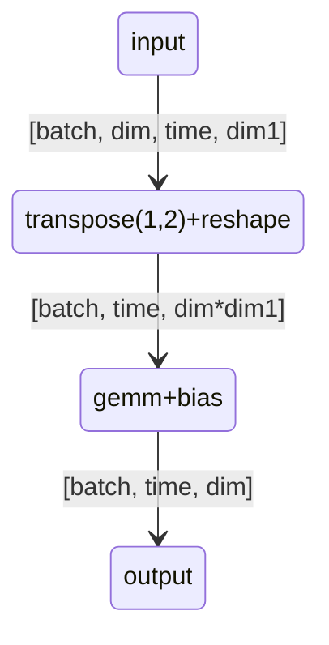
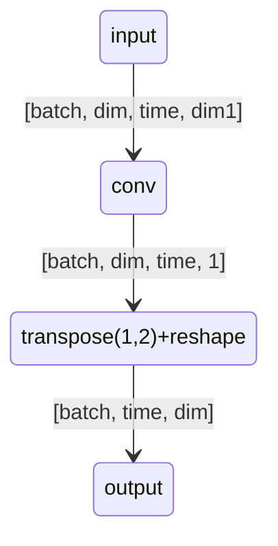
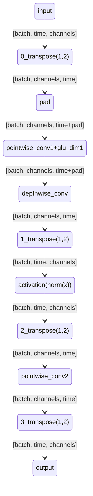
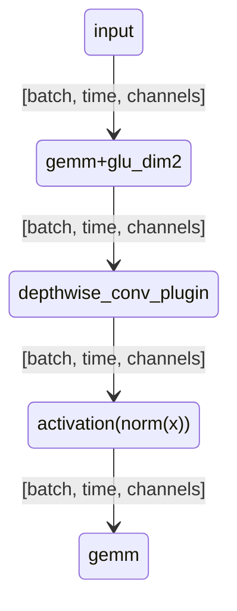

最近一直在做WeNet conformer encoder模型的GPU TensorRT加速，也有幸参加了NVIDIA Hackathon 2022 加速 Wenet 的比赛和阅读了NVIDIA 内部团队 关于 WeNet TensorRT加速的代码。学习到了很多东西，抛砖引玉进行汇总，欢迎各位大佬拍砖。

以下加速策略描述以TensorRT为例进行简单描述。
PS： 阅读前需要非常了解conformer encoder的模型结构，并比较熟悉TensorRT or CUDA。

# 一、 算子级别优化
这一大章节主要内容是算子级别的优化，核心优化思路有两个：
1. 合并所有能合并的算子。
2. 等价替换部分算子，去除冗余。

按照模型结构构建目录结构如下。
## ConformerEncoder 
### 1.1 make_pad_mask
对应代码
```
masks = ~make_pad_mask(xs_lens, T).unsqueeze(1)  # (B, 1, T)
```
mask 逻辑的优化对整体模型影响较大，效果也比较明显。

输入 feat_len 维度是[B]，类型是int。受python语言限制，原mask逻辑是将feat_len 变为多维的bool类型 mask，在后面的subsampling，attn_softmax 和 conv_maskedfill步骤中使用。

将这部分逻辑转换成onnx会发现，多出了大量的equal，not等 bool 级别的算子，非常冗余。

使用c++ or cuda 上线，可以直接使用feat_len即可，可以省去大量的算子。但这样改动也意味着后面使用mask的算子，都不能使用标准算子了，需要自己实现plugin。具体改动见其他模块相对应的部分。

### 2.2 subsampling: Conv2dSubsampling4
#### 2.2.1 mask 逻辑优化
```
x_mask[:, :, :-2:2][:, :, :-2:2]
```
受python语言限制，简单一行 mask 操作 x_mask[:, :, :-2:2][:, :, :-2:2]，需要数个基础算子拼接才能实现。
没有任何疑问，这里要做成一个plugin。
翻译一下，逻辑为F = ceil((x - 2) / 2), F(F(time))

PS： 这段python代码是有问题的，会导致单句和batch执行结果不一致的问题，详细见 https://github.com/wenet-e2e/wenet/issues/1513

#### 2.2.2 out linear 逻辑优化
```
x = self.out(x.transpose(1, 2).contiguous().view(b, t, c * f))
```
原逻辑为：transpose + reshape + linear + bias，转成成trt 算子就是shuffle + matrix_multiply + add 操作，维度变化如下图。



可以等价转换成 conv + transpose操作。
需要先将linear_weight[dim, dim *dim1]进行reshape，linear_weight.reshape(dim, dim, 1, dim1)
维度变化如下图。


这里的加速有两个点：
1. 将gemm + bias 两个算子替换成了 conv 一个算子。
2. 大大减少了 transpose 算子的计算量。

详细可参考第 23 分钟 https://www.bilibili.com/video/BV1i3411G7vN/?spm_id_from=333.999.0.0&vd_source=58a8fa4cc926efbd7338631b3957cc73 

### 1.3. pos_enc: RelPositionalEncoding
```
self.pe = self.pe.to(x.device)
x = x * self.xscale
pos_emb = self.position_encoding(offset, x.size(1), False)
return self.dropout(x), self.dropout(pos_emb)
```

这里没什么复杂的逻辑，先一个scale，再根据输入维度截取 pos_emb。涉及到维度操作，使用trt 基础算子实现还是麻烦，直接做成一个算子，将scale也包进去，完事。

### 1.4. encoders: ConformerEncoderLayer
这里是重头戏，前面都只有一层，模型有N 层 encoder，这里每一步的加速效果，都会被放大N倍，
#### 1.4.1 attn: RelPositionMultiHeadedAttention
att模块的加速技术也比较成熟了，核心思路还是将qkvp gemm 合并在一起，将四个gemm合并成一个大gemm。
大的改动如下：
x[batch, time, dim], qkvp weight[dim, dim]
1. 将qkvp weights 合并成一个 qkvp_weights[dim, 4dim]， x.mul(qkvp_weights) => qkvp_out[batch, time, 4dim]。
2. +qkv bias, +pos_bias_u 和 pos_bias_v和transpose可以合并成一个plugin。
3. (matrix_ac + matrix_bd) / math.sqrt(self.d_k) 和 softmax 合并成一个plugin。

#### 1.4.2 conv_module: ConvolutionModule
这里的加速思路比较新颖。核心代码如下
```
x = x.transpose(1, 2)  # (#batch, channels, time)
x = nn.functional.pad(x, (self.lorder, 0), 'constant', 0.0)

# GLU mechanism
x = self.pointwise_conv1(x)  # (batch, 2*channel, dim)
x = nn.functional.glu(x, dim=1)  # (batch, channel, dim)
# 1D Depthwise Conv
x = self.depthwise_conv(x)
x = x.transpose(1, 2)
x = self.activation(self.norm(x))
x = x.transpose(1, 2)
x = self.pointwise_conv2(x)
x.transpose(1, 2)
```

输入x的维度为 (batch, time，channel)，整个模块就是最后一维进行多次1D卷积和操作layernorm。但conv无法对最后一维计算，所以一共需要4个transpose为此服务。


这里加速的核心就是如何去除这四个冗余的转置。

加速步骤如下：
1. 将两个 pointwise_conv 转换为 Linear
2. depthwise_conv 没有办法替换为现成的算子，需要编写对应的plugin。
3. 将 self.pointwise_conv1.bias 和 glu 进行合并。

优化后流程维度变化如下：


PS： 在 depthwise_conv_plugin 计算中，通过直接按0算pad，可以直接将前面的pad操作去掉。

PPS： 这里pad操作的位置有问题，详细见：https://github.com/wenet-e2e/wenet/issues/1527

#### 1.4.3 layer_norm 
layernorm 值得单独拉出来说一下。
layernorm 多个版本计算不同等原因，trt 并没有提供layernorm算子，onnx也没有。torch layernorm算子转 onnx时，会被打散成一堆算子。在trt8+，mylein 会将这一堆算子合并成一个foreign_node，但速度没有优化过的plugin快。

详细优化思路见这个视频 第28分钟：https://www.bilibili.com/video/BV1i3411G7vN?spm_id_from=333.999.0.0

#### 1.4.4 scale_addbias_residual_prelayernorm
还可以将 scale, bias, residual, layernorm进行合并。在ConformerEncoderLayer中，该合并策略可以应用到三处。
```python
x = self.feed_forward_macaron(x)
x = residual + self.ff_scale * x                                                                         
residual = x                                                                                                   
if self.normalize_before:                                                                                      
    x = self.norm_mha(x)
```
代码为例，不考虑 feed_forward_macaron 模块，可以将逻辑梳理为：
```python
# 输入为x 和 residual，输出为 out_residual 和 out
x = x + self.feed_forward_macaron.bias
out_residual = residual + self.ff_scale * x
out = self.norm_mha(out_residual)
```
梳理后的逻辑，所有的算子可以在一个 kernel 中实现。

# 二、整体优化策略
这一块做的不多，就瞎扯了。
## 2.1 half + int8
1. 建议优先做 fp16，简单速度快。在 T4 上测试发现单fp16的速度甚至能媲美单INT8的速度。
2. int8 在 conformer 模型上容易溢出，模型效果影响较大。想要把效果调回来需要费不少劲，但收益并不诱人。
3. plugin half 版本，有些plugin 可以使用 half2 加速，虽然是微弱的加速，聊胜于无。
4. 想要追求极致的性能，需要fp16+int8。 
5. 追求更极致的性能，可以直接将一些plugin算子实现int8版本，除了能更快，还能免掉一些类型reformat操作。这个nv一直在尝试，但公开的代码比较少。

## 2.2 varlen
没做过

# 三、加速效果

测试模型，语音识别 conformer 12 层 encoder stream模型，一个chunk是16帧。
NVIDIA T4 显卡，下表中是测试一个chunk的时间。

在逐步的应用half加速和大部分算子级计算策略后，加速比达到了8倍之多，RTF 为 0.0157。

| 模型 | 一个chunk的时间 | 
| --- | --- | 
conformer 12l float  | 24.48ms
conformer 12l half	| 7.89ms
conformer 12l half V2 | 4.42696 ms
conformer 12 half V3 | 3.9395 ms
conformer 12 half V4 | 3.39684 ms
conformer 12 half V5 | 3.00334 ms

一点点做下来，速度快了起来~

整句模型我还没做完，NVIDIA 内部给出整句模型测试数据，RTF甚至低到了0.000452.
